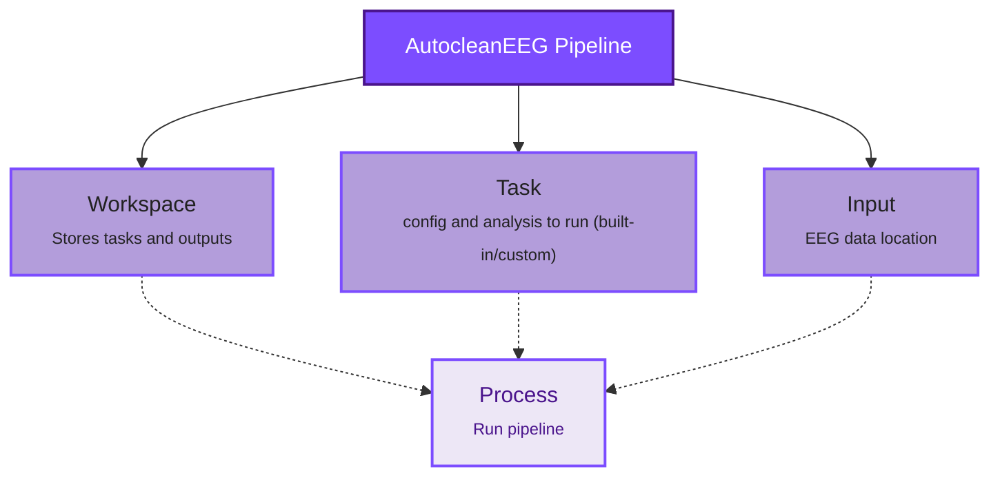

Everything revolves around three simple concepts in AutocleanEEG:

- Workspace: folder for your tasks and outputs
- Task: what analysis pipeline to run (built-in or custom)
- Input: a single EEG file or folder of EEG files

## Corresponding commands

Use these commands to interact with each pillar. 

| Pillar     | Command                               | Purpose (concise)                |
|-----------|----------------------------------------|----------------------------------|
| Workspace | `autocleaneeg-pipeline workspace`      | Manage or inspect a workspace    |
| Task      | `autocleaneeg-pipeline task`           | Define, list, or run a task      |
| Input     | `autocleaneeg-pipeline input`          | Specify / validate EEG data path |
