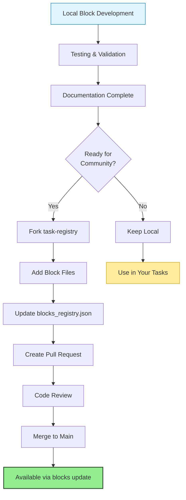
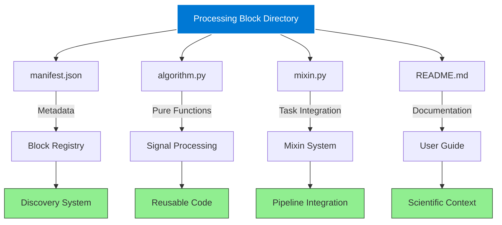
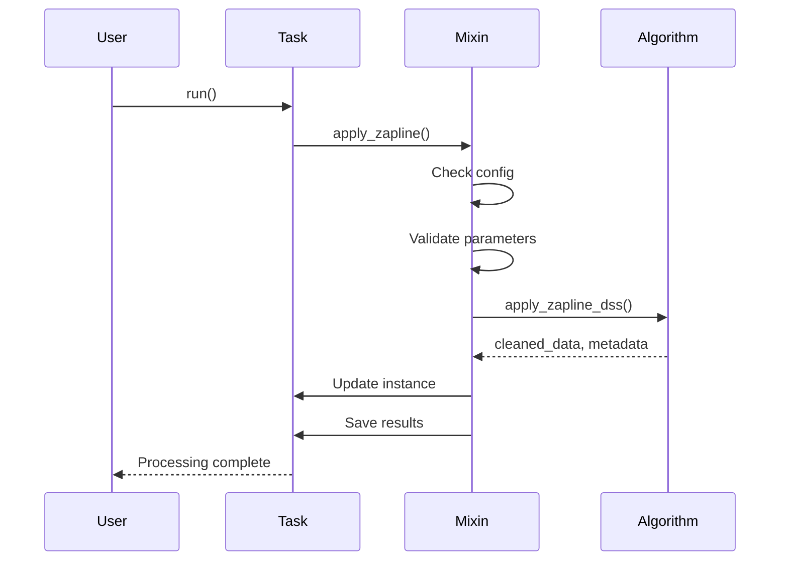
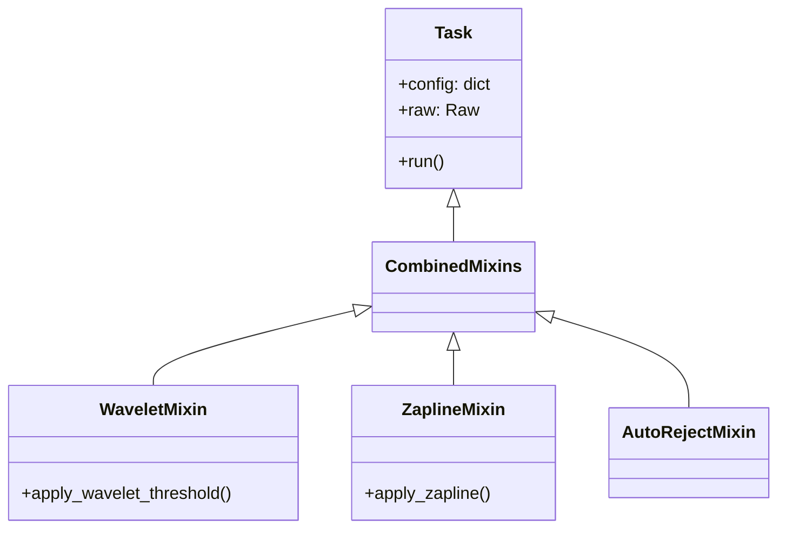
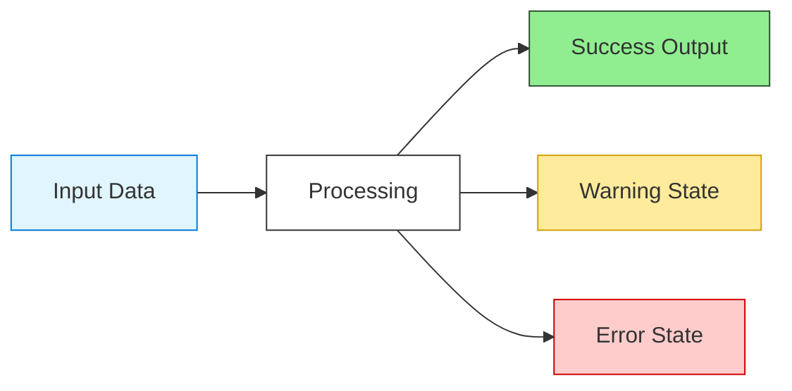
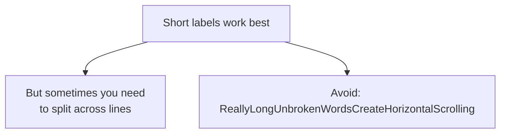

# The Art of Technical Documentation: A Philosophy and Practical Guide

**Meta-document capturing the approach, style, and techniques for creating exceptional technical documentation**

*Created: October 2025 | Based on: AutoCleanEEG Processing Blocks Developer Guide*

---

## Table of Contents

1. [Core Philosophy](#core-philosophy)
2. [The Prose-First Principle](#the-prose-first-principle)
3. [Multi-Audience Architecture](#multi-audience-architecture)
4. [Progressive Complexity Model](#progressive-complexity-model)
5. [Mintlify Component Strategy](#mintlify-component-strategy)
6. [Visual Storytelling with Mermaid](#visual-storytelling-with-mermaid)
7. [Code Examples as Teaching Tools](#code-examples-as-teaching-tools)
8. [The Pattern Language Approach](#the-pattern-language-approach)
9. [Writing Techniques That Work](#writing-techniques-that-work)
10. [Quality Checklist](#quality-checklist)

---

## Core Philosophy

### Principle 1: Understanding Before Instruction

The fundamental distinction between mediocre documentation and exceptional documentation is this: **mediocre docs tell you what to do; exceptional docs help you understand why**.

When a reader finishes your documentation, they should be able to:
- Explain the *reasoning* behind design decisions
- Adapt patterns to their specific use cases
- Troubleshoot problems they haven't seen before
- Teach others what they learned

This requires a shift in mindset from **procedure writer** to **educator and storyteller**.

#### Example: The Wrong Way

```markdown
## Creating a Block

Follow these steps:
1. Create a directory
2. Add four files
3. Write the manifest
4. Write the algorithm
5. Test it
```

**Why this fails**: It's a checklist without context. Readers execute mechanically without understanding. When something goes wrong, they're lost.

#### Example: The Right Way

```markdown
## The Anatomy of a Processing Block

A processing block is a structured directory containing exactly four required files,
each serving a distinct purpose in the block's lifecycle. Understanding why each
file exists and how they interact is crucial for creating blocks that integrate
properly with the AutoCleanEEG ecosystem.

When you create a block, you're not just writing code—you're building a complete
package that other researchers will use, modify, and learn from. The four-file
structure emerged from years of experience with what makes code shareable,
maintainable, and scientifically reproducible...
```

**Why this works**: Sets context before diving into mechanics. Explains the purpose, the historical reasoning, and the values embedded in the design.

### Principle 2: Respect Your Reader's Intelligence

Assume your readers are **smart but busy**. They don't need hand-holding through obvious steps, but they deeply appreciate context about non-obvious decisions.

**What this means in practice:**
- Skip the obvious ("Python is a programming language")
- Explain the subtle ("Why we separate algorithm.py from mixin.py")
- Anticipate confusion ("You might wonder why we return metadata dictionaries")
- Connect to existing knowledge ("Like package.json for npm")

### Principle 3: Show, Then Tell, Then Explain

The optimal teaching sequence for technical content:

1. **Show**: Present a complete, working example
2. **Tell**: Explain what each part does
3. **Explain**: Dive into the *why* and *when*

This mirrors how experts actually learn new systems—they start with working code, reverse-engineer it, then seek deeper understanding.

### Principle 4: Documentation as Time Travel

Imagine your documentation being read by three people on the same day:

- **The Skimmer** (5 minutes): Needs quick answers, scanning for code snippets
- **The Learner** (1 hour): Wants to understand the system from scratch
- **The Reference User** (30 seconds): Knows the system, looking up specifics

Your documentation must serve all three *simultaneously* through strategic formatting, progressive disclosure, and clear information hierarchy.

---

## The Prose-First Principle

### Why "Stupid Bullet Points" Don't Work

Bullet points are cognitively cheap to write but expensive to read. They create the illusion of completeness while actually offloading the work of coherent thinking onto the reader.

#### The Bullet Point Problem

```markdown
## Benefits of Processing Blocks

- Modular
- Reusable
- Validated
- Well-documented
- Community-driven
- Independently updated
```

**What the writer thinks**: "I've listed all the benefits!"

**What the reader experiences**: "Okay... but what does 'modular' actually mean in practice? How does 'independently updated' affect my workflow? What's the difference between these concepts?"

Bullet points work for grocery lists. They fail for complex ideas that require *relationship understanding*.

#### The Prose Solution

```markdown
## Why Processing Blocks Transform EEG Analysis

Processing blocks solve a fundamental tension in scientific software: the need for
stability in established methods versus the need for rapid innovation in emerging
techniques. By packaging each method as a self-contained unit with its own
version number, documentation, and scientific references, blocks can evolve
independently without breaking existing pipelines.

When you use a block, you're not just calling a function—you're invoking a
complete scientific workflow that includes parameter validation, quality metrics,
audit logging, and BIDS-compliant output. The "modular" design means you can
drop blocks into any task without worrying about dependencies conflicts, while
"community-driven" means improvements from researchers worldwide flow back to
everyone automatically through the registry update system.
```

**What this achieves**:
- Explains relationships between concepts
- Provides concrete examples of abstract benefits
- Connects to reader's existing mental models
- Creates a narrative that's memorable

### When to Use Bullets (Sparingly)

Bullets are appropriate for:
- **Lists where order doesn't matter**: "Supported file formats: EDF, BDF, CNT, FIF"
- **Short option enumerations**: "Choose method: 'fir', 'iir', or 'savgol'"
- **Checklists where completion is the goal**: "Before submitting PR: [ ] Tests pass [ ] Docs updated"

Bullets are *not* appropriate for:
- Explaining concepts
- Describing relationships
- Teaching procedures
- Providing context

### The Paragraph Flow Technique

Great technical prose flows like a river, not a list of lakes. Each paragraph should:

1. **Open with a clear topic sentence** that previews what's coming
2. **Develop the idea** with examples, comparisons, or evidence
3. **Transition** to the next paragraph's idea smoothly

**Example:**

> The mixin class inherits from nothing—it's a pure mixin that gets dynamically
> added to the Task's inheritance chain via multiple inheritance. *(Topic sentence)*
> This means every method you define in the mixin becomes available to Task
> instances, but they execute in the context of the task with access to self.config,
> self.raw, and all other task infrastructure. *(Development)* The key implication
> is that your mixin methods should never import from autoclean.core.task, as this
> would create circular dependencies that break the discovery system. *(Transition
> to constraint)*

---

## Multi-Audience Architecture

### The Three Reader Personas

Every technical document has at least three distinct reader types who need different things from the same content:

#### Persona 1: The Skimmer (5-Minute Reader)

**Characteristics:**
- Already familiar with similar systems
- Looking for specific information ("What parameters does this take?")
- Uses Cmd+F and heading navigation
- Judges doc quality by "time to answer" metric

**Design for them:**
- Clear, descriptive headings
- Code examples with inline comments
- Tables for parameter references
- Syntax highlighting
- Consistent formatting patterns

**Example Structure:**
```markdown
### Configuration Parameters

| Parameter | Type | Default | Description |
|-----------|------|---------|-------------|
| cutoff    | float | 0.1    | High-pass frequency in Hz |
| method    | str   | 'fir'  | Filter type: 'fir', 'iir', or 'savgol' |

Quick example:
```python
config = {
    "remove_drift": {"enabled": True, "value": {"cutoff": 0.1}}
}
```
```

#### Persona 2: The Learner (1-Hour Reader)

**Characteristics:**
- New to the system or methodology
- Reads linearly from top to bottom
- Needs context and rationale
- Forms mental models by connecting new information to existing knowledge
- Will actually read the prose

**Design for them:**
- Progressive complexity (basics → advanced)
- Conceptual explanations before technical details
- Analogies to familiar systems
- Diagrams showing relationships
- "Why this matters" sections

**Example Structure:**
```markdown
## Understanding the Four-File Structure

Before diving into code, let's understand why blocks have this specific architecture...

[Extensive prose explaining the reasoning]

Think of it like a book: the manifest is the cover that tells you what's inside,
the algorithm is the story itself, the mixin is how you read it in context, and
the README is the author's commentary...

[Continues with detailed explanation]
```

#### Persona 3: The Reference User (30-Second Reader)

**Characteristics:**
- Expert in the system
- Checking edge cases or exact syntax
- Wants precision, not explanation
- Annoyed by repetition

**Design for them:**
- Complete function signatures
- Return type specifications
- Exception documentation
- Edge case behavior

**Example Structure:**
```markdown
### `apply_zapline_dss()` API Reference

```python
def apply_zapline_dss(
    raw: mne.io.Raw,
    fline: float = 60.0,
    nkeep: int = 1,
    use_iter: bool = False,
    max_iter: int = 10,
) -> Tuple[mne.io.Raw, Dict[str, Any]]
```

**Raises:**
- `ImportError`: If meegkit not installed
- `ValueError`: If fline >= Nyquist frequency
- `ValueError`: If nchan < 2

**Returns:** Tuple of (cleaned_raw, info_dict) where info_dict contains...
```

### Structural Techniques for Multi-Audience Serving

#### Technique 1: Progressive Disclosure with Accordions

Use Mintlify's accordion components to hide optional detail:

```mdx
Basic explanation that everyone sees...

<Accordion title="Deep Dive: Mathematical Derivation" icon="calculator">
Advanced readers can click here for the full mathematical treatment...

$$\int_{-\infty}^{\infty} e^{-x^2} dx = \sqrt{\pi}$$
</Accordion>
```

**Effect**: Learners can skip intimidating math; experts can find it when needed.

#### Technique 2: Tabs for Alternative Approaches

```mdx
<Tabs>
<Tab title="Quickstart (Recommended)">
Just want it to work? Use these defaults...
</Tab>

<Tab title="Full Configuration">
Need precise control? Here's every parameter...
</Tab>

<Tab title="Advanced Patterns">
Expert users doing complex workflows...
</Tab>
</Tabs>
```

#### Technique 3: Visual Hierarchy with Headings

Use heading levels strategically:
- `##` = Major sections (Parts of a book)
- `###` = Subsections (Chapters)
- `####` = Details (Sections within chapters)

Never skip levels. Never use more than 4 levels (indicates need for restructuring).

---

## Progressive Complexity Model

### The Pedagogical Spiral

Great documentation doesn't present information once—it presents it *three times* at increasing levels of sophistication:

1. **Overview (High-Level)**: "Zapline removes line noise using DSS"
2. **Working Detail (Mid-Level)**: "DSS finds spatial filters that maximize power at line frequency, then removes those components"
3. **Complete Picture (Deep)**: Full mathematical derivation, algorithm pseudocode, parameter sensitivity analysis

Each pass reinforces and extends the previous understanding.

### The Ladder of Abstraction

Structure your document as a descent down a ladder of abstraction:

**Top Rung (Most Abstract)**
```markdown
## What are Processing Blocks?

Processing Blocks are self-contained signal processing modules that extend
AutoCleanEEG with advanced analysis methods.
```

**Middle Rung (Concrete but Generic)**
```markdown
## How Processing Blocks Work

When you call `self.apply_wavelet_threshold()` in your task, AutoCleanEEG:
1. Checks if the step is enabled in config
2. Extracts parameters from the config dictionary
3. Validates inputs and parameters
4. Calls the algorithm module
5. Logs metadata and saves results
```

**Bottom Rung (Specific and Detailed)**
```markdown
## The `_check_step_enabled()` Internal API

```python
def _check_step_enabled(self, key: str) -> Tuple[bool, Optional[Dict]]:
    """Check if processing step is enabled in task configuration.

    Returns (False, None) if key not in config or enabled=False.
    Returns (True, settings_dict) if enabled=True.
    """
```

### Example: Teaching the Manifest Structure

**Pass 1 (Overview):**
> The manifest.json file serves as the block's "identity card" in the AutoCleanEEG
> registry, containing metadata about version, dependencies, and API entry points.

**Pass 2 (Structure):**
> Every manifest must declare these key sections:
> - `name` and `version`: Identity and semantic versioning
> - `api`: How the block integrates (mixin class, method name, config key)
> - `dependencies`: Required Python packages and versions
> - `parameters`: User-configurable options with defaults

**Pass 3 (Complete Example with Field-by-Field Explanation):**
> Here's a complete manifest for the Zapline block:
>
> ```json
> {
>   "name": "zapline",              // Registry ID (must match directory name)
>   "version": "1.0.0",             // Semantic version (major.minor.patch)
>   "api": {
>     "mixin_class": "ZaplineMixin", // Class in mixin.py (imported by discovery)
>     "mixin_method": "apply_zapline", // Main method users call
>     "config_key": "apply_zapline"    // Top-level config key
>   },
>   // ... continues with detailed explanation of each field
> }
> ```

Each pass assumes the reader has absorbed the previous level.

---

## Mintlify Component Strategy

### Component Purpose Matrix

| Component | Primary Use | When to Use | When NOT to Use |
|-----------|-------------|-------------|-----------------|
| `<Note>` | Highlight key concepts | Important but not critical info | Warnings or errors |
| `<Warning>` | Prevent common mistakes | User might break something | General information |
| `<Tip>` | Best practices | Optimization or shortcuts | Core functionality |
| `<Info>` | Contextual information | Background that helps understanding | Critical warnings |
| `<Card>` | Scannable features | Showcasing multiple parallel items | Long explanatory text |
| `<CardGroup>` | Feature lists | Benefits, comparisons, options | Sequential procedures |
| `<Accordion>` | Optional detail | Deep dives, advanced topics | Core information |
| `<AccordionGroup>` | Organized options | DO/DON'T lists, FAQs | Main narrative |
| `<Tabs>` | Alternative approaches | Different paths to same goal | Unrelated content |

### Strategic Component Usage Examples

#### Example 1: Using Cards for Feature Showcase

**Purpose**: Let readers quickly grasp multiple benefits without sequential reading

```mdx
<CardGroup cols={2}>
<Card title="🔍 Discoverable" icon="magnifying-glass">
  Browse available blocks with `task list`. Each block is cataloged with
  description, references, and use cases.
</Card>

<Card title="📚 Scientifically Documented" icon="book">
  Every block includes literature references, parameter guidance, validation
  studies, and expert recommendations.
</Card>

<Card title="🔧 Easy Integration" icon="wrench">
  Add to any task with a single line. No complex installation required.
</Card>
</CardGroup>
```

**Why this works**:
- Parallel structure emphasizes equal importance
- Icons provide visual anchors for memory
- Scannable for skimmers, informative for readers

#### Example 2: Accordions for Progressive Disclosure

**Purpose**: Hide complexity that only some readers need

```mdx
The universal threshold is calculated as: T = σ × √(2 × log(N))

<Accordion title="Understanding API Entry Points" icon="plug">
The `api` section is critical for integration. Here's what each field controls:

- **`mixin_class`**: The Python class name in `mixin.py`. The discovery system...
  [Detailed explanation that would overwhelm beginners]
</Accordion>
```

**Why this works**:
- Main text stays simple and scannable
- Advanced users can access details without clutter
- Creates clear visual break in content flow

#### Example 3: Tabs for Alternative Workflows

**Purpose**: Present multiple valid approaches without favoring one

```mdx
<Tabs>
<Tab title="Option A: Wavelet + ICA (Comprehensive)">
```python
def run(self):
    self.import_raw()
    self.apply_wavelet_threshold()  # Remove transients first
    self.run_ica()                   # Then ICA for stationary artifacts
```
</Tab>

<Tab title="Option B: Wavelet Only (Fast)">
```python
def run(self):
    self.import_raw()
    self.apply_wavelet_threshold()  # Fast, good for developmental data
```
</Tab>

<Tab title="Option C: ICA + Wavelet (Alternative Ordering)">
```python
def run(self):
    self.import_raw()
    self.run_ica()                   # ICA first
    self.apply_wavelet_threshold()   # Clean up remaining transients
```
</Tab>
</Tabs>
```

**Why this works**:
- Respects reader's judgment (doesn't force "best practice")
- Shows complete context for each approach
- Encourages comparison and learning

#### Example 4: Warning for Critical Information

**Purpose**: Prevent common destructive mistakes

```mdx
<Warning>
**Common Mistake**: Never import from `autoclean.core.task` in your mixin!
Your mixin class should not inherit from Task—it gets added to Task's
inheritance chain dynamically. Importing Task creates circular dependencies
and breaks the discovery system.
</Warning>
```

**Placement strategy**: Immediately *before* the code section where the mistake would occur.

#### Example 5: Tips for Optimization

**Purpose**: Share insider knowledge without cluttering main flow

```mdx
<Tip>
**Design Pattern**: Notice how `algorithm.py` functions return *both* processed
data and metadata dictionaries. This pattern is crucial for reproducibility—the
metadata gets logged automatically by the mixin, creating a complete audit trail.
</Tip>
```

### Component Anti-Patterns (What NOT to Do)

❌ **Don't nest components excessively**
```mdx
<Note>
<Accordion>
<Card>  <!-- Three levels deep = cognitive overload -->
```

❌ **Don't use warnings for non-critical info**
```mdx
<Warning>
You might want to consider using FIR filters instead of IIR...
<!-- This is a tip, not a warning -->
</Warning>
```

❌ **Don't put core content in accordions**
```mdx
<Accordion title="How to use this block">
The main usage instructions that everyone needs...
<!-- Core content must be visible by default -->
</Accordion>
```

❌ **Don't use tabs for unrelated content**
```mdx
<Tabs>
<Tab title="Installation">...</Tab>
<Tab title="Troubleshooting">...</Tab>  <!-- Different topics, wrong use -->
</Tabs>
```

---

## Visual Storytelling with Mermaid

### The Power of Diagrams

A well-designed diagram can replace 500 words of explanation. But a poorly-designed diagram creates more confusion than clarity.

**When diagrams help:**
- Showing relationships between components
- Illustrating workflows and state transitions
- Comparing alternatives side-by-side
- Depicting hierarchies and taxonomies
- Visualizing data flow

**When diagrams hurt:**
- Showing simple linear sequences (use ordered lists)
- Duplicating information already clear in prose
- Requiring extensive legend explanations
- Containing too many elements (>15 nodes)

### Mermaid Diagram Types and Their Uses

#### 1. Flowcharts for Decision Trees and Workflows

**Use case**: Publishing a block to the community



**Design principles:**
- Start node at top, outcomes at bottom (natural reading flow)
- Use color strategically to show good/neutral/warning states
- Keep decision diamonds simple (binary choices work best)
- Add line breaks in nodes to prevent horizontal sprawl

#### 2. Graph Diagrams for Relationships

**Use case**: Showing how block files interact



**Design principles:**
- Root node should be visually distinct (different color)
- Group related outcomes by proximity and color
- Use edge labels sparingly (clutter quickly)
- Aim for symmetry and balance in layout

#### 3. Sequence Diagrams for API Interactions

**Use case**: Showing how a block method executes



**Design principles:**
- Limit to 4-6 participants (more = chaos)
- Show the "happy path" first
- Use dashed lines for returns
- Keep labels concise (verb + object)

#### 4. Class Diagrams for Architecture

**Use case**: Object relationships and inheritance



### Diagram Styling Best Practices

#### Color Psychology for Technical Diagrams

Use color with semantic meaning:



**Color palette:**
- **Blue (#e1f5ff)**: Neutral, informational, starting points
- **Green (#90EE90)**: Success, completion, positive outcomes
- **Yellow (#ffeb9c)**: Caution, alternatives, optional paths
- **Red (#ffcccc)**: Errors, blocking issues, critical warnings
- **Purple (#9f8ded)**: Special features, brand elements

#### Typography in Diagrams



**Rules:**
- Max 5-7 words per node label
- Use line breaks (`<br/>`) for 2-line labels
- Never more than 3 lines in a single node
- If you need more, use prose instead

---

## Code Examples as Teaching Tools

### The Anatomy of an Effective Code Example

Code examples are not just syntax references—they're miniature teaching moments. Every code block should answer three questions:

1. **What does this do?** (The purpose)
2. **How do I use it?** (The syntax)
3. **Why is it written this way?** (The reasoning)

#### Example: Before (Pure Reference)

```python
def apply_zapline(self, data=None, stage_name="post_zapline"):
    inst = data if data is not None else getattr(self, "raw", None)
    is_enabled, settings = self._check_step_enabled("apply_zapline")
    params = (settings or {}).get("value", {})
    fline = float(params.get("fline", 60.0))
```

**Problem**: Syntactically correct but pedagogically empty. Reader sees *what* but not *why*.

#### Example: After (Teaching Tool)

```python
def apply_zapline(self, data=None, stage_name="post_zapline"):
    """Apply Zapline DSS-based line noise removal.

    This method integrates the pure algorithm from algorithm.py with
    AutoCleanEEG's task infrastructure, handling configuration, validation,
    logging, and data persistence.
    """
    # Use provided data or fall back to self.raw (standard pattern)
    inst = data if data is not None else getattr(self, "raw", None)

    # Check if user enabled this step in task config
    # Returns (True, settings) if enabled, (False, None) if disabled
    is_enabled, settings = self._check_step_enabled("apply_zapline")

    # Extract parameters from nested config structure
    # Config format: {"apply_zapline": {"enabled": True, "value": {...}}}
    params = (settings or {}).get("value", {})

    # Get line frequency with explicit type conversion and default
    # Why explicit float()? Ensures consistent type even if user passes int
    fline = float(params.get("fline", 60.0))
```

**Improvement**: Comments explain the *why* and *pattern*, not just the *what*.

### Comment Strategy for Code Examples

#### Level 1: Line Comments (What and Why)

Use for non-obvious logic:

```python
# Window length must be odd and > polynomial order
window_samples = int(sfreq / cutoff)
if window_samples % 2 == 0:
    window_samples += 1  # Ensure odd
```

#### Level 2: Section Comments (Purpose)

Use to organize logical blocks:

```python
# ============== INPUT VALIDATION ==============
if raw.info['nchan'] < 2:
    raise ValueError("Zapline requires at least 2 channels")

# ============== ALGORITHM APPLICATION ==============
if use_iter:
    out, iterations = dss.dss_line_iter(...)
else:
    out, _ = dss.dss_line(...)

# ============== METADATA LOGGING ==============
metadata = {
    'method': method_used,
    'iterations': iterations,
}
```

#### Level 3: Docstrings (Complete Documentation)

Use for all public functions:

```python
def apply_zapline_dss(
    raw,
    fline: float = 60.0,
    nkeep: int = 1,
) -> Tuple:
    """Apply Zapline DSS-based line noise removal to Raw data.

    Uses Denoising Source Separation (DSS) to remove power line artifacts.

    Parameters
    ----------
    raw : mne.io.Raw
        MNE Raw object containing EEG/MEG data
    fline : float, default=60.0
        Line noise frequency in Hz (60 for US/Americas, 50 for Europe/Asia)
    nkeep : int, default=1
        Number of noise components to remove

    Returns
    -------
    raw_clean : mne.io.Raw
        Raw object with line noise removed
    info : dict
        Processing information with keys 'method', 'iterations', 'fline'

    Raises
    ------
    ImportError
        If meegkit is not installed
    ValueError
        If fline >= Nyquist frequency or nchan < 2

    Examples
    --------
    >>> raw_clean, info = apply_zapline_dss(raw, fline=60, nkeep=1)
    >>> print(f"Removed noise in {info['iterations']} iterations")

    References
    ----------
    .. [1] de Cheveigné, A. (2020). ZapLine: A simple and effective method...
    """
```

### The "Complete but Minimal" Principle

Every code example should be:
- **Runnable**: Copy-paste should work (with stated dependencies)
- **Complete**: Include imports, setup, and teardown if needed
- **Minimal**: Remove everything not essential to the concept

#### Example: Bad (Incomplete)

```python
cleaned = raw.copy().filter(l_freq=cutoff, h_freq=None)
```

**Problem**: Where does `raw` come from? What's `cutoff`? Can't run this.

#### Example: Good (Complete and Minimal)

```python
import mne

# Load sample data
raw = mne.io.read_raw_fif('sample_data.fif', preload=True)

# High-pass filter to remove drift
cutoff = 0.1  # Hz
cleaned = raw.copy().filter(l_freq=cutoff, h_freq=None)

print(f"Filtered {raw.info['nchan']} channels at {cutoff} Hz cutoff")
```

**Why this works**: Everything needed is present, nothing extra.

### Showing Evolution of Code

For complex patterns, show the progression:

```python
# ❌ WRONG - Modifies original
def process(raw):
    raw._data *= 2
    return raw

# ⚠️ BETTER - But unnecessarily verbose
def process(raw):
    import copy
    processed = copy.deepcopy(raw)
    processed._data *= 2
    return processed

# ✅ CORRECT - Uses MNE's copy() method
def process(raw):
    processed = raw.copy()
    processed._data *= 2
    return processed
```

This progression teaches both the concept and the refinement.

---

## The Pattern Language Approach

### What is a Pattern Language?

A pattern language is a structured method of describing recurring solutions to problems. In documentation, patterns help readers recognize situations and apply known solutions.

The format:
1. **Pattern Name**: Brief, memorable identifier
2. **Context**: When does this apply?
3. **Problem**: What challenge does it solve?
4. **Solution**: The pattern itself
5. **Consequences**: What tradeoffs exist?
6. **Examples**: Concrete applications

### Example: The "Algorithm-Mixin Separation" Pattern

**Pattern Name**: Algorithm-Mixin Separation

**Context**: You're creating a processing block that implements a signal processing method.

**Problem**: How do you make your algorithm reusable outside AutoCleanEEG while still integrating seamlessly with the Task system?

**Solution**:
Split implementation into two files:
- `algorithm.py`: Pure functions with no AutoCleanEEG dependencies
- `mixin.py`: Integration wrapper that handles config, logging, and persistence

**Consequences**:
- ✅ Algorithm can be imported anywhere (Jupyter, MATLAB, other frameworks)
- ✅ Clear separation of concerns (math vs infrastructure)
- ✅ Easy to test algorithm independently
- ⚠️ Requires discipline to maintain separation
- ⚠️ Slightly more boilerplate than monolithic approach

**Examples**:
```python
# algorithm.py - Pure signal processing
def apply_zapline_dss(raw, fline, nkeep):
    """No imports from autoclean, no config handling."""
    from meegkit import dss
    data = raw.get_data().T
    out, _ = dss.dss_line(data, fline, sfreq, nkeep)
    return create_cleaned_raw(out), metadata

# mixin.py - Integration wrapper
class ZaplineMixin:
    def apply_zapline(self):
        """Handles config, validation, logging, persistence."""
        params = self._extract_params("apply_zapline")
        cleaned, info = apply_zapline_dss(self.raw, **params)
        self._save_and_log(cleaned, info)
```

### Creating Your Own Pattern Language

For any complex system, document 5-10 key patterns:

1. **Naming Conventions Pattern**: How to name blocks, methods, configs
2. **Configuration Pattern**: How users specify parameters
3. **Error Handling Pattern**: When to raise vs log vs return
4. **Metadata Logging Pattern**: What to track and how
5. **Validation Pattern**: When and how to validate inputs

Each pattern becomes reusable knowledge that compounds over time.

---

## Writing Techniques That Work

### The "Inverted Pyramid" for Technical Writing

Journalism uses the inverted pyramid: most important info first, details later. Technical writing needs the same:

```
━━━━━━━━━━━━━━━━━━━━
█ MOST IMPORTANT █
█  (1 sentence)  █
━━━━━━━━━━━━━━━━━━━━
████ KEY DETAILS ████
████  (1 para)   ████
━━━━━━━━━━━━━━━━━━━━
█████████████████████
█████ FULL STORY █████
█████ (sections) █████
█████████████████████
```

**Example:**

> **Zapline removes 50/60 Hz line noise using spatial filtering.** *(Most important)*
>
> Unlike traditional notch filters that remove all activity at the line frequency,
> Zapline's DSS approach exploits the spatial consistency of line noise across
> channels, removing only the contamination while preserving neural signals at the
> same frequency. This makes it ideal for spectral analysis and connectivity studies.
> *(Key details)*
>
> [Continue with full implementation details, parameters, examples...] *(Full story)*

### The "So What?" Test

After every technical statement, ask "So what?" If you can't answer with practical implications, cut the statement.

**Example:**

❌ **"The function returns a tuple."**
- So what? Why does that matter?

✅ **"The function returns a tuple of (data, metadata), allowing you to access both the processed signal and quality metrics for logging."**
- Now the reader understands the practical value.

### Active Voice and Strong Verbs

Passive voice creates distance and ambiguity. Active voice creates clarity and agency.

| Passive (Weak) | Active (Strong) |
|----------------|-----------------|
| The data is filtered by the algorithm | The algorithm filters the data |
| Parameters can be specified in the config | Specify parameters in the config |
| Errors are raised when validation fails | Raise errors when validation fails |
| The block should be tested before deployment | Test the block before deployment |

### The "Teacher's Aside" Technique

Great teachers pause mid-explanation to address anticipated confusion. Use parenthetical asides:

> The config key (which you'll use to enable/disable the block) must match the
> method name by convention, though technically they could differ.

> Call `self._update_metadata()` to log processing details—this creates the audit
> trail that researchers rely on for reproducibility (and reviewers check during
> peer review).

These asides show you understand reader confusion and address it preemptively.

### Analogies and Metaphors

Abstract concepts stick better when anchored to familiar experiences:

- "The manifest is like a package.json for npm or setup.py for Python"
- "Think of blocks as Lego pieces—each is self-contained but clicks together"
- "The registry acts as an app store for signal processing methods"
- "Algorithm.py is the engine, mixin.py is the dashboard"

**Warning**: Don't overuse metaphors. One per major concept is plenty.

### The "Rule of Three"

Human memory loves triads. When listing items, aim for three:

- ✅ "Blocks are modular, validated, and scientifically documented"
- ⚠️ "Blocks are modular, validated, scientifically documented, independently versioned, community-driven, and discoverable"

For longer lists, group into threes:

> Blocks solve three categories of problems:
> 1. **Technical**: Modular architecture, versioning, dependencies
> 2. **Scientific**: References, validation, parameters
> 3. **Social**: Community contributions, discoverability, reproducibility

---

## Quality Checklist

Before publishing documentation, verify each item:

### Content Quality

- [ ] **Explains "why" not just "what"**: Every design decision has rationale
- [ ] **Shows complete examples**: All code blocks are runnable
- [ ] **Serves multiple audiences**: Skimmers, learners, and experts all find value
- [ ] **Progressive complexity**: Basic → intermediate → advanced
- [ ] **Real examples**: Uses actual production code, not toy examples
- [ ] **Anticipates confusion**: Addresses likely questions proactively
- [ ] **Connects to existing knowledge**: Analogies to familiar systems
- [ ] **Actionable**: Readers know what to do next

### Structural Quality

- [ ] **Clear hierarchy**: Heading levels make sense
- [ ] **Scannable**: Can understand structure from headings alone
- [ ] **Logical flow**: Each section builds on previous ones
- [ ] **Self-contained sections**: Can read any section independently
- [ ] **Appropriate length**: Sections are 2-5 screens (not too long/short)
- [ ] **Visual breaks**: Diagrams, code, components break up text walls

### Component Usage

- [ ] **Strategic not decorative**: Every component serves a purpose
- [ ] **Consistent patterns**: Similar content uses similar components
- [ ] **Not overused**: No more than 2-3 component types per screen
- [ ] **Accessible**: Important info not hidden in accordions
- [ ] **Tested**: Components render correctly in Mintlify

### Technical Accuracy

- [ ] **Code examples work**: Tested and verified
- [ ] **Versions specified**: Library versions documented
- [ ] **Edge cases noted**: Limitations and constraints explained
- [ ] **Links valid**: All external references work
- [ ] **Terminology consistent**: Same concepts use same terms

### Writing Quality

- [ ] **Active voice**: "Configure the block" not "The block should be configured"
- [ ] **Concrete not abstract**: Specific examples over vague descriptions
- [ ] **Concise**: No unnecessary words
- [ ] **Conversational**: Reads like a knowledgeable friend explaining
- [ ] **Proofread**: No typos, grammatical errors, or awkward phrasing

---

## Meta-Principles for Future Documentation

### 1. Documentation is Product

Great documentation isn't an afterthought—it's the interface between your work and everyone who will use it. Invest accordingly.

### 2. Show Respect Through Completeness

Incomplete documentation says "I didn't value your time enough to finish this." Complete documentation shows respect for readers.

### 3. Teach, Don't Just Tell

Anyone can list features. Great documentation *teaches* readers to think in the system's idioms and solve problems independently.

### 4. Optimize for "Future You"

Write documentation that you'd want to read six months from now when you've forgotten the details.

### 5. Make It Beautiful

Formatting, typography, and visual hierarchy aren't superficial—they're cognitive tools that reduce mental load.

### 6. Test with Real Users

The best way to improve docs: watch someone use them. Where do they get stuck? That's where you need more clarity.

### 7. Iterate Relentlessly

First drafts are always rough. Budget time for revision—the real writing happens in editing.

---

## Closing Thoughts

Creating exceptional documentation is hard work. It requires technical mastery, teaching skill, and empathy for the reader's journey. But the investment pays compound returns: every hour you spend on clarity saves hundreds of hours of user confusion, support requests, and abandoned attempts.

The techniques in this guide aren't rules—they're tools in a toolkit. Use them when they serve your readers. Discard them when they don't. The only unbreakable principle is this: **respect your reader enough to make their learning journey as smooth as possible**.

When in doubt, remember the three questions every piece of documentation must answer:

1. **What is this?** (Identity and purpose)
2. **Why should I care?** (Value and context)
3. **What do I do next?** (Action and application)

Answer these three questions clearly, and you'll create documentation that doesn't just inform—it transforms.

---

**Last Updated**: October 2025
**Based On**: AutoCleanEEG Processing Blocks Developer Guide
**License**: Creative Commons Attribution 4.0 International
**Attribution**: Created by Claude (Anthropic) in collaboration with AutoCleanEEG Team
