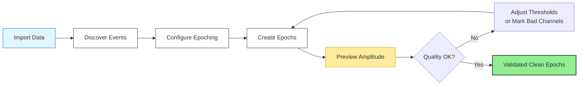

## What is Event Handling?

Event handling refers to the process of working with event markers in your EEG data—the timestamps that mark when stimuli were presented, responses occurred, or experimental conditions changed. In event-related EEG analysis, these markers are essential for segmenting continuous data into meaningful epochs aligned to specific events.

AutoCleanEEG provides intelligent event handling tools that solve two fundamental challenges:

1. **Discovery**: What events exist in my data and how should I configure them?
2. **Quality**: Are my amplitude thresholds appropriate for this dataset?

Traditional approaches require you to write custom code to inspect events, manually configure epoching parameters, and guess at appropriate rejection thresholds. AutoCleanEEG's event handling system does this work for you, providing interpretable feedback and actionable recommendations.

## The Two Core Tools

<CardGroup cols={2}>
<Card title="Event Discovery" icon="magnifying-glass" href="/event-handling/event-discovery">
**Automatically find and configure event markers**

Extracts all events from your data, shows occurrence statistics, and generates ready-to-use configuration examples. No more guessing what event codes exist or how to map them.

**Use when**: Starting with a new dataset, verifying event coding, or setting up epoching for the first time.
</Card>

<Card title="Amplitude Quality Coaching" icon="gauge-high" href="/event-handling/amplitude-quality">
**Get intelligent feedback on epoch rejection**

Analyzes amplitude distributions, detects problematic patterns, and provides specific suggestions for improving data quality. Know whether your thresholds are too strict, too lenient, or just right.

**Use when**: Configuring amplitude rejection, optimizing data retention, or diagnosing quality issues.
</Card>
</CardGroup>

## Why Event Handling Matters

Consider this common scenario: you receive EEG data from a new experiment and need to create epochs. You face immediate questions:

<AccordionGroup>
<Accordion title="What event markers exist in this data?" icon="circle-question">
Without event discovery, you'd write code to inspect `raw.annotations`, note the codes, and manually configure your task. This is tedious and error-prone—especially when codes change across files or formats.

**With event discovery**:
```python
self.print_discovered_events()  # Done.
```

You get a formatted table showing all events, occurrence counts, and ready-to-use configurations. Copy, paste, process.
</Accordion>

<Accordion title="What amplitude threshold should I use?" icon="circle-question">
Literature might say "use 100 µV" but your data might be noisier (developmental populations) or cleaner (well-shielded lab). Guess wrong and you either lose good data or let artifacts through.

**With amplitude coaching**:
- See exactly how your threshold compares to actual amplitude distributions
- Get specific feedback: "Threshold too strict, rejecting 60% of good epochs"
- Receive actionable suggestions: "Mark channels E46, E68 as bad instead of rejecting epochs"
</Accordion>

<Accordion title="How do I know if channels or epochs are the problem?" icon="circle-question">
When amplitude rejection is high, you need to diagnose: are specific channels consistently noisy (bad electrode contact) or are transient artifacts affecting many channels (environmental noise)?

**With amplitude coaching**:
The system automatically identifies channels exceeding thresholds in >20% of epochs (systematic problem → mark as bad) versus occasional exceedances across channels (transient artifacts → epoch rejection is working correctly).
</Accordion>
</AccordionGroup>

## How They Work Together

Event discovery and amplitude coaching form a complete workflow for setting up epoch-based analysis:



**Workflow**:

1. **Discover events** → Know what event markers exist and how to configure them
2. **Configure epoching** → Use discovered events to set up `event_id` mapping
3. **Create epochs** → Run epoching with amplitude rejection
4. **Preview amplitude** → See impact of thresholds *before* committing
5. **Validate or adjust** → If preview shows issues, adjust and retry
6. **Final validation** → Confirm clean epochs meet quality standards

This iterative workflow is built-in—both tools run automatically when you call standard processing methods.

## Automatic Integration

You don't need to remember special commands or write extra code. Event handling tools integrate seamlessly with normal task workflows:

```python
class MMNAnalysis(Task):
    config = {
        "epoch_settings": {
            "enabled": True,
            "value": {
                "tmin": -0.2,
                "tmax": 0.8,
                "reject": {"eeg": 150e-6},
                "event_id": {"standard": 1, "deviant": 2}
            }
        }
    }

    def run(self):
        self.import_raw()
        self.filter_data()

        # Amplitude coaching runs automatically during epoching
        self.create_regular_epochs()
```

During development, add event discovery:

```python
    def run(self):
        self.import_raw()

        # Run once to see what events exist
        self.print_discovered_events()

        self.filter_data()
        self.create_regular_epochs()  # Coaching runs automatically
```

That's it. No special setup, no separate configuration, no extra imports.

## When to Use Each Tool

<Tabs>
<Tab title="Event Discovery">
**Use event discovery when**:

✅ **Starting with new data**: Don't know what event codes exist
✅ **Verifying consistency**: Check that all files use same event coding
✅ **Debugging empty epochs**: Configured `event_id` doesn't match data
✅ **Converting formats**: Event codes may change during conversion
✅ **Documenting protocols**: Generate complete event inventory for methods sections

**Skip event discovery when**:

⏭️ Already know exact event codes (tested on pilot data)
⏭️ Processing batch of files with identical event coding
⏭️ Working with standardized public datasets (codes documented)
</Tab>

<Tab title="Amplitude Coaching">
**Use amplitude coaching when**:

✅ **Setting initial thresholds**: Don't know appropriate values for this dataset
✅ **High rejection rates**: Need to diagnose why many epochs are rejected
✅ **New population**: Switching from adults to children/infants (different noise levels)
✅ **Quality troubleshooting**: Data seems noisy, not sure if channels or epochs are the issue
✅ **Optimizing retention**: Want to keep as many epochs as possible while maintaining quality

**Coaching runs automatically**, but you can ignore output when:

⏭️ Production batch processing (output just informational)
⏭️ Thresholds well-established from pilot data
⏭️ Using automated methods like AutoReject (handles thresholds automatically)
</Tab>
</Tabs>

## Real-World Examples

### Example 1: New MMN Dataset

**Scenario**: Received EEG data from mismatch negativity (MMN) study. Need to set up epoching.

**Workflow**:
```python
class ExploreMM (Task):
    def run(self):
        self.import_raw()
        print("\n🔍 What events exist in this data?")
        self.print_discovered_events()
```

**Output shows**:
```
Event Name          Code    Count    % of Total
────────────────────────────────────────────────
Standard            1       1600     80.0%
Deviant             2       400      20.0%
```

**Next steps**:
1. Copy configuration from output
2. Add to task file
3. Process with amplitude coaching to verify quality

### Example 2: High Rejection Rate

**Scenario**: Processing infant data, 55% of epochs rejected—need to diagnose.

**Workflow**:
```python
class DiagnoseQuality(Task):
    config = {
        "epoch_settings": {
            "enabled": True,
            "value": {"reject": {"eeg": 150e-6}}  # Initial guess
        }
    }

    def run(self):
        self.import_raw()
        self.filter_data()
        self.create_regular_epochs()  # Coaching runs, shows preview
```

**Preview output shows**:
```
⚠️ Channels exceeding threshold in >20% of epochs:
  • E17: 62.1% of epochs
  • E126: 58.3% of epochs
  • E127: 51.7% of epochs

💡 Suggestion: Mark these as bad channels
```

**Solution**:
```python
config = {
    "bad_channels_manual": {"enabled": True, "value": ["E17", "E126", "E127"]},
    "epoch_settings": {"enabled": True, "value": {"reject": {"eeg": 150e-6}}}
}
```

**Reprocess** → Validation shows 88% retention with clean data.

### Example 3: Cross-Site Data

**Scenario**: Processing data from multiple sites, need to verify event coding consistency.

**Workflow**:
```python
class VerifyEvents(Task):
    def run(self):
        self.import_raw()
        print(f"\nSite: {self.config['unprocessed_file'].parent.name}")
        self.print_discovered_events()
```

Run on one file from each site, compare outputs. If event codes differ, need site-specific configurations.

## Design Philosophy

These tools follow AutoCleanEEG's core principles:

**1. Interpretable, Not Magical**

The tools don't make decisions for you—they provide clear information so *you* can make informed decisions. You see exactly what's happening and why.

**2. Actionable Feedback**

Feedback isn't just descriptive ("high rejection rate")—it's prescriptive ("mark channels E46, E68 as bad channels"). You know what to do next.

**3. Zero Extra Code**

Event handling integrates seamlessly into your existing workflow. No need to remember special commands or write auxiliary scripts.

**4. Fail-Safe Defaults**

If you ignore event handling tools entirely, your pipeline still works. They enhance the process but aren't mandatory dependencies.

## Comparison with Traditional Approaches

<Tabs>
<Tab title="AutoCleanEEG Event Handling">
**Built-in, interpretable, actionable**

```python
# Event discovery
self.print_discovered_events()

# Amplitude coaching (automatic)
self.create_regular_epochs()
```

**Time to configure epochs**: 30 seconds
**Understanding of data quality**: High
**Required expertise**: Minimal

Provides specific recommendations, runs automatically, zero boilerplate.
</Tab>

<Tab title="Manual Event Inspection">
**Custom code for each dataset**

```python
# Inspect events
events, event_id = mne.events_from_annotations(raw)
unique, counts = np.unique(events[:, 2], return_counts=True)
for code, count in zip(unique, counts):
    print(f"{code}: {count}")

# Check amplitudes
epochs = mne.Epochs(raw, events, reject={'eeg': 100e-6})
amp_data = np.ptp(epochs.get_data(), axis=-1)
print(f"Mean amplitude: {amp_data.mean()}")

# Identify bad channels manually
# ... more custom code ...
```

**Time to configure epochs**: 15-30 minutes
**Understanding of data quality**: Variable (depends on analysis)
**Required expertise**: Moderate-high

Flexible but time-consuming, easy to miss patterns, requires MNE/NumPy knowledge.
</Tab>

<Tab title="Automated Tools (AutoReject, etc.)">
**Data-driven optimization**

```python
from autoreject import AutoReject
ar = AutoReject()
epochs_clean = ar.fit_transform(epochs)
```

**Time to configure epochs**: Automated (but slow)
**Understanding of data quality**: Limited (black box)
**Required expertise**: Low

Optimizes automatically but opaque process, doesn't explain decisions, slower computation.
</Tab>
</Tabs>

AutoCleanEEG event handling sits in the sweet spot: faster than manual inspection, more interpretable than full automation.

## Best Practices

**1. Use event discovery for every new dataset**

Even if you "know" the event codes, verify with discovery. File format conversions, system updates, or protocol changes can alter coding unexpectedly.

**2. Keep discovery calls during development**

Leave `print_discovered_events()` in your task file, commented out:

```python
def run(self):
    self.import_raw()
    # self.print_discovered_events()  # Uncomment for new data
    self.filter_data()
    self.create_regular_epochs()
```

**3. Document coaching-informed decisions**

When coaching suggests changes, document why in your config:

```python
config = {
    "bad_channels_manual": {
        "enabled": True,
        "value": ["E17", "E126", "E127"]  # Coaching identified persistent high amplitude
    }
}
```

**4. Save coaching output for QA documentation**

The preview/validation reports document your quality control process. Consider saving for methods sections or QA reviews.

**5. Use preview mode to experiment**

Since preview shows impact *before* committing, try different threshold values:

1. Start conservative (100 µV)
2. Check preview feedback
3. Adjust based on suggestions
4. Iterate until validation confirms good quality

## What's Next?

Ready to use event handling in your analysis?

<CardGroup cols={2}>
<Card title="Event Discovery Guide" icon="magnifying-glass" href="/event-handling/event-discovery">
Learn how to discover events, configure epoching, and handle different event formats
</Card>

<Card title="Amplitude Quality Guide" icon="gauge-high" href="/event-handling/amplitude-quality">
Understand amplitude coaching, interpret feedback, and optimize rejection thresholds
</Card>

<Card title="Epoching Reference" icon="book" href="/pipeline-steps/steps">
Complete reference for epoch creation methods and configuration options
</Card>

<Card title="Task Customization" icon="code" href="/tasks/task-customization">
Advanced epoching strategies and custom rejection criteria
</Card>
</CardGroup>

---

**Key Takeaway**: Event handling transforms the tedious, error-prone process of configuring event-related analysis into a guided, interpretable workflow. By automatically discovering events and coaching you on quality thresholds, AutoCleanEEG helps you set up robust epoching quickly and confidently.
