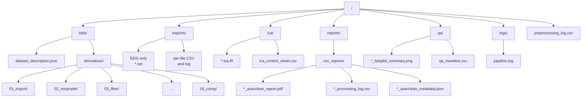

## Overview

Each processing task writes to a self‑contained folder. AutoCleanEEG separates the strict BIDS tree (for input/derivatives) from task‑root convenience folders (for final deliverables, logs, and QA).

### Diagram (Mermaid)



```
<task>/
  bids/
    dataset_description.json
    derivatives/
      dataset_description.json
      01_import/
      02_resample/
      03_filter/
      ...
      16_comp/

  exports/                  # EEG‑only final datasets + convenience copies
    <basename>_comp_epo.set
    <basename>_processing_log.csv
    <basename>_processing.log

  ica/                      # ICA artifacts + control sheet
    <basename>-ica.fif
    ica_control_sheet.csv

  logs/
    pipeline.log            # Single consolidated log per task

  qa/                       # QA summary images + manifest
    <basename>_fastplot_summary.png
    qa_manifest.csv         # image, source_file, qa_status, timestamp

  reports/
    run_reports/
      <basename>_autoclean_report.pdf
      <basename>_processing_log.csv
      <basename>_autoclean_metadata.json

  preprocessing_log.csv     # Combined task‑level processing log (no task prefix)
```

### BIDS and Derivatives

- `bids/` holds the raw‑like inputs following BIDS conventions.
- `bids/derivatives/` holds numbered stage folders (e.g., `01_import/` … `16_comp/`). These are stepwise artifacts, not final deliverables.
- Both `bids/dataset_description.json` and `bids/derivatives/dataset_description.json` are produced. AutoCleanEEG amends the dataset description to set `Name` to the task and add `GeneratedBy` for `autocleaneeg-pipeline`.

### Exports (Final Deliverables)

- The task‑root `exports/` folder contains **EEG‑only** EEGLAB `.set` files derived from the last stage, plus convenience copies of the per‑file processing CSV and run log.
- Fastplot QA visualizations are generated from these exported `.set` files to ensure alignment with the final deliverables.

### Logs and Reports

- `logs/pipeline.log` is a single append‑only log for the task.
- Per‑file reports are stored in `reports/run_reports/` and include `*_autoclean_report.pdf`, the per‑file `*_processing_log.csv`, and the `*_autoclean_metadata.json` JSON summary.
- A combined task‑level log is written to `<task>/preprocessing_log.csv`.

### QA and ICA

- `qa/` contains fastplot summary images (`*_fastplot_summary.png`) and `qa_manifest.csv` with columns: `image`, `source_file`, `qa_status` (defaults to `unverified`), and `timestamp`.
- `ica/` contains exported ICA FIF files and an editable `ica_control_sheet.csv` for reviewing/reapplying components.

## Notes

- Final user deliverables live under `exports/`; intermediate artifacts remain in `bids/derivatives/`.
- The pipeline writes the QA image after exports are created, using exported data only.
- The combined processing log at the task root (`preprocessing_log.csv`) has no task prefix.
- The structure avoids version‑named derivative folders; provenance is captured in `dataset_description.json` and the per‑run JSONs in `reports/run_reports/`.
