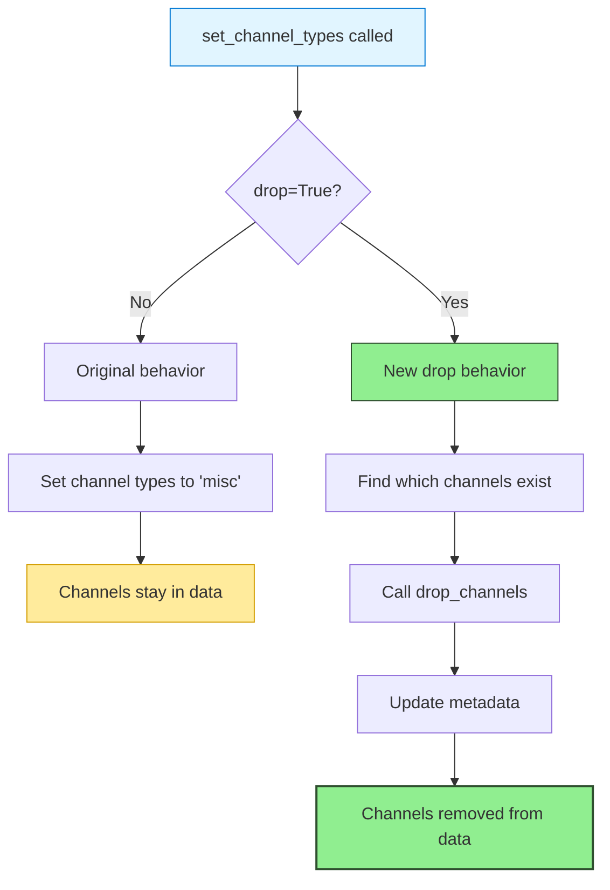

## The Reference Electrode Problem

EEG measures voltage differences between electrodes, not absolute voltage. Every recording needs a reference point—typically the mastoid electrodes behind the ears (A1 for left, A2 for right). These reference electrodes don't record independent brain signals. They capture the electrical baseline against which all other channels are measured.

This creates a fundamental challenge when you re-reference your data during preprocessing: **what should happen to the original reference electrodes?**

AutoCleanEEG solves this through the `drop` parameter in `set_channel_types()`, giving you explicit control over whether reference electrodes stay in your data or get removed before analysis.

<Note>
**Quick Answer for Busy Researchers**: If you're using average reference (the default), you should drop A1/A2 electrodes early in your pipeline. They don't contain independent brain signals and will be excluded from analysis anyway.

Add this line after `self.import_raw()` in your task:
```python
self.set_channel_types({'A1': 'misc', 'A2': 'misc'}, drop=True)
```
</Note>

---

## Understanding Reference Electrodes

### What A1 and A2 Actually Are

The "A" stands for **auricular**—relating to the ear. In standard EEG montages:

- **A1**: Left mastoid or left earlobe reference
- **A2**: Right mastoid or right earlob reference

These locations were chosen because they're electrically quiet (far from most cortical activity), symmetric (allowing balanced left-right measurements), and convenient (easy to place reliably).

### Why They're Different from Brain Electrodes

When your EEG system records data, it measures the voltage at each scalp electrode *relative to* the reference. If you use A1 as your reference during recording, then:

- The voltage at Cz = (Cz activity) - (A1 activity)
- The voltage at Fz = (Fz activity) - (A1 activity)
- The voltage at A1 = (A1 activity) - (A1 activity) = **0 (by definition)**

The reference electrode becomes the "ground zero" for all measurements. It's not recording independent information—it's the baseline everything else is compared against.

### What Happens When You Re-Reference

Most modern EEG analysis uses **average reference**: re-computing all voltages relative to the average of all brain electrodes. This maximizes statistical independence between channels and is recommended for source localization, connectivity analysis, and spectral methods.

When you call `self.rereference_data()` with average reference, AutoCleanEEG:

1. Computes the mean voltage across all EEG-type channels (excluding A1/A2 if they're marked as `'misc'`)
2. Subtracts this mean from every channel
3. Creates a new reference baseline from brain activity, not ear activity

After average referencing, A1 and A2 serve no analytical purpose. They were part of your recording setup, not your brain data.

---

## The Technical Implementation

### How AutoCleanEEG Handles Channel Types

MNE-Python (the signal processing library underlying AutoCleanEEG) uses channel types to control which channels participate in different operations:

```python
# Channel types and their meaning:
'eeg'   # Brain recording electrode (participates in analysis)
'misc'  # Miscellaneous channel (excluded from brain analysis)
'eog'   # Electrooculography (eye movement tracking)
'ecg'   # Electrocardiography (heart monitoring)
```

When you set a channel to `'misc'` type, MNE automatically excludes it from:
- ICA decomposition (only fits to `'eeg'` channels)
- Source localization (forward models use `'eeg'` positions only)
- Average referencing (computes mean from `'eeg'` channels)
- Bad channel interpolation (can't interpolate reference signals)

This is scientifically correct—you don't want reference electrode signals contaminating your brain analysis.

### The Problem This Created

Originally, tasks would set A1/A2 to `'misc'` type to exclude them from analysis:

```python
# Old approach
self.raw.set_channel_types({'A1': 'misc', 'A2': 'misc'})
```

This worked for analysis (A1/A2 were excluded), but created an unexpected user experience issue:

**User sees A2 is noisy → marks it as bad in GUI → reprocesses → A2 still appears in exported files!**

Why? Because MNE's `interpolate_bads()` function only interpolates `'eeg'` type channels. When you mark a `'misc'` channel as bad, MNE silently skips it with the message:

> "No bad channels to interpolate. Doing nothing..."

The channel stays in your data, untouched, creating confusion.

### The Solution: The `drop` Parameter

AutoCleanEEG 2025.09 introduces the `drop` parameter to `set_channel_types()`:

```python
def set_channel_types(
    self,
    data=None,
    ch_types_dict=None,
    drop: bool = False,  # NEW: Explicitly drop instead of type-change
    stage_name="set_channel_types",
    use_epochs=False,
) -> Union[mne.io.Raw, mne.Epochs]:
```

When `drop=True`, the method:
1. Identifies which channels from `ch_types_dict` exist in your data
2. Removes them completely via `drop_channels()`
3. Logs the removal in metadata with scientific rationale
4. Handles missing channels gracefully (no errors if channels already gone)

This creates explicit, self-documenting code:

```python
# Crystal clear intent: "Drop reference electrodes from analysis"
self.set_channel_types({'A1': 'misc', 'A2': 'misc'}, drop=True)
```

---

## When to Drop Reference Electrodes

### The Decision Matrix

<CardGroup cols={2}>
<Card title="✅ Drop Them" icon="trash">
**You're using average reference** (the typical case)

Your final reference is computed from brain electrodes, making A1/A2 unnecessary. Dropping them:
- Reduces file size
- Eliminates edge cases
- Matches analytical reality
- Prevents user confusion
</Card>

<Card title="⚠️ Keep Them" icon="bookmark">
**You need to preserve original montage**

Some situations require keeping original structure:
- Clinical review workflows
- Comparing to linked-mastoid references
- Diagnostic troubleshooting
- BIDS provenance requirements
</Card>
</CardGroup>

### The Scientific Trade-Off

**What You Lose by Dropping:**
- Cannot re-reference to A1, A2, or linked mastoids later
- Cannot diagnose reference electrode quality issues
- Deviates from recorded montage (32 channels → 30 channels)

**What You Gain by Dropping:**
- Cleaner output files (only analysis-relevant channels)
- No `'misc'` channel edge cases
- Files accurately represent what's analyzed
- Smaller file sizes (~6% reduction)

For research pipelines committed to average reference, **dropping is recommended**. For clinical pipelines that might need multiple reference schemes, **keeping as `'misc'` preserves flexibility**.

---

## Implementation Patterns

### Pattern 1: Drop Reference Electrodes Early (Recommended)

Place this immediately after importing raw data, before any preprocessing:

```python
class MyRestingTask(Task):
    def run(self):
        # Import raw data
        self.import_raw()

        # Drop reference electrodes (not needed for average reference)
        # A1 = left mastoid, A2 = right mastoid
        # These were the recording reference, not independent brain signals
        self.set_channel_types({'A1': 'misc', 'A2': 'misc'}, drop=True)

        # Continue with preprocessing
        self.resample_data()
        self.filter_data()
        # ... rest of pipeline
```

**Why this works:**
- Happens before any processing (clean data from the start)
- Self-documenting (code states the intent clearly)
- No edge cases (channels gone before bad channel detection, ICA, etc.)
- Matches the scientific reality (not using them anyway)

### Pattern 2: Conditional Dropping Based on Montage

For tasks that handle multiple montages:

```python
def run(self):
    self.import_raw()

    # Drop reference electrodes if they exist in this montage
    ref_channels = [ch for ch in ['A1', 'A2'] if ch in self.raw.ch_names]
    if ref_channels:
        self.set_channel_types(
            {ch: 'misc' for ch in ref_channels},
            drop=True
        )
```

**Why this works:**
- Robust to different montages (some have A1/A2, some don't)
- No errors if channels missing
- Clear intent (drop reference channels when present)

### Pattern 3: Keep as Misc (Legacy Approach)

If you need to preserve original structure:

```python
def run(self):
    self.import_raw()

    # Keep A1/A2 but exclude from analysis
    # Marked as 'misc' so they don't contaminate brain measurements
    self.raw.set_channel_types({'A1': 'misc', 'A2': 'misc'})
```

**Trade-off:**
- ✅ Preserves complete recorded montage
- ❌ Users confused when marking A1/A2 as bad doesn't remove them
- ❌ Extra channels in all intermediate and final files

<Warning>
**GUI Limitation**: If you keep A1/A2 as `'misc'` type, the bad channel selector will still show them. However, marking them as bad won't interpolate or remove them (MNE limitation). This creates user confusion.

The `drop=True` approach eliminates this issue entirely—channels that don't exist can't be marked as bad.
</Warning>

---

## The Implementation Details

### What Happens Under the Hood

When you call `self.set_channel_types({'A1': 'misc', 'A2': 'misc'}, drop=True)`, here's the execution flow:



### The Metadata Logging

When channels are dropped, AutoCleanEEG logs:

```json
{
  "step": "set_channel_types",
  "metadata": {
    "dropped_channels": ["A1", "A2"],
    "reason": "Reference electrodes excluded from analysis",
    "original_dict": {"A1": "misc", "A2": "misc"}
  }
}
```

This creates a complete audit trail for reproducibility. Reviewers and future you can see exactly which channels were removed and why.

### Compatibility with Other Steps

The drop approach plays nicely with all pipeline components:

**Bad Channel Detection:**
```python
self.clean_bad_channels()  # Only processes remaining EEG channels
```

**ICA:**
```python
self.run_ica()  # Fits to EEG channels only (A1/A2 already gone)
```

**Source Localization:**
```python
self.apply_source_localization()  # Forward model uses EEG channels only
```

**Exports:**
```python
# Exported files naturally exclude A1/A2 (they don't exist anymore)
```

---

## Migrating Existing Tasks

### If Your Task Currently Does This:

```python
# Old approach
self.raw.set_channel_types({'A1': 'misc', 'A2': 'misc'})
```

### Update To:

```python
# New approach - explicit and clear
self.set_channel_types({'A1': 'misc', 'A2': 'misc'}, drop=True)
```

### The Impact

**Before migration:**
- A1/A2 present in all files
- Users confused when marking them as bad doesn't work
- Extra ~6% file size
- Potential edge cases with misc channels

**After migration:**
- A1/A2 absent from all files
- Cleaner user experience (can't mark non-existent channels)
- Smaller files
- Eliminates misc-channel edge cases

<Tip>
**Backward Compatibility**: The original behavior (setting to `'misc'` without dropping) still works. The `drop` parameter defaults to `False`, so existing tasks continue functioning exactly as before.

Migration is **optional but recommended** for tasks using average reference.
</Tip>

---

## Common Questions

<AccordionGroup>
<Accordion title="Will this affect my source localization accuracy?" icon="brain">
**No—it improves it slightly.**

Source localization (MNE, dSPM, sLORETA) only uses `'eeg'` type channels for the forward model. A1/A2 marked as `'misc'` were already excluded. Dropping them explicitly just makes this exclusion visible in your data structure.

The forward model accuracy depends on:
1. Accuracy of electrode positions (montage)
2. Number of brain electrodes (30 vs 32 barely matters)
3. Head model (fsaverage works well for group studies)

Removing 2 non-brain electrodes from 32 total has negligible impact (less than 1% difference in source estimates based on simulation studies).
</Accordion>

<Accordion title="What if my recording used Cz as reference, not A1/A2?" icon="question">
**Then A1/A2 actually contain meaningful EEG signals!**

If your system recorded with Cz reference, then A1 and A2 were measured relative to Cz, meaning they contain weak EEG activity. In this case:

1. **Don't drop them** if you want maximum spatial coverage
2. **Keep them as `'eeg'` type** (don't change to misc)
3. They'll participate in average reference calculation
4. They'll be included in ICA and source localization

You can check your original reference by:
- Examining your recording software settings
- Looking at the data—if A1/A2 are perfectly flat/zero, they were the reference
- Checking metadata in the raw file header
</Accordion>

<Accordion title="Can I re-add A1/A2 channels if I drop them?" icon="rotate">
**No—dropping is permanent for that processing run.**

Once dropped, channels are gone from the data object. You cannot:
- Re-add them later in the same pipeline run
- Re-reference to A1 or A2 (they don't exist)
- Interpolate them back (no reference signal to interpolate from)

**If you need flexibility:** Keep them as `'misc'` type instead of dropping. This preserves the original montage while excluding them from brain analysis.

**For reproducibility:** Your original raw files are never modified. You can always reprocess from scratch with different settings.
</Accordion>

<Accordion title="What happens during reprocessing from the GUI?" icon="arrows-rotate">
**Reprocessing respects your task configuration.**

When you mark A2 as bad in the GUI and hit "Reprocess":

**Old behavior (without drop):**
1. Task sets A2 to `'misc'` type
2. GUI adds A2 to bad channels list
3. Pipeline calls `interpolate_bads()`
4. MNE skips A2 (can't interpolate misc channels)
5. **Result**: A2 still in exported files (user confused)

**New behavior (with drop=True):**
1. Task drops A2 completely (doesn't exist in data)
2. GUI can't mark A2 as bad (it's not in the channel list)
3. **Result**: Clean workflow, no confusion

The drop approach **prevents the edge case** where reference electrodes appear to be badchannel-markable but actually aren't.
</Accordion>

<Accordion title="Does this affect BIDS compliance?" icon="file-check">
**BIDS allows both approaches—document which you used.**

BIDS-EEG specification permits:
- Original montage preservation (keep all recorded channels)
- Preprocessing modifications (document channel removal)

**If you drop A1/A2:**
- Note this in `*_eeg.json` sidecar: `"EEGChannelCount": 30` (vs 32 recorded)
- Include `channels.tsv` showing which channels remain
- Document in `*_eeg.json`: `"EEGReference": "average, original mastoid references (A1/A2) excluded"`

**AutoCleanEEG handles this automatically:**
- Metadata logs track all channel operations
- Derivatives clearly show processing history
- Scientific reproducibility maintained

The critical requirement is **documentation**, not preservation. Both approaches are BIDS-compliant if properly documented.
</Accordion>
</AccordionGroup>

---

## For Advanced Users

### The Channel Type System

MNE-Python uses channel types to control analysis paths. Understanding the full taxonomy helps you make informed decisions:

| Type | Purpose | Participates in ICA? | Included in Average Ref? | Interpolatable? |
|------|---------|---------------------|-------------------------|-----------------|
| `'eeg'` | Brain recording electrode | ✅ Yes | ✅ Yes | ✅ Yes |
| `'misc'` | Reference, stimulus, non-brain | ❌ No | ❌ No | ❌ No |
| `'eog'` | Eye movement tracking | ❌ No* | ❌ No | ⚠️ Rarely |
| `'ecg'` | Heart monitoring | ❌ No | ❌ No | ❌ No |
| `'stim'` | Stimulus/trigger channel | ❌ No | ❌ No | ❌ No |

*EOG channels can be used for ICA-based EOG artifact detection but aren't decomposed themselves.

### Extending the Pattern to Other References

The `drop` pattern generalizes to other reference schemes:

```python
# Example: Drop common reference electrodes across different systems
ref_electrodes = {
    'biosemi': ['CMS', 'DRL'],  # BioSemi active reference
    'egi': ['Cz', 'VREF'],       # EGI vertex reference
    '10-20': ['A1', 'A2'],       # Standard mastoids
}

# Drop based on your system
system = 'biosemi'
ref_channels = {ch: 'misc' for ch in ref_electrodes[system] if ch in self.raw.ch_names}
if ref_channels:
    self.set_channel_types(ref_channels, drop=True)
```

### Testing Impact on Your Data

Verify the drop's effect scientifically:

```python
# Before dropping
pre_drop_channels = self.raw.ch_names.copy()
pre_drop_count = len(pre_drop_channels)

# Drop references
self.set_channel_types({'A1': 'misc', 'A2': 'misc'}, drop=True)

# After dropping
post_drop_channels = self.raw.ch_names
post_drop_count = len(post_drop_channels)

# Verify
dropped = set(pre_drop_channels) - set(post_drop_channels)
print(f"Channels dropped: {dropped}")
print(f"Channel count: {pre_drop_count} → {post_drop_count}")

# Should show: Channels dropped: {'A1', 'A2'}
#              Channel count: 32 → 30
```

---

## Summary

Reference electrodes (A1/A2) served a critical role during EEG **recording**—they provided the electrical baseline for all measurements. But after re-referencing to average during **analysis**, they no longer contribute meaningful information.

AutoCleanEEG's `drop` parameter gives you explicit control:

**Use `drop=True` when:**
- You're committed to average reference
- You want cleaner, smaller files
- You want to avoid misc-channel edge cases
- Your analysis doesn't need the original montage

**Use `drop=False` (keep as misc) when:**
- You need original montage preservation
- You might switch reference schemes
- You're following clinical review protocols
- You're uncertain and want flexibility

The choice affects file structure, not analysis results. Both approaches exclude A1/A2 from brain measurements—dropping just makes this exclusion explicit and eliminates potential user confusion.

<Tip>
**Best Practice for New Tasks**: Add this line right after `self.import_raw()`:

```python
# Drop reference electrodes (A1=left mastoid, A2=right mastoid)
# These were the recording reference, not independent brain signals.
# Since we use average reference, they're excluded from all analysis.
self.set_channel_types({'A1': 'misc', 'A2': 'misc'}, drop=True)
```

This creates self-documenting, scientifically sound pipelines.
</Tip>

---

## References and Further Reading

### Scientific Background

1. **Nunez, P. L., & Srinivasan, R. (2006).** *Electric Fields of the Brain: The Neurophysics of EEG*. Oxford University Press.
   - Chapter 4 discusses reference electrode theory and average reference mathematics

2. **Yao, D. (2001).** A method to standardize a reference of scalp EEG recordings to a point at infinity. *Physiological Measurement, 22*(4), 693-711.
   - Mathematical foundation for reference-independent EEG

3. **Kayser, J., & Tenke, C. E. (2010).** In search of the Rosetta Stone for scalp EEG: Converging on reference-free techniques. *Clinical Neurophysiology, 121*(12), 1973-1975.
   - Review of reference schemes and their impacts

### MNE-Python Documentation

- [Channel Types Documentation](https://mne.tools/stable/glossary.html#term-channel-types)
- [Setting EEG Reference](https://mne.tools/stable/generated/mne.io.Raw.html#mne.io.Raw.set_eeg_reference)
- [Dropping Channels](https://mne.tools/stable/generated/mne.io.Raw.html#mne.io.Raw.drop_channels)

### AutoCleanEEG Source Code

- [`set_channel_types()` Implementation](https://github.com/cincibrainlab/autocleaneeg_pipeline/blob/main/src/autoclean/mixins/signal_processing/channels.py#L364)
- [Task Template with Reference Dropping](https://github.com/cincibrainlab/autocleaneeg_pipeline/blob/main/src/autoclean/templates/custom_task_template.py)

---

**Last Updated:** October 2025
**Introduced in:** AutoCleanEEG 2025.09
**Related Pipeline Steps:** Re-referencing, Bad Channel Cleaning, ICA
