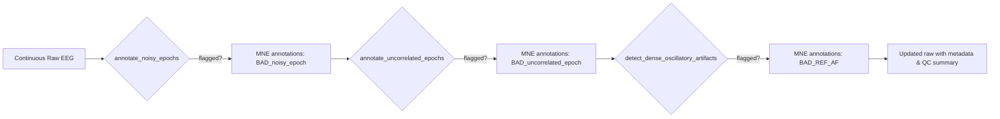

import { Callout, Cards, Steps, Tabs, Table } from 'nextra/components';

# Segment Rejection Artifact Detection Peer Review

<Callout type="info">
This peer-review walk-through inspects the three artifact cleaning steps that run in our baseline EEG tasks: `annotate_noisy_epochs`, `annotate_uncorrelated_epochs`, and `detect_dense_oscillatory_artifacts`. The goal is to document how each routine behaves, highlight correctness and maintainability findings, and capture practical guidance for operators who must justify these detections to stakeholders.【F:src/autoclean/mixins/signal_processing/segment_rejection.py†L20-L204】【F:src/autoclean/functions/segment_rejection/dense_oscillatory.py†L13-L200】
</Callout>

## Segment Rejection Overview

The segment rejection mixin executes three denoising routines in sequence to protect downstream feature extraction and QC dashboards. Together they:

- Epoch continuous raw EEG into fixed windows shared by all detectors
- Annotate noisy amplitude dispersion, spatially incoherent segments, and dense oscillatory bursts
- Persist artifact metadata so reviewers can reconcile automatic flags with technician notes

### Baseline flow

## Epoch Denoising Bundle

The following sections drill into the three routines that share the epoching scaffold. Treat them as a bundle: tuning one detector’s window or pick set usually means re-validating the others on the same segmentation.

<Callout type="warning">
Verify that recording spans cover the chosen epoch durations and that montages load correctly before scheduling batch jobs. When prerequisites fail, the mixin aborts early and silently returns a copy of the input raw object.【F:src/autoclean/mixins/signal_processing/segment_rejection.py†L98-L155】【F:src/autoclean/mixins/signal_processing/segment_rejection.py†L284-L347】
</Callout>

### Step-by-step reasoning

<Steps>

### 1. `annotate_noisy_epochs`: amplitude dispersion sweep

- **Mechanics** – The routine epochs the raw stream, converts the result into an `xarray` tensor, and measures per-channel standard deviations per epoch. Epochs are flagged when more than `quantile_flag_crit` of picked channels exceed an interquartile-range (IQR) outlier fence scaled by `quantile_k`.【F:src/autoclean/mixins/signal_processing/segment_rejection.py†L98-L155】
- **Annotation write-back** – Flagged epochs become `BAD_noisy_epoch` annotations with durations equal to the epoch window. Onsets subtract `raw.first_samp/sfreq`, matching MNE’s expectation when the original recording started before the current buffer.【F:src/autoclean/mixins/signal_processing/segment_rejection.py†L160-L203】
- **Code review callouts**
  - ✅ *Strength*: relies on channel-wise statistics so low-SNR channels cannot dominate the metric.【F:src/autoclean/mixins/signal_processing/segment_rejection.py†L139-L155】
  - ⚠️ *Concern*: the IQR fence only checks high variance (`init_dir="pos"`). Extremely flat-lined channels will not be caught even though they are undesirable for evoked analyses. Consider adding `init_dir="both"` or a secondary detector for low variance epochs.
  - ⚠️ *Concern*: The onset correction assumes `raw.annotations.orig_time` is valid. Import pipelines that drop measurement metadata may produce misaligned annotations. Documented in Notes but not enforced; we could warn when `orig_time is None`.

<Table>
  <thead>
    <tr><th>Parameter</th><th>Default</th><th>Reviewer guidance</th></tr>
  </thead>
  <tbody>
    <tr><td>`epoch_duration`</td><td>2.0 s</td><td>Shorten (1.0 s) for tasks with rapid transients; keep ≥2 s for resting eyes closed to stabilize variance estimates.</td></tr>
    <tr><td>`quantile_k`</td><td>3.0</td><td>Lower to 2.5 when chasing subtle broadband bursts; raise to 4.0 for pediatric recordings with higher baseline variance.</td></tr>
    <tr><td>`quantile_flag_crit`</td><td>0.2</td><td>Tune between 0.1-0.3 depending on channel density. Avoid >0.3 or the detector will miss global glitches.</td></tr>
  </tbody>
</Table>

### 2. `annotate_uncorrelated_epochs`: spatial coherence monitor

- **Mechanics** – After epoching, the mixin computes pairwise Euclidean distances from the montage and gathers the `n_nearest_neighbors` per channel. It aggregates neighbor correlations per epoch (max/mean/trimmed-mean) and flags epochs where too many channels fall below the IQR-based low-correlation fence (`init_dir="neg"`).【F:src/autoclean/mixins/signal_processing/segment_rejection.py†L301-L343】【F:src/autoclean/mixins/signal_processing/segment_rejection.py†L493-L518】
- **Annotation write-back** – Onsets correct for `first_samp` offsets before saving `BAD_uncorrelated_epoch` spans, followed by metadata updates for downstream reporting.【F:src/autoclean/mixins/signal_processing/segment_rejection.py†L349-L384】
- **Code review callouts**
  - ✅ *Strength*: explicit montage check prevents correlation math without spatial context, failing fast with a clear error message.【F:src/autoclean/mixins/signal_processing/segment_rejection.py†L319-L323】
  - ⚠️ *Concern*: `_chan_neighbour_r` recomputes the full distance matrix every call. For high-density nets, caching channel geometry could reduce quadratic costs.
  - ⚠️ *Concern*: The trim-mean branch relies on SciPy’s `trim_mean`, but upper-bound validation for `corr_trim_percent` happens in wrapper functions, not here. Future refactors should consolidate parameter checks.

<Table>
  <thead>
    <tr><th>Parameter</th><th>Default</th><th>Reviewer guidance</th></tr>
  </thead>
  <tbody>
    <tr><td>`n_nearest_neighbors`</td><td>5</td><td>Increase to 8–10 for dense caps (128 ch) to stabilize averages; reduce to 3 when only midline electrodes exist.</td></tr>
    <tr><td>`corr_method`</td><td>`"max"`</td><td>`"max"` resists polarity flips but exaggerates lucky pairs. Prefer `"trimmean"` when expecting distributed synchrony drops.</td></tr>
    <tr><td>`outlier_flag_crit`</td><td>0.2</td><td>Lower (0.1) when drift-induced dropouts are critical; raise (0.3) to avoid overflagging in mobile recordings.</td></tr>
  </tbody>
</Table>

### 3. `detect_dense_oscillatory_artifacts`: reference artifact tracer

- **Mechanics** – Slides a fixed window (default 100 ms) without overlap, counts channels whose peak-to-peak amplitudes exceed `channel_threshold_uv`, and annotates padded spans when `min_channels` channels are involved. Padding protects against fencepost errors around the oscillatory burst.【F:src/autoclean/functions/segment_rejection/dense_oscillatory.py†L141-L198】
- **Code review callouts**
  - ✅ *Strength*: defensive input validation catches negative durations, thresholds, and ensures an MNE Raw object before any heavy computation.【F:src/autoclean/functions/segment_rejection/dense_oscillatory.py†L123-L139】
  - ⚠️ *Concern*: The stride equals the window size (`range(0, n_samples - window_size, window_size)`), so artifacts shorter than the window or straddling boundaries may be missed. Consider an overlap factor or half-window hop.
  - ⚠️ *Concern*: Multiple consecutive windows append overlapping annotations rather than merging. Downstream duration reports may double-count unless annotations are consolidated.
  - ⚠️ *Concern*: Default `min_channels=75` exceeds electrode counts for 64-channel systems. Users must override or risk silent failure to flag genuine events.

<Table>
  <thead>
    <tr><th>Parameter</th><th>Default</th><th>Reviewer guidance</th></tr>
  </thead>
  <tbody>
    <tr><td>`window_size_ms`</td><td>100</td><td>Use 50–75 ms for muscle bursts, ≥150 ms for low-frequency reference oscillations.</td></tr>
    <tr><td>`channel_threshold_uv`</td><td>45</td><td>Drop to 30 µV on already high-pass filtered data; increase to 70 µV if mains interference remains.</td></tr>
    <tr><td>`min_channels`</td><td>75</td><td>Scale to ~60 % of available channels; adjust automatically in templates to avoid mismatch.</td></tr>
    <tr><td>`padding_ms`</td><td>500</td><td>Shorten to 200 ms when preserving adjacent ERPs, extend to 800 ms when dealing with ringing artifacts.</td></tr>
  </tbody>
</Table>

</Steps>

### Validation checklist

<Tabs items={['Unit tests', 'Manual validation']}>
  <Tabs.Tab>

  1. Install dev dependencies (`pip install -r requirements-dev.txt`) and run the targeted tests: `pytest tests/functions/test_segment_rejection.py -k "dense or noisy or uncorrelated"`. The suite mocks MNE objects to ensure parameter validation and annotation writes behave as expected.【1460db†L1-L219】
  2. For integration confidence, execute `pytest tests/functions/test_segment_rejection.py::TestDetectDenseOscilatoryArtifacts::test_high_amplitude_detection` to confirm high-amplitude bursts trigger annotations with relaxed thresholds.【1460db†L79-L98】

  </Tabs.Tab>
  <Tabs.Tab>

  1. Load a representative Raw file in a notebook, call each method sequentially, and visualize `raw.plot(block=True)` to inspect inserted annotation spans.
  2. Verify metadata updates by inspecting `self.metadata['step_annotate_noisy_epochs']` (and similar keys) after execution; the mixin stores flagged epoch indices for reporting dashboards.【F:src/autoclean/mixins/signal_processing/segment_rejection.py†L195-L203】
  3. For dense oscillations, overlay band-limited RMS traces to ensure the window stride does not miss shorter bursts; adjust `window_size_ms` and rerun if necessary.【F:src/autoclean/functions/segment_rejection/dense_oscillatory.py†L154-L176】

  </Tabs.Tab>
</Tabs>

### Deployment playbooks

<Cards>
  <Cards.Card title="Resting-state QC" icon="🛌">
    Combine noisy and uncorrelated detectors to reject drifts and connector pops before PSD aggregation. Keep `epoch_duration` at 2–4 s for alpha-band stability.【F:src/autoclean/mixins/signal_processing/segment_rejection.py†L20-L384】
  </Cards.Card>
  <Cards.Card title="High-density reference artifact removal" icon="🛰️">
    Use `detect_dense_oscillatory_artifacts` with `min_channels` tuned to ~70 % of electrodes to catch reference wire oscillations prevalent in high-density nets.【F:src/autoclean/functions/segment_rejection/dense_oscillatory.py†L13-L198】
  </Cards.Card>
  <Cards.Card title="Mobile/field EEG triage" icon="🚶">
    Drop `epoch_duration` to 1 s and relax `outlier_flag_crit` to 0.3 to tolerate movement while still catching complete channel dropouts via the correlation monitor.【F:src/autoclean/mixins/signal_processing/segment_rejection.py†L206-L384】
  </Cards.Card>
</Cards>

### Reviewer concerns & follow-up items

<Callout type="warning">
- Introduce optional overlap in the dense oscillatory detector to avoid blind spots; couple with annotation merging to prevent duplicate spans.【F:src/autoclean/functions/segment_rejection/dense_oscillatory.py†L154-L189】
- Evaluate adding a low-variance branch to `annotate_noisy_epochs` so flat-lined electrodes are surfaced for technician review.【F:src/autoclean/mixins/signal_processing/segment_rejection.py†L147-L155】
- Cache montage-derived neighbor indices to reduce the quadratic cost in repeated calls, especially in sliding-window pipelines.【F:src/autoclean/mixins/signal_processing/segment_rejection.py†L493-L518】
</Callout>

<Callout type="success">
Despite the improvement opportunities, the implementations correctly guard against empty epoch sets, preserve original annotation timing, and serialize metadata for reporting dashboards, making them production-ready once the noted edge cases are addressed.【F:src/autoclean/mixins/signal_processing/segment_rejection.py†L98-L203】【F:src/autoclean/mixins/signal_processing/segment_rejection.py†L349-L384】【F:src/autoclean/functions/segment_rejection/dense_oscillatory.py†L180-L198】
</Callout>
