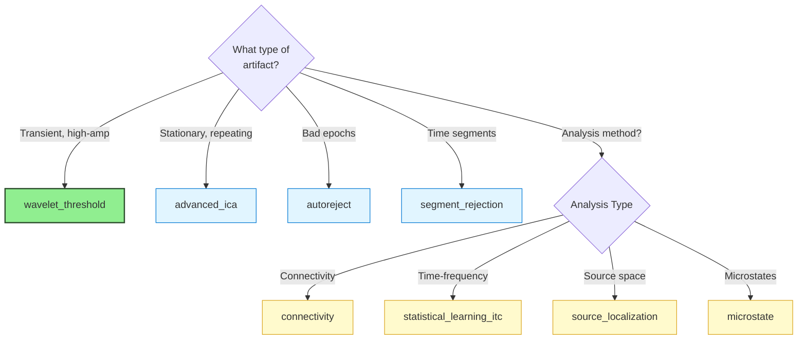

## Currently Available ✅

### Signal Processing Blocks

<Card title="wavelet_threshold" icon="wave-square" href="/processing-blocks/wavelet-threshold/overview">
  **Wavelet-based artifact removal using discrete wavelet transform**

  <Accordion title="Details" icon="info">
  **Version**: 1.0.0 (Stable)

  **Category**: Signal Processing

  **Purpose**: Remove transient high-amplitude artifacts (eye blinks, muscle twitches, electrode pops) while preserving underlying neural signals

  **Best For**:
  - Developmental/pediatric EEG with high artifact rates
  - Transient artifact removal
  - Fast preprocessing pipelines
  - Complementing ICA

  **Limitations**:
  - Less effective for stationary artifacts (use ICA)
  - Requires pre-filtering for best results

  **Scientific References**:
  - Donoho & Johnstone (1994) - Universal thresholding theory
  - Gabard-Durnam et al. (2018) - HAPPE pipeline
  - [DOI: 10.1093/biomet/81.3.425](https://doi.org/10.1093/biomet/81.3.425)

  **Example Tasks**:
  - `WaveletBlock_Test` - Test task with comprehensive reporting
  - `RestingState_WaveletDemo` - Resting-state demo
  - `RestingState_WaveletOnly` - Wavelet-only pipeline (no ICA)

  **Configuration Example**:
  ```python
  "wavelet_threshold": {
      "enabled": True,
      "value": {
          "wavelet": "sym4",
          "level": 5,
          "threshold_mode": "soft",
          "threshold_scale": 1.0,
      }
  }
  ```

  **Method Call**: `self.apply_wavelet_threshold()`

  **Output**:
  - Denoised EEG data
  - PDF report with before/after comparisons
  - Processing metadata
  </Accordion>
</Card>

---

## Coming Soon 🔄

### Priority 1: High-Impact Blocks (Q1 2026)

<AccordionGroup>
<Accordion title="advanced_ica - Enhanced ICA Methods" icon="brain">
**Multiple ICA algorithms with automated selection** (estimated 740 lines)

**Status**: Planned | **Priority**: ⭐⭐⭐⭐⭐

**Purpose**: Extend ICA capabilities with multiple algorithms, automatic selection, and enhanced convergence diagnostics

**Features**:
- **Algorithms**: Infomax, FastICA, Picard, Extended Infomax, AMICA
- **Auto-selection**: Choose best algorithm based on data characteristics
- **Convergence diagnostics**: Real-time monitoring and validation
- **Component classification**: Multiple methods (ICLabel, ICVision, MARA)
- **Batch processing**: Optimized for large datasets

**Use Cases**:
- Complex artifact patterns requiring specific ICA algorithms
- Comparative ICA studies
- Datasets where FastICA underperforms
- Research requiring reproducible ICA with controlled initialization

**Scientific References**:
- Bell & Sejnowski (1995) - Infomax
- Hyvärinen (1999) - FastICA
- Ablin et al. (2018) - Picard
- Palmer et al. (2011) - AMICA

**Planned Timeline**: Q1 2026
</Accordion>

<Accordion title="autoreject - Data-Driven Epoch Rejection" icon="filter">
**Automated bad epoch and channel detection** (estimated 315 lines)

**Status**: Planned | **Priority**: ⭐⭐⭐⭐

**Purpose**: Objective, data-driven rejection of bad epochs and channels using cross-validation

**Features**:
- **Cross-validation based**: Learns optimal thresholds from data
- **Local vs. global rejection**: Channel-specific or epoch-wide decisions
- **Interpolation decisions**: Automatic bad channel interpolation
- **Transparent criteria**: Explainable rejection decisions
- **Integration with MNE**: Leverages `autoreject` Python package

**Use Cases**:
- Objective quality control without manual inspection
- Large-scale batch processing
- Reproducible rejection criteria
- Developmental data with variable quality

**Scientific References**:
- Jas et al. (2017) - AutoReject method
- [DOI: 10.1016/j.neuroimage.2017.06.030](https://doi.org/10.1016/j.neuroimage.2017.06.030)

**Planned Timeline**: Q1 2026
</Accordion>
</AccordionGroup>

### Priority 2: Specialized Blocks (Q2 2026)

<AccordionGroup>
<Accordion title="statistical_learning_itc - ITC/ERSP Analysis" icon="chart-line">
**Advanced time-frequency decomposition for statistical learning** (estimated 812 lines)

**Status**: Planned | **Priority**: ⭐⭐⭐⭐

**Purpose**: Inter-trial coherence (ITC) and event-related spectral perturbation (ERSP) for auditory statistical learning paradigms

**Features**:
- **ITC calculation**: Phase consistency across trials
- **ERSP analysis**: Time-frequency power changes
- **Statistical learning specific**: Optimized for oddball/deviant detection
- **Phase-amplitude coupling**: Cross-frequency interactions
- **Visualization suite**: Comprehensive time-frequency plots

**Use Cases**:
- Auditory oddball paradigms
- Statistical learning studies
- MMN/P300 analysis
- Frequency-specific ERP analysis

**Scientific References**:
- Makeig et al. (2004) - ERSP/ITC methods
- Delorme & Makeig (2004) - EEGLAB implementation

**Planned Timeline**: Q2 2026
</Accordion>

<Accordion title="segment_rejection - Correlation-Based Rejection" icon="trash">
**Segment rejection using correlation-based metrics** (estimated 735 lines)

**Status**: Planned | **Priority**: ⭐⭐⭐⭐

**Purpose**: Identify and reject bad segments using temporal correlation and statistical outlier detection

**Features**:
- **Correlation metrics**: Cross-channel consistency analysis
- **Sliding window**: Adaptive segment-wise evaluation
- **Outlier detection**: Statistical thresholding
- **Rodent EEG optimized**: Designed for preclinical recordings
- **Flexible rejection**: Keep/interpolate/reject decisions

**Use Cases**:
- Rodent/mouse EEG data
- Data with variable quality across time
- Movement artifact detection
- Automated quality control

**Planned Timeline**: Q2 2026
</Accordion>

<Accordion title="connectivity - Functional Connectivity Measures" icon="diagram-project">
**Network analysis and connectivity metrics**

**Status**: Planned | **Priority**: ⭐⭐⭐

**Purpose**: Calculate functional connectivity and network metrics from EEG data

**Features**:
- **Phase connectivity**: PLI, wPLI, PLV
- **Amplitude connectivity**: Coherence, partial coherence
- **Graph metrics**: Clustering, path length, modularity
- **Time-resolved**: Dynamic connectivity over time
- **Source space**: Connectivity in source-reconstructed space

**Use Cases**:
- Network neuroscience studies
- Resting-state connectivity
- Task-related network changes
- Clinical biomarker research

**Scientific References**:
- Stam et al. (2007) - Graph theoretical analysis
- Vinck et al. (2011) - PLI methods

**Planned Timeline**: Q2 2026
</Accordion>
</AccordionGroup>

### Priority 3: Emerging Methods (Q3 2026+)

<AccordionGroup>
<Accordion title="asr - Artifact Subspace Reconstruction" icon="wand-magic-sparkles">
**Real-time artifact removal using subspace methods**

**Status**: Under Consideration | **Priority**: ⭐⭐⭐

**Purpose**: Remove artifacts by reconstructing clean signal from artifact subspace (inspired by EEGLAB's `clean_rawdata`)

**Features**:
- **Real-time capable**: Low-latency processing
- **Subspace projection**: PCA-based artifact identification
- **Automatic calibration**: Learn from clean segments
- **Online/offline modes**: BCI and batch processing

**Use Cases**:
- Brain-computer interfaces (BCI)
- Real-time neurofeedback
- Online EEG processing
- Mobile EEG applications

**Planned Timeline**: Q3 2026
</Accordion>

<Accordion title="source_localization - EEG Source Estimation" icon="location-dot">
**Distributed source reconstruction methods**

**Status**: Under Consideration | **Priority**: ⭐⭐

**Purpose**: Estimate cortical sources of EEG activity using distributed inverse solutions

**Features**:
- **Multiple methods**: MNE, dSPM, sLORETA, eLORETA
- **Forward models**: Standard head models or individualized
- **Visualization**: Brain plots and source time courses
- **ROI analysis**: Extract activity from regions of interest

**Use Cases**:
- Source-level analysis
- Localization studies
- Clinical epilepsy mapping
- Cognitive neuroscience research

**Planned Timeline**: Q4 2026
</Accordion>

<Accordion title="microstate - EEG Microstate Analysis" icon="layer-group">
**Temporal segmentation into quasi-stable states**

**Status**: Under Consideration | **Priority**: ⭐⭐

**Purpose**: Identify and analyze EEG microstates (quasi-stable topographical patterns)

**Features**:
- **Clustering algorithms**: K-means, hierarchical
- **Canonical maps**: Extract prototypical microstates
- **Temporal dynamics**: Transition probabilities, duration statistics
- **Group analysis**: Compare microstates across conditions

**Use Cases**:
- Resting-state network dynamics
- Consciousness studies
- Psychiatric biomarkers
- State-dependent processing

**Planned Timeline**: 2027
</Accordion>
</AccordionGroup>

---

## Block Status Legend

<Tabs>
<Tab title="Stable ✅">
**Production-ready and fully tested**

- Complete documentation
- Example tasks available
- Test suite passing
- Peer-reviewed methods
- Long-term support guaranteed
</Tab>

<Tab title="Beta 🧪">
**Functional but subject to changes**

- Core functionality complete
- Documentation in progress
- Limited example tasks
- API may change in updates
- Community testing welcome
</Tab>

<Tab title="Planned 🔄">
**In development or design phase**

- Specification complete
- Implementation scheduled
- Timeline estimated
- Community input welcome
- No code available yet
</Tab>

<Tab title="Under Consideration 💭">
**Being evaluated for inclusion**

- Concept stage
- Community interest being assessed
- Technical feasibility under review
- Timeline not determined
- May or may not be implemented
</Tab>
</Tabs>

---

## Requesting New Blocks

Have a processing method you'd like to see as a block? We welcome community input!

<Steps>
<Step title="Check Existing Plans">
Review this catalog to ensure it's not already planned
</Step>

<Step title="Open a Discussion">
Start a discussion on [GitHub Discussions](https://github.com/cincibrainlab/autocleaneeg_pipeline/discussions) with:
- Proposed block name and purpose
- Scientific references (papers, methods)
- Use cases and benefits
- Potential implementation approach
</Step>

<Step title="Gauge Community Interest">
Community feedback helps us prioritize new blocks
</Step>

<Step title="Contribute (Optional)">
If you have expertise, consider contributing the block yourself! See [Contributing Processing Blocks](/processing-blocks/contributing-blocks)
</Step>
</Steps>

---

## Block Selection Guide

Not sure which block to use? Use this decision tree:



---

## Comparison Tables

### Artifact Removal Blocks

| Block | Speed | Artifact Type | Automation | Data Loss | Best For |
|-------|-------|--------------|------------|-----------|----------|
| **wavelet_threshold** | ⚡⚡⚡ | Transient | ✅ Full | 🟢 Minimal | Developmental, high artifacts |
| **advanced_ica** | 🐌 | Stationary | 🔶 Semi | 🟢 Minimal | Eye movements, ECG, EMG |
| **autoreject** | 🐌🐌 | Any | ✅ Full | 🟡 Moderate | Objective epoch QC |
| **segment_rejection** | ⚡⚡ | Correlation-based | ✅ Full | 🟡 Moderate | Rodent EEG, movement |

### Analysis Blocks

| Block | Purpose | Input | Output | Computational Cost |
|-------|---------|-------|--------|-------------------|
| **statistical_learning_itc** | Time-frequency | Epochs | ITC/ERSP maps | 🐌🐌 |
| **connectivity** | Networks | Continuous/Epochs | Connectivity matrices | 🐌🐌 |
| **source_localization** | Source estimation | Continuous/Epochs | Source time courses | 🐌🐌🐌 |
| **microstate** | State dynamics | Continuous | Microstate sequences | 🐌🐌 |

---

## Learn More

<CardGroup cols={2}>
<Card title="Introduction to Blocks" icon="cube" href="/processing-blocks/introduction">
  Understand the processing blocks concept and architecture
</Card>

<Card title="Getting Started" icon="rocket" href="/processing-blocks/getting-started">
  Quick start guide for using processing blocks
</Card>

<Card title="Wavelet Threshold" icon="wave-square" href="/processing-blocks/wavelet-threshold/overview">
  Deep-dive into our first stable processing block
</Card>

<Card title="Contributing Blocks" icon="code-pull-request" href="/processing-blocks/contributing-blocks">
  Guidelines for creating and sharing new processing blocks
</Card>
</CardGroup>

---

## Updates and Versioning

<Note>
This catalog is regularly updated as new blocks are developed and existing blocks are enhanced. Check the [Task Registry](https://github.com/cincibrainlab/autocleaneeg-task-registry) for the latest `blocks_registry.json` with current versions and status.
</Note>

**Last Updated**: 2025-09-29

**Next Planned Update**: Q1 2026 (advanced_ica and autoreject blocks)