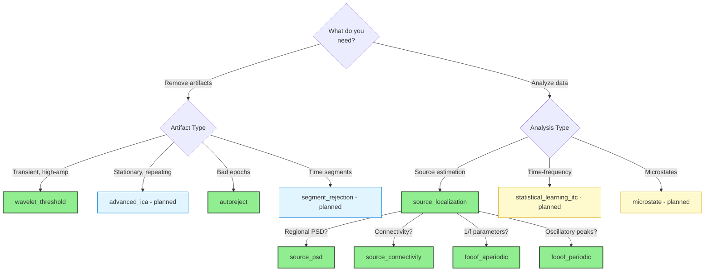

## Currently Available ✅

### Signal Processing Blocks

<Card title="wavelet_threshold" icon="wave-square" href="/processing-blocks/wavelet-threshold/overview">
  **Wavelet-based artifact removal using discrete wavelet transform**

  <Accordion title="Details" icon="info">
  **Version**: 1.0.0 (Stable)

  **Category**: Signal Processing

  **Purpose**: Remove transient high-amplitude artifacts (eye blinks, muscle twitches, electrode pops) while preserving underlying neural signals

  **Best For**:
  - Developmental/pediatric EEG with high artifact rates
  - Transient artifact removal
  - Fast preprocessing pipelines
  - Complementing ICA

  **Limitations**:
  - Less effective for stationary artifacts (use ICA)
  - Requires pre-filtering for best results

  **Scientific References**:
  - Donoho & Johnstone (1994) - Universal thresholding theory
  - Gabard-Durnam et al. (2018) - HAPPE pipeline
  - [DOI: 10.1093/biomet/81.3.425](https://doi.org/10.1093/biomet/81.3.425)

  **Example Tasks**:
  - `WaveletBlock_Test` - Test task with comprehensive reporting
  - `RestingState_WaveletDemo` - Resting-state demo
  - `RestingState_WaveletOnly` - Wavelet-only pipeline (no ICA)

  **Configuration Example**:
  ```python
  "wavelet_threshold": {
      "enabled": True,
      "value": {
          "wavelet": "sym4",
          "level": 5,
          "threshold_mode": "soft",
          "threshold_scale": 1.0,
      }
  }
  ```

  **Method Call**: `self.apply_wavelet_threshold()`

  **Output**:
  - Denoised EEG data
  - PDF report with before/after comparisons
  - Processing metadata
  </Accordion>
</Card>

<Card title="autoreject" icon="brain-circuit" href="/processing-blocks/autoreject/overview">
  **Machine learning-based automated artifact rejection and channel interpolation**

  <Accordion title="Details" icon="info">
  **Version**: 1.0.0 (Stable)

  **Category**: Signal Processing

  **Purpose**: Objective, data-driven rejection of bad epochs and channels using cross-validation, with automatic bad channel interpolation

  **Best For**:
  - Event-related potentials (ERPs) where every epoch matters
  - Multi-site studies requiring reproducible criteria
  - Large-scale analysis with automated QC
  - Publication-quality data with defendable rejection criteria
  - Clinical/developmental populations with high artifacts

  **Limitations**:
  - Requires sufficient epochs (minimum 20-30, optimal 100+)
  - Computationally intensive (1-10 minutes per dataset)
  - Only for epoched data (not continuous)
  - Memory requirements scale with epochs × channels × CV folds

  **Scientific References**:
  - Jas et al. (2017) - AutoReject method
  - Jas et al. (2016) - Automated rejection and repair
  - [DOI: 10.1016/j.neuroimage.2017.06.030](https://doi.org/10.1016/j.neuroimage.2017.06.030)

  **Example Tasks**:
  - `AutorejectDemo_Resting` - Resting-state with regular epochs
  - `ERP_With_AutoReject` - Event-related potential cleaning
  - `OddballAutoReject` - Oddball paradigm with AutoReject

  **Configuration Example**:
  ```python
  "apply_autoreject": {
      "enabled": True,
      "value": {
          "n_interpolate": [1, 4, 8],
          "consensus": [0.1, 0.25, 0.5, 0.75, 0.9],
          "n_jobs": 4,
          "cv": 4,
          "random_state": 42
      }
  }
  ```

  **Method Call**: `self.apply_autoreject()`

  **Output**:
  - Cleaned epoched data with bad epochs removed
  - Bad channels interpolated within epochs
  - 3-page PDF report with rejection statistics, PSD comparisons, interpolation heatmaps
  - Comprehensive processing metadata
  </Accordion>
</Card>

---

## Analysis Blocks 🧪

<Card title="source_localization" icon="location-dot" href="/processing-blocks/source-localization/overview">
  **MNE source localization for projecting sensor-space EEG to cortical sources**

  <Accordion title="Details" icon="info">
  **Version**: 1.0.0 (Stable)

  **Category**: Analysis

  **Purpose**: Estimate cortical sources from sensor-space EEG using minimum norm estimation (MNE) with fsaverage template

  **Best For**:
  - ROI-based power spectral density analysis
  - Functional connectivity studies
  - Network analysis of brain dynamics
  - Localization of evoked responses
  - Source-level time-frequency analysis

  **Limitations**:
  - Requires high-density EEG (minimum 19 channels, optimal 64+)
  - Computationally intensive (2-5 minutes per subject)
  - Uses template brain (fsaverage), not subject-specific anatomy
  - Large file sizes for STC output (~2.3GB for Raw, ~78MB per epoch)

  **Scientific References**:
  - Hämäläinen & Ilmoniemi (1994) - Minimum norm estimates
  - Gramfort et al. (2013) - MNE-Python
  - Fischl et al. (1999) - fsaverage template
  - [DOI: 10.1007/BF02512476](https://doi.org/10.1007/BF02512476)

  **Example Tasks**:
  - `SourceLocalization_Raw` - Continuous data source localization
  - `SourceLocalization_Epochs` - Epoched data source localization

  **Configuration Example**:
  ```python
  "apply_source_localization": {
      "enabled": True,
      "value": {
          "method": "MNE",
          "lambda2": 0.111,
          "pick_ori": "normal",
          "n_jobs": 10,
          "save_stc": False,  # STC files are large (2.3GB)
          "convert_to_eeg": True  # 68-channel ROI .set file (3.9MB)
      }
  }
  ```

  **Method Call**: `self.apply_source_localization()`

  **Output**:
  - SourceEstimate objects (vertex-level, 10,242 vertices per hemisphere)
  - Optional: 68-channel EEG .set files (Desikan-Killiany ROIs)
  - ROI metadata (names, positions, hemispheres)
  - Processing metadata (method, lambda2, timing)
  </Accordion>
</Card>

<Card title="source_psd" icon="chart-line" href="/processing-blocks/source-psd/overview">
  **Source-level power spectral density with ROI averaging using Desikan-Killiany atlas**

  <Accordion title="Details" icon="info">
  **Version**: 1.0.0 (Stable)

  **Category**: Analysis

  **Purpose**: Calculate frequency-resolved power spectral density from source estimates with anatomical ROI averaging

  **Best For**:
  - Regional spectral analysis (delta, theta, alpha, beta, gamma)
  - Comparing power across brain regions
  - Group-level statistical analyses
  - Resting-state frequency band analysis
  - Developmental/aging studies of regional power

  **Limitations**:
  - Requires prior source localization
  - Memory intensive (8GB+ recommended)
  - Computation time: 3-8 minutes per subject
  - Uses fixed atlas (Desikan-Killiany, 68 ROIs)

  **Scientific References**:
  - Welch (1967) - PSD estimation method
  - Desikan et al. (2006) - Anatomical atlas
  - [DOI: 10.1109/TAU.1967.1161901](https://doi.org/10.1109/TAU.1967.1161901)

  **Example Tasks**:
  - `SourcePSD_Analysis` - Source-level spectral analysis

  **Configuration Example**:
  ```python
  "apply_source_psd": {
      "enabled": True,
      "value": {
          "segment_duration": 80,  # seconds
          "n_jobs": 4,
          "generate_plots": True
      }
  }
  ```

  **Method Call**: `self.apply_source_psd()`

  **Output**:
  - Parquet file: frequency-resolved PSD (0.5-45 Hz) for 68 ROIs
  - CSV file: band power summaries (delta, theta, alpha, beta, gamma)
  - PNG visualization: 4-panel diagnostic plot
  - Processing metadata
  </Accordion>
</Card>

<Card title="source_connectivity" icon="diagram-project" href="/processing-blocks/source-connectivity/overview">
  **Functional connectivity and graph theory metrics from source-localized data**

  <Accordion title="Details" icon="info">
  **Version**: 1.0.0 (Stable)

  **Category**: Analysis

  **Purpose**: Calculate functional connectivity between brain regions using multiple methods and compute graph theory metrics

  **Best For**:
  - Brain network characterization
  - Resting-state connectivity analysis
  - Network dynamics across frequency bands
  - Clinical biomarkers (connectivity fingerprints)
  - Graph theory analysis (clustering, efficiency, modularity)

  **Limitations**:
  - Very memory intensive (16GB+ recommended)
  - Long computation time (10-20 minutes per subject)
  - Requires prior source localization
  - Multiple connectivity methods increase computation

  **Scientific References**:
  - Vinck et al. (2011) - Weighted Phase Lag Index
  - Rubinov & Sporns (2010) - Graph theory metrics
  - [DOI: 10.1016/j.neuroimage.2010.01.073](https://doi.org/10.1016/j.neuroimage.2010.01.073)

  **Connectivity Methods**:
  - WPLI: Weighted phase lag index (volume conduction robust)
  - PLV: Phase locking value
  - Coherence: Magnitude-squared coherence
  - PLI: Phase lag index (volume conduction robust)
  - AEC: Amplitude envelope correlation

  **Graph Metrics**:
  - Clustering coefficient, Global efficiency
  - Characteristic path length, Modularity
  - Small-worldness, Assortativity

  **Configuration Example**:
  ```python
  "apply_source_connectivity": {
      "enabled": True,
      "value": {
          "epoch_length": 4.0,  # seconds
          "n_epochs": 40,
          "n_jobs": 4
      }
  }
  ```

  **Method Call**: `self.apply_source_connectivity()`

  **Output**:
  - CSV: Pairwise connectivity (all ROI pairs × methods × bands)
  - CSV: Full connectivity matrices per method/band
  - CSV: Graph theory metrics
  - TXT: Detailed processing log
  </Accordion>
</Card>

<Card title="fooof_aperiodic" icon="wave-square" href="/processing-blocks/fooof-aperiodic/overview">
  **FOOOF aperiodic (1/f) parameter extraction from source-localized data**

  <Accordion title="Details" icon="info">
  **Version**: 1.0.0 (Stable)

  **Category**: Analysis / Spectral Parameterization

  **Purpose**: Extract aperiodic (1/f background) parameters from vertex-level source estimates using FOOOF algorithm

  **Best For**:
  - Excitation/inhibition (E/I) balance studies
  - Developmental neuroscience (aperiodic changes across lifespan)
  - Disease biomarkers (Alzheimer's, ADHD, schizophrenia)
  - Medication effects on cortical excitability
  - Comparing periodic vs aperiodic contributions

  **Limitations**:
  - Requires source localization first
  - Memory intensive (2-4GB)
  - Processing time: 3-5 minutes
  - Requires broadband spectrum (not narrow-band filtered data)
  - Minimum 60 seconds of clean data

  **Scientific References**:
  - Donoghue et al. (2020) - FOOOF method
  - Voytek & Knight (2015) - Aperiodic activity and cognition
  - [DOI: 10.1038/s41593-020-00744-x](https://doi.org/10.1038/s41593-020-00744-x)

  **Parameters Extracted**:
  - Offset: Broadband power level
  - Exponent: Spectral slope (1/f)
  - Knee: Knee frequency (if using knee mode)
  - R²: Goodness of fit
  - Error: Fitting error

  **Configuration Example**:
  ```python
  "apply_fooof_aperiodic": {
      "enabled": True,
      "value": {
          "fmin": 1.0,
          "fmax": 45.0,
          "n_jobs": 10,
          "aperiodic_mode": "knee"
      }
  }
  ```

  **Method Call**: `self.apply_fooof_aperiodic()`

  **Output**:
  - Parquet: Aperiodic parameters for all 20,484 vertices
  - CSV: Same data in CSV format
  - H5: PSD data for verification
  </Accordion>
</Card>

<Card title="fooof_periodic" icon="chart-scatter" href="/processing-blocks/fooof-periodic/overview">
  **FOOOF periodic (oscillatory peak) detection from source-localized data**

  <Accordion title="Details" icon="info">
  **Version**: 1.0.0 (Stable)

  **Category**: Analysis / Spectral Parameterization

  **Purpose**: Detect and characterize oscillatory peaks (alpha, beta, theta, etc.) after removing aperiodic component

  **Best For**:
  - Oscillatory biomarker discovery
  - Peak frequency analysis (individual alpha frequency)
  - Peak power quantification
  - Frequency band specificity studies
  - Separating rhythmic from arrhythmic activity

  **Limitations**:
  - Same as fooof_aperiodic block
  - May not detect peaks in all vertices/subjects
  - Requires sufficient peak prominence

  **Scientific References**:
  - Donoghue et al. (2020) - FOOOF method
  - [DOI: 10.1038/s41593-020-00744-x](https://doi.org/10.1038/s41593-020-00744-x)

  **Parameters Extracted (per peak)**:
  - Center frequency (Hz)
  - Power (amplitude)
  - Bandwidth (full-width half-maximum)

  **Configuration Example**:
  ```python
  "apply_fooof_periodic": {
      "enabled": True,
      "value": {
          "fmin": 1.0,
          "fmax": 45.0,
          "n_jobs": 10,
          "aperiodic_mode": "knee"
      }
  }
  ```

  **Method Call**: `self.apply_fooof_periodic()`

  **Output**:
  - Parquet: Detected peaks for all vertices
  - CSV: Same data in CSV format
  - Multiple peaks per vertex possible
  </Accordion>
</Card>

---

## Coming Soon 🔄

### Priority 1: High-Impact Blocks (Q1 2026)

<AccordionGroup>
<Accordion title="advanced_ica - Enhanced ICA Methods" icon="brain">
**Multiple ICA algorithms with automated selection** (estimated 740 lines)

**Status**: Planned | **Priority**: ⭐⭐⭐⭐⭐

**Purpose**: Extend ICA capabilities with multiple algorithms, automatic selection, and enhanced convergence diagnostics

**Features**:
- **Algorithms**: Infomax, FastICA, Picard, Extended Infomax, AMICA
- **Auto-selection**: Choose best algorithm based on data characteristics
- **Convergence diagnostics**: Real-time monitoring and validation
- **Component classification**: Multiple methods (ICLabel, ICVision, MARA)
- **Batch processing**: Optimized for large datasets

**Use Cases**:
- Complex artifact patterns requiring specific ICA algorithms
- Comparative ICA studies
- Datasets where FastICA underperforms
- Research requiring reproducible ICA with controlled initialization

**Scientific References**:
- Bell & Sejnowski (1995) - Infomax
- Hyvärinen (1999) - FastICA
- Ablin et al. (2018) - Picard
- Palmer et al. (2011) - AMICA

**Planned Timeline**: Q1 2026
</Accordion>
</AccordionGroup>

### Priority 2: Specialized Blocks (Q2 2026)

<AccordionGroup>
<Accordion title="statistical_learning_itc - ITC/ERSP Analysis" icon="chart-line">
**Advanced time-frequency decomposition for statistical learning** (estimated 812 lines)

**Status**: Planned | **Priority**: ⭐⭐⭐⭐

**Purpose**: Inter-trial coherence (ITC) and event-related spectral perturbation (ERSP) for auditory statistical learning paradigms

**Features**:
- **ITC calculation**: Phase consistency across trials
- **ERSP analysis**: Time-frequency power changes
- **Statistical learning specific**: Optimized for oddball/deviant detection
- **Phase-amplitude coupling**: Cross-frequency interactions
- **Visualization suite**: Comprehensive time-frequency plots

**Use Cases**:
- Auditory oddball paradigms
- Statistical learning studies
- MMN/P300 analysis
- Frequency-specific ERP analysis

**Scientific References**:
- Makeig et al. (2004) - ERSP/ITC methods
- Delorme & Makeig (2004) - EEGLAB implementation

**Planned Timeline**: Q2 2026
</Accordion>

<Accordion title="segment_rejection - Correlation-Based Rejection" icon="trash">
**Segment rejection using correlation-based metrics** (estimated 735 lines)

**Status**: Planned | **Priority**: ⭐⭐⭐⭐

**Purpose**: Identify and reject bad segments using temporal correlation and statistical outlier detection

**Features**:
- **Correlation metrics**: Cross-channel consistency analysis
- **Sliding window**: Adaptive segment-wise evaluation
- **Outlier detection**: Statistical thresholding
- **Rodent EEG optimized**: Designed for preclinical recordings
- **Flexible rejection**: Keep/interpolate/reject decisions

**Use Cases**:
- Rodent/mouse EEG data
- Data with variable quality across time
- Movement artifact detection
- Automated quality control

**Planned Timeline**: Q2 2026
</Accordion>

</AccordionGroup>

### Priority 3: Emerging Methods (Q3 2026+)

<AccordionGroup>
<Accordion title="asr - Artifact Subspace Reconstruction" icon="wand-magic-sparkles">
**Real-time artifact removal using subspace methods**

**Status**: Under Consideration | **Priority**: ⭐⭐⭐

**Purpose**: Remove artifacts by reconstructing clean signal from artifact subspace (inspired by EEGLAB's `clean_rawdata`)

**Features**:
- **Real-time capable**: Low-latency processing
- **Subspace projection**: PCA-based artifact identification
- **Automatic calibration**: Learn from clean segments
- **Online/offline modes**: BCI and batch processing

**Use Cases**:
- Brain-computer interfaces (BCI)
- Real-time neurofeedback
- Online EEG processing
- Mobile EEG applications

**Planned Timeline**: Q3 2026
</Accordion>


<Accordion title="microstate - EEG Microstate Analysis" icon="layer-group">
**Temporal segmentation into quasi-stable states**

**Status**: Under Consideration | **Priority**: ⭐⭐

**Purpose**: Identify and analyze EEG microstates (quasi-stable topographical patterns)

**Features**:
- **Clustering algorithms**: K-means, hierarchical
- **Canonical maps**: Extract prototypical microstates
- **Temporal dynamics**: Transition probabilities, duration statistics
- **Group analysis**: Compare microstates across conditions

**Use Cases**:
- Resting-state network dynamics
- Consciousness studies
- Psychiatric biomarkers
- State-dependent processing

**Planned Timeline**: 2027
</Accordion>
</AccordionGroup>

---

## Block Status Legend

<Tabs>
<Tab title="Stable ✅">
**Production-ready and fully tested**

- Complete documentation
- Example tasks available
- Test suite passing
- Peer-reviewed methods
- Long-term support guaranteed
</Tab>

<Tab title="Beta 🧪">
**Functional but subject to changes**

- Core functionality complete
- Documentation in progress
- Limited example tasks
- API may change in updates
- Community testing welcome
</Tab>

<Tab title="Planned 🔄">
**In development or design phase**

- Specification complete
- Implementation scheduled
- Timeline estimated
- Community input welcome
- No code available yet
</Tab>

<Tab title="Under Consideration 💭">
**Being evaluated for inclusion**

- Concept stage
- Community interest being assessed
- Technical feasibility under review
- Timeline not determined
- May or may not be implemented
</Tab>
</Tabs>

---

## Requesting New Blocks

Have a processing method you'd like to see as a block? We welcome community input!

<Steps>
<Step title="Check Existing Plans">
Review this catalog to ensure it's not already planned
</Step>

<Step title="Open a Discussion">
Start a discussion on [GitHub Discussions](https://github.com/cincibrainlab/autocleaneeg_pipeline/discussions) with:
- Proposed block name and purpose
- Scientific references (papers, methods)
- Use cases and benefits
- Potential implementation approach
</Step>

<Step title="Gauge Community Interest">
Community feedback helps us prioritize new blocks
</Step>

<Step title="Contribute (Optional)">
If you have expertise, consider contributing the block yourself! See [Contributing Processing Blocks](/processing-blocks/contributing-blocks)
</Step>
</Steps>

---

## Block Selection Guide

Not sure which block to use? Use this decision tree:



---

## Comparison Tables

### Artifact Removal Blocks

| Block | Speed | Artifact Type | Automation | Data Loss | Best For |
|-------|-------|--------------|------------|-----------|----------|
| **wavelet_threshold** | ⚡⚡⚡ | Transient | ✅ Full | 🟢 Minimal | Developmental, high artifacts |
| **advanced_ica** | 🐌 | Stationary | 🔶 Semi | 🟢 Minimal | Eye movements, ECG, EMG |
| **autoreject** | 🐌🐌 | Any | ✅ Full | 🟡 Moderate | Objective epoch QC |
| **segment_rejection** | ⚡⚡ | Correlation-based | ✅ Full | 🟡 Moderate | Rodent EEG, movement |

### Analysis Blocks

| Block | Purpose | Input | Output | Computational Cost |
|-------|---------|-------|--------|-------------------|
| **source_localization** | Source estimation | Raw/Epochs | SourceEstimate objects | 🐌🐌 |
| **source_psd** | Regional PSD | SourceEstimate | ROI PSD dataframes | 🐌🐌 |
| **source_connectivity** | Brain networks | SourceEstimate | Connectivity matrices + graphs | 🐌🐌🐌 |
| **fooof_aperiodic** | 1/f parameters | SourceEstimate | Aperiodic params (20k vertices) | 🐌🐌 |
| **fooof_periodic** | Oscillatory peaks | SourceEstimate | Peak parameters (frequency, power, BW) | 🐌🐌 |
| **statistical_learning_itc** | Time-frequency | Epochs | ITC/ERSP maps | 🐌🐌 (planned) |
| **microstate** | State dynamics | Continuous | Microstate sequences | 🐌🐌 (planned) |

---

## Learn More

<CardGroup cols={2}>
<Card title="Introduction to Blocks" icon="cube" href="/processing-blocks/introduction">
  Understand the processing blocks concept and architecture
</Card>

<Card title="Getting Started" icon="rocket" href="/processing-blocks/getting-started">
  Quick start guide for using processing blocks
</Card>

<Card title="Wavelet Threshold" icon="wave-square" href="/processing-blocks/wavelet-threshold/overview">
  Deep-dive into our first stable processing block
</Card>

<Card title="Contributing Blocks" icon="code-pull-request" href="/processing-blocks/contributing-blocks">
  Guidelines for creating and sharing new processing blocks
</Card>
</CardGroup>

---

## Updates and Versioning

<Note>
This catalog is regularly updated as new blocks are developed and existing blocks are enhanced. Check the [Task Registry](https://github.com/cincibrainlab/autocleaneeg-task-registry) for the latest `blocks_registry.json` with current versions and status.
</Note>

**Last Updated**: 2025-09-30

**Next Planned Update**: Q1 2026 (advanced_ica block)

**Recent Additions** (2025-09-30):
- ✅ source_localization: MNE source estimation with fsaverage
- ✅ source_psd: Regional PSD with Desikan-Killiany atlas
- ✅ source_connectivity: Functional connectivity + graph metrics
- ✅ fooof_aperiodic: 1/f parameter extraction
- ✅ fooof_periodic: Oscillatory peak detection