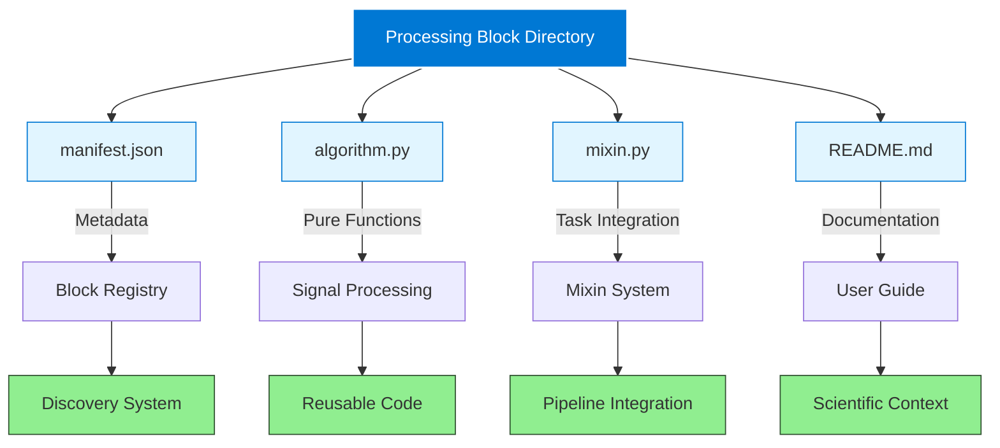
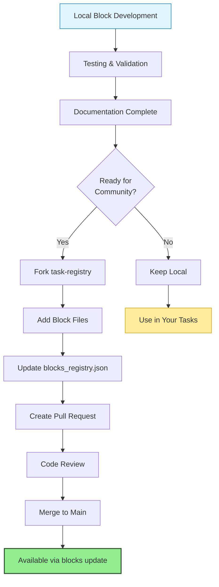

<Note>
**Prerequisites**: This guide assumes you are comfortable with Python development, understand the AutoCleanEEG Task system, and have experience with signal processing concepts. If you're new to AutoCleanEEG, start with the [Getting Started](/processing-blocks/getting-started) guide first.
</Note>

## Introduction: The Philosophy Behind Processing Blocks

Before diving into the technical details of creating processing blocks, it's important to understand *why* they exist and what problems they solve in the EEG processing ecosystem. This context will guide your design decisions and help you create blocks that serve the broader research community.

### The Traditional EEG Software Dilemma

For decades, neuroscience researchers have faced a fundamental trade-off when building EEG processing pipelines. On one hand, established software packages like EEGLAB and FieldTrip offer stability and widespread adoption, but adding new methods requires either waiting for maintainers to incorporate them or creating fragmented plugin ecosystems. On the other hand, custom Python scripts offer flexibility and rapid iteration, but they're difficult to share, lack scientific context, and often become unmaintainable as projects evolve.

Processing blocks were designed to transcend this dilemma by creating a third path: **modular, scientifically-documented methods that are both stable and rapidly evolving**. Each block is a complete package containing not just code, but peer-reviewed references, parameter guidance, validation examples, and quality metrics. They can be updated independently without breaking existing pipelines, yet they integrate seamlessly into the AutoCleanEEG architecture as if they were built-in methods.

### What Makes a Good Processing Block?

The best processing blocks share several characteristics that distinguish them from generic Python functions or one-off scripts:

**Scientific Grounding**: Every block should be based on peer-reviewed methods with clear citations. When users call `self.apply_zapline()`, they should have confidence that they're implementing de Cheveigné's (2020) validated DSS method, not an ad-hoc noise removal approach. Your block's documentation should provide enough context that a researcher can cite the underlying methods in their paper without needing to hunt through obscure references.

**Self-Contained Algorithms**: One of the most important architectural decisions in processing blocks is the separation between algorithm and integration. The core signal processing logic lives in `algorithm.py`—a pure Python module with no dependencies on AutoCleanEEG internals. This means researchers can extract just the algorithm if they want to use it in other contexts (MATLAB, standalone Python, different frameworks), while the `mixin.py` file handles integration with AutoCleanEEG's Task system.

**Comprehensive Documentation**: Unlike typical code comments, processing block documentation serves multiple audiences simultaneously: end-users who need to know *when* to use the method, researchers who need scientific validation, and developers who need implementation details. This is why each block includes a detailed README with background theory, parameter tuning guides, comparison with alternative methods, and troubleshooting sections.

**Reproducibility First**: Processing blocks automatically log all parameters, generate quality metrics, and save intermediate results. When a researcher processes 200 subjects with `apply_wavelet_threshold()`, they should be able to look back months later and know exactly what threshold scale was used, how many components were removed per subject, and what the mean artifact reduction was. This isn't optional metadata—it's baked into the block architecture.

---

## The Anatomy of a Processing Block

A processing block is a structured directory containing exactly four required files, each serving a distinct purpose in the block's lifecycle. Understanding why each file exists and how they interact is crucial for creating blocks that integrate properly with the AutoCleanEEG ecosystem.



### File 1: manifest.json — The Block's Identity Card

The manifest is a JSON file that serves as the block's "identity card" in the AutoCleanEEG registry. When you run `autocleaneeg-pipeline blocks list`, the system reads these manifests to display available blocks, their versions, and compatibility information. Think of it as package.json for npm or setup.py metadata for Python—it tells the discovery system everything it needs to know about your block without having to import any code.

The manifest structure follows a specific schema that balances completeness with usability. At minimum, every manifest must declare the block's name, version, category, and API entry points. But the real power comes from the optional fields: dependencies let the system check if required packages are installed, tags enable semantic search, references provide scientific context, and compatibility rules prevent users from applying blocks to inappropriate data types.

Here's what a well-structured manifest looks like for a signal processing block:

```json
{
  "name": "zapline",
  "version": "1.0.0",
  "description": "Zapline DSS-based line noise removal using Denoising Source Separation",
  "author": "AutoCleanEEG Team",
  "maintainer": "ernest.pedapati@cchmc.org",
  "license": "MIT",
  "category": "signal_processing",

  "api": {
    "mixin_class": "ZaplineMixin",
    "mixin_method": "apply_zapline",
    "config_key": "apply_zapline",
    "schema_function": "zapline_descriptor"
  },

  "dependencies": {
    "python": ">=3.10",
    "packages": {
      "mne": ">=1.10.0",
      "numpy": ">=2.0.0",
      "scipy": ">=1.16.0",
      "meegkit": ">=0.1.9"
    },
    "autocleaneeg-pipeline": ">=3.0.0"
  },

  "compatibility": {
    "data_types": ["raw"],
    "processing_stages": ["post_filtering", "pre_ica", "post_ica"],
    "min_channels": 2,
    "requires_montage": false,
    "requires_reference": false
  },

  "parameters": {
    "fline": {
      "type": "float",
      "default": 60,
      "description": "Line noise frequency (Hz): 60 for US/Americas, 50 for Europe/Asia",
      "options": [50, 60]
    },
    "nkeep": {
      "type": "int",
      "default": 1,
      "description": "Number of noise components to remove",
      "range": [1, 5]
    }
  },

  "references": [
    {
      "name": "ZapLine: A simple and effective method to remove power line artifacts",
      "authors": "de Cheveigné A",
      "journal": "NeuroImage",
      "year": 2020,
      "volume": 207,
      "doi": "10.1016/j.neuroimage.2019.116356",
      "citation": "de Cheveigné, A. (2020). ZapLine: A simple and effective method to remove power line artifacts. NeuroImage, 207, 116356."
    }
  ],

  "tags": ["line-noise", "60Hz", "50Hz", "zapline", "dss", "denoising"],

  "created_at": "2025-10-01T07:45:00Z",
  "updated_at": "2025-10-01T07:45:00Z"
}
```

<Accordion title="Understanding API Entry Points">
The `api` section is critical for integration. Here's what each field controls:

- **`mixin_class`**: The Python class name in `mixin.py`. The discovery system imports this class and adds it to the Task's inheritance chain via multiple inheritance. This is how `self.apply_zapline()` becomes available in task code.

- **`mixin_method`**: The primary method users will call. This should be a descriptive verb phrase like `apply_wavelet_threshold` or `compute_source_connectivity`. Convention is to start with a verb (`apply`, `compute`, `analyze`, `generate`).

- **`config_key`**: The top-level key in task configuration dictionaries. When users write `config = {"apply_zapline": {"enabled": True, "value": {...}}}`, this key determines where the mixin looks for parameters.

- **`schema_function`**: Optional function that returns a Cerberus schema for parameter validation. If provided, AutoCleanEEG will validate user-provided parameters before running the block.
</Accordion>

<Accordion title="Dependency Specification Best Practices">
The `dependencies` section prevents runtime errors by checking packages before loading the block:

**Minimum version constraints** (`>=1.10.0`): Use these for packages where you need specific features. For example, if you use MNE's new montage API introduced in 1.10, specify `"mne": ">=1.10.0"`.

**Version ranges** (`>=1.0,<2.0`): Use these when you know breaking changes exist in major versions. For example, `"specparam": ">=2.0.0,<3.0"` ensures users have the new API but won't break when v3 is released.

**Pinned versions** (`==2.8.0`): Avoid these unless absolutely necessary (like when a specific bug fix is critical). Pinned versions create dependency conflicts and prevent users from updating other packages.

**Optional dependencies**: If your block can work with or without certain features, document them in the README rather than listing them as hard requirements. For example, report generation might require reportlab, but core functionality doesn't.
</Accordion>

### File 2: algorithm.py — Pure Signal Processing Logic

The `algorithm.py` file contains the mathematical and signal processing core of your block, implemented as pure Python functions with no dependencies on AutoCleanEEG internals. This architectural separation is deliberate and has profound implications for code reusability, testing, and scientific validation.

When you write `algorithm.py`, you're not writing "AutoCleanEEG code"—you're writing domain-specific signal processing functions that happen to be used by AutoCleanEEG. The file should be importable in any Python environment: a Jupyter notebook, a MATLAB MEX function, a standalone analysis script, or even a different EEG framework. This portability means other researchers can extract just your algorithm if they want to use it without adopting the entire AutoCleanEEG ecosystem.

Here's the structure of a well-designed `algorithm.py` for Zapline:

```python
"""Zapline DSS-based line noise removal algorithm.

This module implements the Zapline algorithm using Denoising Source Separation (DSS)
to remove power line artifacts from EEG/MEG data.

Based on:
- de Cheveigné, A. (2020). ZapLine: A simple and effective method to remove
  power line artifacts. NeuroImage, 207, 116356.
- MEEGkit Python toolbox: https://github.com/nbara/python-meegkit
"""

import numpy as np
from typing import Tuple, Optional


def apply_zapline_dss(
    raw,
    fline: float = 60.0,
    nkeep: int = 1,
    use_iter: bool = False,
    max_iter: int = 10,
) -> Tuple:
    """Apply Zapline DSS-based line noise removal to Raw data.

    Uses Denoising Source Separation (DSS) to remove power line artifacts.
    The method combines spectral and spatial filtering to effectively remove
    line noise while preserving signal characteristics.

    Parameters
    ----------
    raw : mne.io.Raw
        MNE Raw object containing EEG/MEG data
    fline : float, default=60.0
        Line noise frequency in Hz (60 for US/Americas, 50 for Europe/Asia)
    nkeep : int, default=1
        Number of noise components to remove. Typically 1 removes the strongest
        line noise component. Higher values (2-3) can remove harmonics.
    use_iter : bool, default=False
        If True, use iterative removal (dss_line_iter) for more thorough
        noise reduction.
    max_iter : int, default=10
        Maximum number of iterations for iterative mode

    Returns
    -------
    raw_clean : mne.io.Raw
        Raw object with line noise removed
    info : dict
        Dictionary containing:
        - 'iterations': Number of iterations used
        - 'method': 'dss_line' or 'dss_line_iter'
        - 'fline': Line frequency used
        - 'nkeep': Number of components removed

    Raises
    ------
    ImportError
        If meegkit is not installed
    ValueError
        If data has insufficient channels or samples

    Examples
    --------
    >>> # Basic usage (remove 60 Hz)
    >>> raw_clean, info = apply_zapline_dss(raw, fline=60, nkeep=1)

    >>> # Remove 50 Hz with iterative refinement
    >>> raw_clean, info = apply_zapline_dss(raw, fline=50, use_iter=True)

    References
    ----------
    .. [1] de Cheveigné, A. (2020). ZapLine: A simple and effective method to
       remove power line artifacts. NeuroImage, 207, 116356.
    """
    # Import meegkit (raise informative error if not installed)
    try:
        from meegkit import dss
    except ImportError:
        raise ImportError(
            "meegkit is required for Zapline. Install with: pip install meegkit"
        )

    # Validate input
    if raw.info['nchan'] < 2:
        raise ValueError(
            f"Zapline requires at least 2 channels, got {raw.info['nchan']}. "
            "DSS exploits spatial structure of noise."
        )

    # Extract data and parameters
    data = raw.get_data().T  # Convert to (n_samples, n_channels)
    sfreq = raw.info['sfreq']

    # Validate frequency parameters
    nyquist = sfreq / 2
    if fline >= nyquist:
        raise ValueError(
            f"Line frequency ({fline} Hz) must be below Nyquist frequency "
            f"({nyquist} Hz) for sampling rate {sfreq} Hz"
        )

    # Apply appropriate DSS method
    info = {
        'method': 'dss_line_iter' if use_iter else 'dss_line',
        'fline': fline,
        'nkeep': nkeep,
    }

    if use_iter:
        # Iterative removal - automatically determines convergence
        out, iterations = dss.dss_line_iter(
            data,
            fline=fline,
            sfreq=sfreq,
            nkeep=nkeep,
            nfft=None,
        )
        info['iterations'] = iterations
    else:
        # Single-pass removal
        out, _ = dss.dss_line(
            data,
            fline=fline,
            sfreq=sfreq,
            nkeep=nkeep,
            nfft=None,
        )
        info['iterations'] = 1

    # Create cleaned Raw object
    raw_clean = raw.copy()
    raw_clean._data = out.T  # Convert back to (n_channels, n_samples)

    return raw_clean, info


def compute_line_noise_power(
    raw,
    fline: float = 60.0,
    bandwidth: float = 2.0
) -> Tuple[float, float]:
    """Compute power at line frequency before and after Zapline.

    Useful for quantifying noise reduction effectiveness.

    Parameters
    ----------
    raw : mne.io.Raw
        Raw data
    fline : float, default=60.0
        Line noise frequency in Hz
    bandwidth : float, default=2.0
        Bandwidth around fline to integrate power (Hz)

    Returns
    -------
    power_db : float
        Power at line frequency in dB
    snr : float
        Signal-to-noise ratio: power at line freq / average power elsewhere
    """
    from scipy import signal

    data = raw.get_data()
    sfreq = raw.info['sfreq']

    # Compute power spectrum
    freqs, psd = signal.welch(
        data,
        fs=sfreq,
        nperseg=int(4 * sfreq),
        scaling='density'
    )

    # Find indices for line frequency band
    line_band = (freqs >= fline - bandwidth/2) & (freqs <= fline + bandwidth/2)

    # Average across channels
    psd_mean = psd.mean(axis=0)

    # Power at line frequency
    line_power = psd_mean[line_band].mean()

    # Background power (excluding line frequency ±5 Hz)
    background_mask = (freqs < fline - 5) | (freqs > fline + 5)
    background_power = psd_mean[background_mask].mean()

    # Convert to dB
    power_db = 10 * np.log10(line_power)
    snr = line_power / background_power if background_power > 0 else 0

    return power_db, snr
```

<Tip>
**Design Pattern**: Notice how `algorithm.py` functions return *both* processed data and metadata dictionaries. This pattern is crucial for reproducibility—the metadata gets logged automatically by the mixin, creating a complete audit trail of processing parameters and quality metrics.
</Tip>

The key principles demonstrated here are:

**Comprehensive docstrings**: Every function has a complete docstring following NumPy/SciPy conventions with sections for Parameters, Returns, Raises, Examples, and References. This isn't just good practice—it's essential documentation that gets displayed by `blocks info <name>` and helps users understand what parameters to tune.

**Input validation**: The function validates inputs before processing (channel count, frequency ranges, data types) and provides informative error messages. When validation fails, users should immediately understand what went wrong and how to fix it.

**Return metadata**: Along with processed data, functions return dictionaries containing processing details (which method was used, how many iterations, what parameters). This metadata gets automatically logged by the mixin for reproducibility.

**Minimal dependencies**: Only import what you absolutely need, and make those imports conditional where possible. The `from meegkit import dss` happens inside the function, not at module level, so blocks without meegkit can still be discovered.

### File 3: mixin.py — Integration with AutoCleanEEG

While `algorithm.py` contains pure signal processing logic, `mixin.py` is where that logic gets integrated into AutoCleanEEG's Task system. This is the file that makes `self.apply_zapline()` work when called from a task's `run()` method. The mixin acts as a bridge between the task configuration system, the logging infrastructure, the metadata tracking, and your signal processing algorithms.

The mixin class inherits from nothing (it's a pure mixin) and gets dynamically added to the Task's inheritance chain via multiple inheritance. This means every method you define in the mixin becomes available to Task instances, but they execute in the context of the task—with access to `self.config`, `self.raw`, `self._check_step_enabled()`, and all other task infrastructure.

Here's a properly structured mixin:

```python
"""Zapline DSS-based line noise removal mixin for AutoClean tasks."""

from __future__ import annotations

from typing import Optional

import mne

from .algorithm import apply_zapline_dss, compute_line_noise_power
from autoclean.utils.logging import message


class ZaplineMixin:
    """Mixin providing Zapline DSS-based line noise removal."""

    def apply_zapline(
        self,
        data: Optional[mne.io.BaseRaw] = None,
        stage_name: str = "post_zapline",
    ) -> Optional[mne.io.BaseRaw]:
        """Apply Zapline DSS-based line noise removal if enabled in configuration.

        Uses Denoising Source Separation (DSS) to remove power line artifacts
        (50 or 60 Hz) and their harmonics from EEG/MEG data.

        Parameters
        ----------
        data : mne.io.BaseRaw, optional
            Raw object to clean. If not provided, uses ``self.raw``.
        stage_name : str, default="post_zapline"
            Stage identifier used when exporting the cleaned data.

        Returns
        -------
        mne.io.BaseRaw or None
            The cleaned raw instance when Zapline ran, otherwise the original object.

        Notes
        -----
        Configuration parameters (in task config):
        - fline : float
            Line noise frequency in Hz (60 for US/Americas, 50 for Europe/Asia)
        - nkeep : int
            Number of noise components to remove (typically 1)
        - use_iter : bool
            Use iterative removal for thorough noise reduction
        - max_iter : int
            Maximum iterations for iterative mode

        Examples
        --------
        In task config:
        >>> config = {
        ...     "apply_zapline": {
        ...         "enabled": True,
        ...         "value": {"fline": 60, "nkeep": 1, "use_iter": False}
        ...     }
        ... }
        """
        inst = data if data is not None else getattr(self, "raw", None)
        if inst is None:
            message("warning", "Zapline skipped: no raw data available")
            return inst

        # Check if step is enabled in configuration
        is_enabled, settings = self._check_step_enabled("apply_zapline")
        if not is_enabled:
            message("info", "Zapline disabled in configuration")
            return inst

        # Extract parameters from config
        params = (settings or {}).get("value", {})
        fline = float(params.get("fline", 60.0))
        nkeep = int(params.get("nkeep", 1))
        use_iter = bool(params.get("use_iter", False))
        max_iter = int(params.get("max_iter", 10))

        # Validate parameters
        if fline not in [50.0, 60.0]:
            message(
                "warning",
                f"Unusual line frequency {fline} Hz (typically 50 or 60 Hz)",
            )

        nyquist = inst.info["sfreq"] / 2
        if fline >= nyquist:
            message(
                "error",
                f"Line frequency ({fline} Hz) must be below Nyquist ({nyquist} Hz)",
            )
            return inst

        # Measure line noise before removal
        try:
            power_before, snr_before = compute_line_noise_power(inst, fline=fline)
            message(
                "info",
                f"Pre-Zapline: {power_before:.1f} dB at {fline} Hz (SNR: {snr_before:.2f})",
            )
        except Exception as exc:
            message("warning", f"Could not compute pre-Zapline power: {exc}")
            power_before = None
            snr_before = None

        # Apply Zapline
        message(
            "header",
            f"Applying Zapline (fline={fline} Hz, nkeep={nkeep}, iter={use_iter})...",
        )

        try:
            cleaned, info = apply_zapline_dss(
                inst,
                fline=fline,
                nkeep=nkeep,
                use_iter=use_iter,
                max_iter=max_iter,
            )
        except ImportError as exc:
            message("error", f"Zapline requires meegkit: {exc}")
            return inst
        except Exception as exc:
            message("error", f"Zapline failed: {exc}")
            return inst

        # Measure line noise after removal
        try:
            power_after, snr_after = compute_line_noise_power(cleaned, fline=fline)
            reduction_db = power_before - power_after if power_before else None

            if reduction_db is not None:
                message(
                    "info",
                    f"Post-Zapline: {power_after:.1f} dB at {fline} Hz "
                    f"(reduction: {reduction_db:.1f} dB, SNR: {snr_after:.2f})",
                )
        except Exception as exc:
            message("warning", f"Could not compute post-Zapline power: {exc}")
            power_after = None
            snr_after = None
            reduction_db = None

        # Update instance data and save result
        self._update_instance_data(inst, cleaned)
        self._save_raw_result(cleaned, stage_name)

        # Store metadata
        metadata = {
            "fline": fline,
            "nkeep": nkeep,
            "use_iter": use_iter,
            "method": info.get("method"),
            "iterations": info.get("iterations"),
        }

        if power_before is not None:
            metadata["power_before_db"] = float(power_before)
        if power_after is not None:
            metadata["power_after_db"] = float(power_after)
        if reduction_db is not None:
            metadata["reduction_db"] = float(reduction_db)

        self._update_metadata("step_zapline", metadata)

        message("success", f"Zapline complete ({info.get('iterations')} iterations)")
        return cleaned
```

<Warning>
**Common Mistake**: Never import from `autoclean.core.task` in your mixin! Your mixin class should *not* inherit from Task—it gets added to Task's inheritance chain dynamically. Importing Task creates circular dependencies and breaks the discovery system.
</Warning>

The mixin follows a specific pattern that all blocks should adopt:

**Configuration checking**: Use `self._check_step_enabled("apply_zapline")` to respect the task's configuration. If the user sets `"apply_zapline": {"enabled": False}`, your method should return early without processing.

**Parameter extraction and validation**: Pull parameters from the config dictionary, convert types explicitly, validate ranges, and provide sensible defaults. Never assume users will provide valid inputs.

**Progressive logging**: Use the `message()` function to log progress at different levels (info, warning, error, success, header). This creates a narrative in the console output that helps users understand what's happening and troubleshoot problems.

**Metadata tracking**: Call `self._update_metadata("step_zapline", {...})` to log processing details. This metadata ends up in the subject's JSON files and database records, creating a complete audit trail.

**Data persistence**: Use `self._save_raw_result(cleaned, stage_name)` to save processed data to the derivatives directory with automatic BIDS naming. This creates `derivatives/zapline/sub-01_task-rest_eeg.fif` files that users can inspect later.

**Graceful error handling**: Wrap algorithm calls in try/except blocks and return the original data if processing fails. Never let a block crash the entire pipeline—log the error and continue.

### File 4: README.md — Your Block's User Manual

The README is where you transition from developer to educator. While the manifest provides metadata and the code provides functionality, the README provides *understanding*. This is where you explain the scientific rationale, guide parameter tuning, compare with alternative methods, and share accumulated wisdom about when and how to use your block.

A comprehensive README should follow this structure:

<Tabs>
<Tab title="Essential Sections">
**Required sections** that every block README must include:

1. **Title and Overview**: One paragraph explaining what the block does and why it exists
2. **Scientific Background**: Theory, equations, diagrams explaining the method
3. **Configuration**: Complete parameter reference with examples
4. **Usage Examples**: Real task code showing different use cases
5. **When to Use**: Clear guidance on appropriate vs inappropriate applications
6. **References**: Peer-reviewed papers with DOIs and citations
</Tab>

<Tab title="Enhanced Sections">
**Recommended sections** that significantly improve usability:

1. **Comparison with Other Methods**: Table comparing your block with alternatives
2. **Parameter Tuning Guide**: Step-by-step instructions for optimizing settings
3. **Quality Metrics**: How to interpret the output and validate results
4. **Pipeline Integration**: Where in the processing chain to place your block
5. **Troubleshooting**: Common errors and their solutions
6. **Performance Benchmarks**: Timing and memory requirements
</Tab>

<Tab title="Advanced Sections">
**Optional sections** for complex blocks:

1. **Mathematical Derivations**: Detailed equations and proofs
2. **Validation Studies**: Results on benchmark datasets
3. **Advanced Usage**: Edge cases and specialized applications
4. **API Reference**: Complete function signatures and return values
5. **Contributing**: How others can improve the block
6. **Version History**: Changelog with migration guides
</Tab>
</Tabs>

The key is to write for multiple reading styles. Some users will skim for quick answers ("What parameters do I need?"), others will read deeply for understanding ("How does DSS work?"), and some will reference it later for troubleshooting ("Why is my reduction only 3 dB?"). Your README should serve all three audiences simultaneously.

<Accordion title="README Writing Tips">
**Use active voice and concrete examples**: Instead of "The threshold scale parameter can be adjusted to modify sensitivity," write "Increase threshold_scale to 1.5 if artifacts remain after processing."

**Provide scientific context without jargon**: Assume readers are smart but busy. Explain "DSS finds spatial filters that maximize power at the line frequency" rather than just citing de Cheveigné (2008) and moving on.

**Show, don't tell**: Every parameter should have a code example showing actual usage, not just a type signature.

**Include failure modes**: The troubleshooting section should cover *actual problems users will encounter*, not hypothetical edge cases.

**Link related blocks**: If your block is commonly used with others (e.g., Zapline before ICA), show those patterns explicitly.
</Accordion>

---

## Step-by-Step: Creating Your First Block

Now that you understand the architecture, let's walk through creating a complete processing block from scratch. We'll build a simple but realistic example: a block that removes drift artifacts using high-pass filtering with different strategies for continuous vs epoched data.

### Step 1: Planning Your Block

Before writing any code, answer these foundational questions:

**What problem does your block solve?** Be specific. "Remove artifacts" is too vague. "Remove slow drift artifacts (&lt;0.1 Hz) caused by electrode gel drying or subject movement" is actionable.

**What method will you implement?** Identify the specific paper or technique. For drift removal, we might implement: (1) Hamming-windowed FIR filter (Smith & Delorme, 2007), (2) Butter worth IIR with zero-phase (Widmann et al., 2015), or (3) Savitzky-Golay polynomial fit.

**What are the parameters?** List every parameter users might want to control: cutoff frequency, filter order, transition bandwidth, filter type (FIR vs IIR), window type, handling of edge artifacts.

**What are the outputs?** Beyond the processed data, what quality metrics should you log? Mean drift magnitude removed, filter frequency response, transition band width, edge artifact duration.

**Where does it fit?** Map out where in a typical pipeline your block gets called. Drift removal typically goes after import but before ICA, since slow drifts can contaminate ICA components.

### Step 2: Setting Up the Directory Structure

Create your block directory in the appropriate category:

```bash
# Navigate to the pipeline source
cd autocleaneeg_pipeline/src/autoclean/blocks/

# Create directory structure
mkdir -p signal_processing/drift_removal
cd signal_processing/drift_removal

# Create the four required files
touch manifest.json
touch algorithm.py
touch mixin.py
touch README.md
```

Category choices follow this taxonomy:
- **signal_processing**: Filtering, denoising, artifact removal
- **analysis**: Spectral analysis, connectivity, source localization
- **quality_control**: Bad channel detection, epoch rejection, validation
- **preprocessing**: Resampling, referencing, montage operations
- **visualization**: Specialized plotting and reporting

### Step 3: Writing algorithm.py

Start with the pure signal processing logic. Here's a complete example:

```python
"""Drift artifact removal using adaptive high-pass filtering.

This module implements multiple strategies for removing slow drift artifacts
from EEG data, including:
- Hamming-windowed FIR high-pass filter
- Butterworth IIR high-pass filter with zero-phase filtering
- Savitzky-Golay polynomial detrending

Based on:
- Widmann, A., et al. (2015). Digital filter design for electrophysiological data.
  Journal of Neuroscience Methods, 250, 34-46.
"""

import numpy as np
from typing import Tuple, Dict, Optional, Literal


def remove_drift(
    raw,
    cutoff: float = 0.1,
    method: Literal["fir", "iir", "savgol"] = "fir",
    filter_length: str = "auto",
    phase: Literal["zero", "zero-double", "minimum"] = "zero",
) -> Tuple:
    """Remove slow drift artifacts using high-pass filtering.

    Parameters
    ----------
    raw : mne.io.Raw
        Raw data to filter
    cutoff : float, default=0.1
        High-pass cutoff frequency in Hz. Frequencies below this will be attenuated.
        Typical values:
        - 0.1 Hz: Remove very slow drifts (recommended for most cases)
        - 0.5 Hz: More aggressive for high-drift data
        - 1.0 Hz: ERP analysis (preserves ERP morphology)
    method : {'fir', 'iir', 'savgol'}, default='fir'
        Filtering method:
        - 'fir': Hamming-windowed FIR filter (best for ERP)
        - 'iir': Butterworth IIR filter (faster for continuous data)
        - 'savgol': Savitzky-Golay polynomial fit (non-linear detrending)
    filter_length : str or int, default='auto'
        FIR filter length. 'auto' selects based on cutoff and sampling rate.
    phase : {'zero', 'zero-double', 'minimum'}, default='zero'
        Phase mode for IIR filters. FIR always uses zero-phase.

    Returns
    -------
    raw_filtered : mne.io.Raw
        Filtered raw data with drift removed
    info : dict
        Processing information including:
        - method: Which method was used
        - cutoff: Actual cutoff frequency
        - transition_bandwidth: Filter transition width
        - mean_drift_removed: Average drift magnitude per channel (μV)

    Examples
    --------
    >>> # Standard drift removal (0.1 Hz FIR)
    >>> raw_clean, info = remove_drift(raw, cutoff=0.1, method='fir')

    >>> # Aggressive drift removal for severely drifting data
    >>> raw_clean, info = remove_drift(raw, cutoff=0.5, method='iir')

    References
    ----------
    .. [1] Widmann, A., et al. (2015). Digital filter design for
       electrophysiological data. Journal of Neuroscience Methods, 250, 34-46.
    """
    sfreq = raw.info['sfreq']

    # Validate cutoff frequency
    nyquist = sfreq / 2
    if cutoff >= nyquist:
        raise ValueError(
            f"Cutoff frequency ({cutoff} Hz) must be below Nyquist ({nyquist} Hz)"
        )

    # Store original data statistics
    data_before = raw.get_data()
    mean_before = np.mean(np.abs(data_before), axis=1)

    # Apply appropriate filtering method
    if method == "fir":
        # Hamming-windowed FIR filter (MNE default)
        raw_filtered = raw.copy().filter(
            l_freq=cutoff,
            h_freq=None,
            method='fir',
            fir_design='firwin',
            filter_length=filter_length,
            phase='zero',
            verbose=False
        )

        # Calculate transition bandwidth for FIR
        if filter_length == 'auto':
            transition_bw = min(max(cutoff * 0.25, 2), cutoff)
        else:
            transition_bw = cutoff * 0.25

    elif method == "iir":
        # Butterworth IIR filter
        raw_filtered = raw.copy().filter(
            l_freq=cutoff,
            h_freq=None,
            method='iir',
            iir_params={'order': 4, 'ftype': 'butter'},
            phase=phase,
            verbose=False
        )
        transition_bw = cutoff * 0.5  # Sharper transition for IIR

    elif method == "savgol":
        # Savitzky-Golay detrending
        from scipy.signal import savgol_filter

        # Window length must be odd and > polynomial order
        window_samples = int(sfreq / cutoff)
        if window_samples % 2 == 0:
            window_samples += 1
        window_samples = max(window_samples, 5)

        data = raw.get_data()
        detrended = np.zeros_like(data)

        for i, channel_data in enumerate(data):
            # Fit polynomial and subtract
            trend = savgol_filter(channel_data, window_samples, polyorder=3)
            detrended[i] = channel_data - trend

        raw_filtered = raw.copy()
        raw_filtered._data = detrended
        transition_bw = cutoff  # Not really a frequency filter

    else:
        raise ValueError(f"Unknown method: {method}")

    # Compute drift removed (mean absolute difference)
    data_after = raw_filtered.get_data()
    drift_removed = np.mean(np.abs(data_before - data_after), axis=1) * 1e6  # Convert to μV

    info = {
        'method': method,
        'cutoff': cutoff,
        'transition_bandwidth': transition_bw,
        'mean_drift_removed_uv': float(np.mean(drift_removed)),
        'filter_length': filter_length if method == 'fir' else None,
        'phase': phase if method == 'iir' else 'zero',
    }

    return raw_filtered, info
```

Notice how this algorithm module follows all the principles we discussed:
- Pure functions with no AutoCleanEEG dependencies
- Comprehensive docstrings with parameter guidance
- Input validation with informative errors
- Returns both processed data and metadata
- Scientific references in docstring
- Type hints for clarity

### Step 4: Writing mixin.py

Now wrap the algorithm in a mixin for Task integration:

```python
"""Drift removal mixin for AutoClean tasks."""

from __future__ import annotations
from typing import Optional
import mne

from .algorithm import remove_drift
from autoclean.utils.logging import message


class DriftRemovalMixin:
    """Mixin providing drift artifact removal via high-pass filtering."""

    def remove_drift_artifacts(
        self,
        data: Optional[mne.io.BaseRaw] = None,
        stage_name: str = "post_drift_removal",
    ) -> Optional[mne.io.BaseRaw]:
        """Remove slow drift artifacts using adaptive high-pass filtering.

        Parameters
        ----------
        data : mne.io.BaseRaw, optional
            Raw object to process. If None, uses self.raw.
        stage_name : str
            Export stage name for BIDS derivatives.

        Returns
        -------
        mne.io.BaseRaw or None
            Filtered data, or original if processing skipped/failed.

        Configuration
        -------------
        config = {
            "remove_drift_artifacts": {
                "enabled": True,
                "value": {
                    "cutoff": 0.1,
                    "method": "fir",
                    "filter_length": "auto",
                    "phase": "zero"
                }
            }
        }
        """
        # Get data instance
        inst = data if data is not None else getattr(self, "raw", None)
        if inst is None:
            message("warning", "Drift removal skipped: no raw data available")
            return inst

        # Check configuration
        is_enabled, settings = self._check_step_enabled("remove_drift_artifacts")
        if not is_enabled:
            message("info", "Drift removal disabled in configuration")
            return inst

        # Extract parameters
        params = (settings or {}).get("value", {})
        cutoff = float(params.get("cutoff", 0.1))
        method = params.get("method", "fir")
        filter_length = params.get("filter_length", "auto")
        phase = params.get("phase", "zero")

        # Validate
        if cutoff <= 0 or cutoff >= inst.info['sfreq'] / 2:
            message(
                "error",
                f"Invalid cutoff {cutoff} Hz for sampling rate {inst.info['sfreq']} Hz"
            )
            return inst

        message("header", f"Removing drift artifacts (cutoff={cutoff} Hz, {method})...")

        # Apply algorithm
        try:
            filtered, info = remove_drift(
                inst,
                cutoff=cutoff,
                method=method,
                filter_length=filter_length,
                phase=phase,
            )
        except Exception as exc:
            message("error", f"Drift removal failed: {exc}")
            return inst

        # Log results
        message(
            "info",
            f"Drift removed: {info['mean_drift_removed_uv']:.2f} μV average per channel"
        )

        # Update task state
        self._update_instance_data(inst, filtered)
        self._save_raw_result(filtered, stage_name)
        self._update_metadata("step_drift_removal", info)

        message("success", "Drift removal complete")
        return filtered
```

### Step 5: Creating manifest.json

Write the metadata file that makes your block discoverable:

```json
{
  "name": "drift_removal",
  "version": "1.0.0",
  "description": "Remove slow drift artifacts using adaptive high-pass filtering with FIR, IIR, or polynomial methods",
  "author": "AutoCleanEEG Team",
  "maintainer": "your.email@institution.edu",
  "license": "MIT",
  "category": "signal_processing",

  "api": {
    "mixin_class": "DriftRemovalMixin",
    "mixin_method": "remove_drift_artifacts",
    "config_key": "remove_drift_artifacts"
  },

  "dependencies": {
    "python": ">=3.10",
    "packages": {
      "mne": ">=1.10.0",
      "numpy": ">=2.0.0",
      "scipy": ">=1.16.0"
    }
  },

  "compatibility": {
    "data_types": ["raw"],
    "processing_stages": ["post_import", "pre_ica"],
    "min_channels": 1
  },

  "parameters": {
    "cutoff": {
      "type": "float",
      "default": 0.1,
      "description": "High-pass cutoff frequency in Hz",
      "range": [0.01, 2.0]
    },
    "method": {
      "type": "string",
      "default": "fir",
      "description": "Filtering method",
      "options": ["fir", "iir", "savgol"]
    }
  },

  "references": [
    {
      "authors": "Widmann A, Schröger E, Maess B",
      "title": "Digital filter design for electrophysiological data",
      "journal": "Journal of Neuroscience Methods",
      "year": 2015,
      "doi": "10.1016/j.jneumeth.2014.08.002"
    }
  ],

  "tags": ["drift", "high-pass", "filtering", "detrending"],
  "created_at": "2025-10-01T00:00:00Z",
  "updated_at": "2025-10-01T00:00:00Z"
}
```

### Step 6: Writing the README

Create comprehensive documentation (see the Zapline README in the task-registry for a complete example). Your README should cover:

```markdown
# Drift Removal Processing Block

**Category**: Signal Processing | **Version**: 1.0.0 | **Status**: Stable

## Overview

The drift removal block eliminates slow voltage drifts caused by electrode gel drying,
subject movement, or amplifier instability using adaptive high-pass filtering...

## Scientific Background

### What Causes Drift?

Drift artifacts are slow (&lt; 0.5 Hz) voltage changes that...

[Continue with comprehensive documentation following the Zapline README structure]
```

### Step 7: Testing Your Block

Create a simple test task to verify your block works:

```python
# test_drift_removal.py
from autoclean.core.task import Task

config = {
    "remove_drift_artifacts": {
        "enabled": True,
        "value": {
            "cutoff": 0.1,
            "method": "fir"
        }
    }
}

class DriftRemovalTest(Task):
    def run(self):
        self.import_raw()
        self.remove_drift_artifacts()  # Your new block!
        self.generate_reports()
```

Run it on test data:
```bash
autocleaneeg-pipeline process DriftRemovalTest /path/to/test_data.fif
```

### Step 8: Adding to the Registry

Update the bundled registry:

```json
// src/autoclean/blocks/registry.json
{
  "blocks": [
    // ... existing blocks ...
    {
      "name": "drift_removal",
      "category": "signal_processing",
      "path": "blocks/signal_processing/drift_removal",
      "version": "1.0.0",
      "description": "Remove slow drift artifacts using adaptive high-pass filtering"
    }
  ]
}
```

Verify discovery:
```bash
autocleaneeg-pipeline blocks list
# Should show your new drift_removal block!
```

---

## Publishing Your Block to the Community

Once your block is working and well-documented, consider sharing it with the AutoCleanEEG community through the task-registry. This makes your block available to all users via `blocks update` and establishes you as a contributor to the scientific EEG processing ecosystem.



### Step 1: Fork the Task Registry

Navigate to [github.com/cincibrainlab/autocleaneeg-task-registry](https://github.com/cincibrainlab/autocleaneeg-task-registry) and click "Fork" to create your own copy.

Clone your fork:
```bash
git clone https://github.com/YOUR_USERNAME/autocleaneeg-task-registry.git
cd autocleaneeg-task-registry
```

### Step 2: Add Your Block

Copy your block directory to the appropriate category:

```bash
# Copy your complete block directory
cp -r /path/to/your/block blocks/signal_processing/drift_removal/

# Verify all four files are present
ls blocks/signal_processing/drift_removal/
# Should show: algorithm.py  manifest.json  mixin.py  README.md
```

### Step 3: Update the Registry

Edit `blocks_registry.json` to add your block:

```json
{
  "version": 1,
  "commit": "your-feature-branch",
  "updated_at": "2025-10-01T12:00:00Z",
  "blocks": [
    // ... existing blocks ...
    {
      "name": "drift_removal",
      "category": "signal_processing",
      "path": "blocks/signal_processing/drift_removal",
      "version": "1.0.0",
      "description": "Remove slow drift artifacts using adaptive high-pass filtering with FIR, IIR, or polynomial methods",
      "tags": ["drift", "high-pass", "filtering", "detrending", "preprocessing"],
      "mixin_method": "remove_drift_artifacts",
      "compatible_data_types": ["raw"],
      "processing_stages": ["post_import", "pre_ica"],
      "status": "stable"
    }
  ]
}
```

### Step 4: Create Pull Request

Commit and push your changes:

```bash
git checkout -b add-drift-removal-block
git add blocks/signal_processing/drift_removal/
git add blocks_registry.json
git commit -m "feat: add drift removal block

Implements adaptive high-pass filtering for removing slow voltage drifts
caused by electrode gel drying or subject movement.

Features:
- Three filtering methods (FIR, IIR, Savitzky-Golay)
- Automatic filter design based on cutoff frequency
- Quality metrics (mean drift removed per channel)
- Comprehensive documentation with parameter tuning guide

References:
- Widmann et al. (2015) Digital filter design for electrophysiological data
"
git push origin add-drift-removal-block
```

Then create a pull request on GitHub with a description of your block, what it does, and why it's useful.

### Step 5: Code Review Process

The maintainers will review your submission for:

<CardGroup cols={2}>
<Card title="✅ Completeness" icon="check-circle">
All four required files present with appropriate content
</Card>

<Card title="📚 Documentation" icon="book">
README includes scientific background, parameters, examples, troubleshooting
</Card>

<Card title="🔬 Scientific Validity" icon="flask">
Methods are peer-reviewed, properly cited, and accurately implemented
</Card>

<Card title="🧪 Testing" icon="vial">
Block has been tested on real data and produces expected outputs
</Card>

<Card title="💡 Code Quality" icon="code">
Follows Python conventions, has type hints, docstrings, error handling
</Card>

<Card title="🎯 Usefulness" icon="bullseye">
Solves a real problem that benefits the community
</Card>
</CardGroup>

After addressing any review comments, your block will be merged and become available to all AutoCleanEEG users!

---

## Advanced Topics

### Multi-File Blocks with Helper Modules

Some blocks need more than just `algorithm.py`. For complex implementations, you can add additional Python modules:

```
your_block/
├── manifest.json
├── algorithm.py
├── mixin.py
├── README.md
├── utils.py          # ← Additional helper module
├── validators.py     # ← Input validation functions
└── visualizations.py # ← Plotting functions
```

Import helpers in your algorithm:

```python
# algorithm.py
from .utils import compute_kernel_size, validate_wavelet_family
from .validators import check_data_continuity
```

<Warning>
All additional modules must be pure Python with no AutoCleanEEG dependencies. They should be importable standalone.
</Warning>

### Generating Custom Reports

Blocks can generate PDF or HTML reports using the reporting infrastructure:

```python
# In your mixin
def apply_your_method(self, ...):
    # ... processing ...

    # Generate report
    try:
        report_path = self._resolve_report_path("your_method", f"{basename}_report.pdf")
        generate_custom_report(
            raw_before=inst,
            raw_after=processed,
            params=params,
            output_path=report_path
        )
        message("info", f"Report saved: {report_path}")
    except Exception as exc:
        message("warning", f"Report generation failed: {exc}")
```

Reports typically include:
- Before/after signal comparisons
- Power spectra or time-frequency plots
- Quality metrics tables
- Parameter summaries
- Channel-wise statistics

### Handling Different Data Types

Some blocks work with multiple data types (Raw, Epochs, Evoked). Use type checking:

```python
def apply_flexible_method(self, data=None):
    inst = data if data is not None else getattr(self, "raw", None)

    if inst is None:
        # Try epochs
        inst = getattr(self, "epochs", None)

    if inst is None:
        message("warning", "No data available")
        return None

    # Dispatch based on type
    import mne
    if isinstance(inst, mne.io.BaseRaw):
        return self._process_raw(inst)
    elif isinstance(inst, mne.Epochs):
        return self._process_epochs(inst)
    elif isinstance(inst, mne.Evoked):
        return self._process_evoked(inst)
    else:
        message("error", f"Unsupported data type: {type(inst)}")
        return inst
```

### Versioning and Backwards Compatibility

When updating existing blocks, follow semantic versioning:

- **Patch (1.0.0 → 1.0.1)**: Bug fixes, documentation improvements
- **Minor (1.0.0 → 1.1.0)**: New features, additional parameters (backwards compatible)
- **Major (1.0.0 → 2.0.0)**: Breaking changes to API or default behavior

For major version changes, document migration paths in README:

```markdown
## Migrating from v1.x to v2.0

### Breaking Changes

1. **Parameter rename**: `threshold` → `threshold_scale`
   ```python
   # Old (v1.x)
   "threshold": 1.5

   # New (v2.0)
   "threshold_scale": 1.5
   ```

2. **Default changed**: `use_iter` now defaults to `True` (was `False`)
   - If you relied on single-pass mode, explicitly set `"use_iter": False`
```

### Creating Block Families

Related blocks can share code via a common subdirectory:

```
blocks/
└── connectivity/
    ├── _shared/
    │   ├── graph_metrics.py
    │   └── network_utils.py
    ├── wpli/
    │   ├── manifest.json
    │   ├── algorithm.py
    │   └── ...
    └── coherence/
        ├── manifest.json
        ├── algorithm.py
        └── ...
```

Blocks import from `_shared`:
```python
from .._shared.graph_metrics import compute_clustering_coefficient
```

---

## Best Practices and Common Pitfalls

### ✅ DO:

<AccordionGroup>
<Accordion title="Validate all inputs explicitly" icon="check">
Never assume users will provide valid parameters. Check types, ranges, and consistency:

```python
if not 0 < threshold_scale < 10:
    raise ValueError(f"threshold_scale must be between 0 and 10, got {threshold_scale}")

if cutoff_freq >= sampling_rate / 2:
    raise ValueError(f"Cutoff {cutoff_freq} Hz exceeds Nyquist {sampling_rate/2} Hz")
```
</Accordion>

<Accordion title="Log progress at appropriate levels" icon="check">
Use message levels consistently:
- `header`: Major processing steps
- `info`: Progress updates and metrics
- `warning`: Non-fatal issues or unusual situations
- `error`: Fatal errors that prevent processing
- `success`: Completion messages
</Accordion>

<Accordion title="Return metadata dictionaries" icon="check">
Always return processing details for audit trail:

```python
info = {
    'method': method_used,
    'iterations': num_iterations,
    'mean_metric': quality_metric,
    'n_components_removed': n_removed,
}
return processed_data, info
```
</Accordion>

<Accordion title="Provide sensible defaults" icon="check">
Users shouldn't need to specify every parameter for common cases:

```python
cutoff = params.get("cutoff", 0.1)  # Good default for drift removal
nkeep = params.get("nkeep", 1)      # Usually one component is enough
```
</Accordion>

<Accordion title="Write comprehensive docstrings" icon="check">
Follow NumPy/SciPy docstring conventions with all sections:
- Parameters (with types and descriptions)
- Returns (with types)
- Raises (what errors can occur)
- Examples (real usage code)
- References (peer-reviewed papers)
</Accordion>
</AccordionGroup>

### ❌ DON'T:

<AccordionGroup>
<Accordion title="Import from autoclean.core.task in algorithm.py" icon="xmark">
**NEVER** import Task in your algorithm module:

```python
# ❌ WRONG - Creates circular dependency
from autoclean.core.task import Task

def my_algorithm(task: Task):
    data = task.raw.get_data()
```

```python
# ✅ CORRECT - Pass data directly
def my_algorithm(raw):
    data = raw.get_data()
```

Algorithm modules must be standalone!
</Accordion>

<Accordion title="Modify data in-place without copying" icon="xmark">
Always work on copies unless explicitly documented:

```python
# ❌ WRONG - Modifies original
def process(raw):
    raw._data *= 2
    return raw

# ✅ CORRECT - Works on copy
def process(raw):
    processed = raw.copy()
    processed._data *= 2
    return processed
```
</Accordion>

<Accordion title="Silently fail or return None" icon="xmark">
If processing fails, log the error and return original data:

```python
# ❌ WRONG - User doesn't know what happened
try:
    result = process(data)
except:
    return None

# ✅ CORRECT - Clear error message, pipeline continues
try:
    result = process(data)
except Exception as exc:
    message("error", f"Processing failed: {exc}")
    return data  # Return original so pipeline continues
```
</Accordion>

<Accordion title="Use magic numbers without explanation" icon="xmark">
Document constants and make them configurable:

```python
# ❌ WRONG - What is 0.6745?
sigma = mad / 0.6745

# ✅ CORRECT - Explained and derivable
MAD_TO_STD = 0.6745  # Conversion factor for Gaussian distribution
sigma = mad / MAD_TO_STD
```
</Accordion>

<Accordion title="Forget edge cases" icon="xmark">
Consider what happens with:
- Single-channel data
- Very short recordings
- NaN or inf values
- Empty epochs
- Flat channels

Test these explicitly and handle gracefully.
</Accordion>
</AccordionGroup>

### Performance Considerations

<Tip>
**Optimization Priorities:**
1. **Correctness** > Speed. Always.
2. **Readability** > Cleverness. Future you will thank present you.
3. **Tested performance** > Theoretical performance. Profile before optimizing.
</Tip>

For computationally intensive blocks:

```python
# Show progress for long operations
message("info", f"Processing {n_channels} channels...")

# Parallelize when possible
from joblib import Parallel, delayed
results = Parallel(n_jobs=-1)(
    delayed(process_channel)(ch_data) for ch_data in data
)

# Provide time estimates
import time
start = time.time()
# ... processing ...
elapsed = time.time() - start
message("info", f"Completed in {elapsed:.1f} seconds")
```

---

## Conclusion: From Code to Community Contribution

Creating a processing block is more than writing Python code—it's contributing to the scientific infrastructure that thousands of researchers will use to understand the human brain. Every block you create, document, and share becomes part of a growing ecosystem of validated, reusable EEG analysis methods.

The blocks you create today might help a graduate student clean their first dataset tomorrow, enable a clinical researcher to process longitudinal patient data next month, or become a standard preprocessing step in a widely-adopted protocol next year. By following the patterns in this guide—separating algorithms from integration, providing comprehensive documentation, logging quality metrics, and sharing through the task-registry—you're not just solving your own analysis problem. You're building tools that elevate the entire field.

As you develop blocks, remember that the best ones emerge from real research needs, not theoretical possibilities. Start with a problem you've encountered in your own work. Implement the solution carefully, document it thoroughly, and then share it. The AutoCleanEEG community will refine it through use, contribute improvements, and help it evolve into something more robust than any single researcher could build alone.

Welcome to the community of processing block developers. We're excited to see what you'll create.

---

## Additional Resources

<CardGroup cols={2}>
<Card title="Example Blocks" icon="code" href="https://github.com/cincibrainlab/autocleaneeg-task-registry/tree/main/blocks">
Browse the task-registry to see complete, production-ready blocks
</Card>

<Card title="Zapline Implementation" icon="wave-pulse" href="https://github.com/cincibrainlab/autocleaneeg-task-registry/tree/main/blocks/signal_processing/zapline">
Study a full implementation with all best practices
</Card>

<Card title="Block Registry API" icon="server" href="https://github.com/cincibrainlab/autoclean_pipeline/blob/main/src/autoclean/utils/block_registry.py">
Understand how blocks are discovered and loaded
</Card>

<Card title="Community Forum" icon="comments" href="https://github.com/cincibrainlab/autocleaneeg_pipeline/discussions">
Ask questions and share your blocks
</Card>
</CardGroup>

<Note>
**Need help?** Join the [AutoCleanEEG Discussions](https://github.com/cincibrainlab/autocleaneeg_pipeline/discussions) forum or open an issue on GitHub. The community is here to support your block development journey.
</Note>
