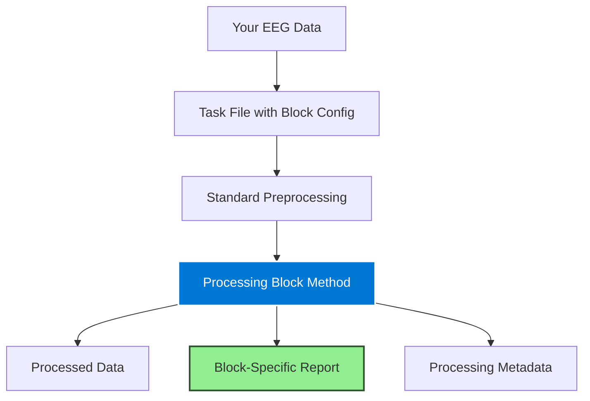

## Quick Start (5 Minutes)

Get up and running with processing blocks in just a few steps:

<Steps>
<Step title="List Available Blocks">
View all processing blocks in the task library:

```bash
autocleaneeg-pipeline task list --source=library
```

Look for tasks with block names in their descriptions (e.g., "WaveletBlock_Test", "RestingState_WaveletDemo")
</Step>

<Step title="Install a Demo Task">
Install a pre-built task that demonstrates a processing block:

```bash
autocleaneeg-pipeline task use RestingState_WaveletDemo
```

This installs a task that uses the **wavelet_threshold** processing block
</Step>

<Step title="Process Sample Data">
Run the task on your EEG data:

```bash
autocleaneeg-pipeline process /path/to/your/data.set
```

Or set it as your active task and use it repeatedly:

```bash
autocleaneeg-pipeline task set RestingState_WaveletDemo
autocleaneeg-pipeline process /path/to/data.set
```
</Step>

<Step title="Review the Output">
Check the processing block's output:

```bash
# Open the output directory
autocleaneeg-pipeline workspace explore

# Navigate to:
# output/RestingState_WaveletDemo/reports/wavelet_threshold/

# Open the PDF report:
# *_wavelet_threshold.pdf
```

This report shows before/after comparisons, artifact reduction metrics, and processing details
</Step>

<Step title="Examine the Task File">
See how the block is configured:

```bash
autocleaneeg-pipeline task edit
```

Look for the `wavelet_threshold` configuration section and the `self.apply_wavelet_threshold()` method call
</Step>
</Steps>

---

## Understanding Processing Block Workflow

### The Big Picture



### What Happens When You Use a Block

1. **Discovery**: Block is registered in `blocks_registry.json`
2. **Configuration**: You add block settings to task `config` dictionary
3. **Execution**: You call the block's mixin method (e.g., `self.apply_wavelet_threshold()`)
4. **Processing**: Block applies its algorithm to your data
5. **Output**: Block generates:
   - Modified EEG data (saved to derivatives)
   - Block-specific report (PDF in reports directory)
   - Processing metadata (logged to database)

---

## Discovering Available Blocks

### Method 1: Browse Task Library

The easiest way to discover blocks is through example tasks:

```bash
# List all library tasks
autocleaneeg-pipeline task list --source=library

# Search for block-related tasks
autocleaneeg-pipeline task search wavelet
autocleaneeg-pipeline task search block
```

**Example output:**
```
Available to Install

 Task Name                     Source      Description
 WaveletBlock_Test             📦 library  Test task for wavelet_threshold processing block
 RestingState_WaveletDemo      📦 library  Resting-state demo using wavelet_threshold block
 RestingState_WaveletOnly      📦 library  Resting-state with wavelet-based denoising
```

### Method 2: Check Task Registry

Browse the [AutoCleanEEG Task Registry](https://github.com/cincibrainlab/autocleaneeg-task-registry) on GitHub:

```
autocleaneeg-task-registry/
├── blocks/                    # All processing blocks
│   └── signal_processing/
│       └── wavelet_threshold/
├── blocks_registry.json       # Central block catalog
└── tasks/                     # Example tasks using blocks
```

### Method 3: Read Documentation

Visit the [Available Blocks](/processing-blocks/available-blocks) catalog page for:
- Complete list of blocks
- Status and versioning
- Scientific references
- Use case descriptions

---

## Installing and Using Blocks

### Automatic Installation (Recommended)

Blocks are automatically available when you install or use a task from the library:

```bash
# Installing a task brings its required blocks
autocleaneeg-pipeline task use RestingState_WaveletDemo

# The wavelet_threshold block is now available
```

<Tip>
**No separate block installation needed!** Blocks are distributed with task files from the task registry. When you install a task, you get all the blocks it uses.
</Tip>

### Manual Integration

To add a block to your own custom task:

<Steps>
<Step title="Find the Block Documentation">
Review the block's README in the task registry or on this documentation site

**Example**: [Wavelet Threshold Overview](/processing-blocks/wavelet-threshold/overview)
</Step>

<Step title="Add Configuration">
Copy the block's configuration to your task's `config` dictionary:

```python
config = {
    # ... your existing config ...

    "wavelet_threshold": {
        "enabled": True,
        "value": {
            "wavelet": "sym4",
            "level": 5,
            "threshold_mode": "soft",
            "threshold_scale": 1.0,
            "is_erp": False,
        }
    },
}
```
</Step>

<Step title="Call the Method">
Add the block's method call in your task's `run()` function:

```python
class MyCustomTask(Task):
    def run(self):
        self.import_raw()
        self.resample_data()
        self.filter_data()

        # Call the processing block
        self.apply_wavelet_threshold()  # ← Add this line

        self.create_epochs()
```
</Step>

<Step title="Test It">
Process a file to verify the block works:

```bash
autocleaneeg-pipeline process --yes --file /path/to/test.set
```

Check for the block's output report and processed data
</Step>
</Steps>

---

## Example Walkthrough: Wavelet Threshold

Let's walk through using the **wavelet_threshold** block step-by-step.

### Step 1: Install Example Task

```bash
autocleaneeg-pipeline task use RestingState_WaveletDemo
```

### Step 2: Examine the Task File

```bash
autocleaneeg-pipeline task edit
```

You'll see a task file like this:

```python
from autoclean.core.task import Task

config = {
    "schema_version": "2025.09",
    "resample_step": {"enabled": True, "value": 250},
    "filtering": {
        "enabled": True,
        "value": {"l_freq": 1.0, "h_freq": 45.0, "notch_freqs": [60.0]}
    },

    # Processing block configuration
    "wavelet_threshold": {
        "enabled": True,
        "value": {
            "wavelet": "sym4",           # Wavelet basis function
            "level": 5,                   # Decomposition depth
            "threshold_mode": "soft",     # Thresholding type
            "threshold_scale": 1.0,       # Threshold multiplier
            "is_erp": False,              # ERP-preserving mode
            "psd_fmax": 45.0,            # PSD analysis ceiling
            "picks": "eeg",               # Channel selection
        }
    },

    "reference_step": {"enabled": True, "value": "average"},
    "ICA": {"enabled": False},  # Using wavelet instead
    "epoch_settings": {
        "enabled": True,
        "value": {"tmin": -1.0, "tmax": 1.0}
    },
}

class RestingState_WaveletDemo(Task):
    def run(self):
        # Standard preprocessing
        self.import_raw()
        self.resample_data()
        self.filter_data()

        # Apply processing block
        self.apply_wavelet_threshold()  # ← The magic happens here

        # Post-processing
        self.rereference_data()
        self.create_regular_epochs(export=True)
```

### Step 3: Set as Active Task

```bash
autocleaneeg-pipeline task set RestingState_WaveletDemo
```

### Step 4: Process Your Data

```bash
# Process a single file
autocleaneeg-pipeline process /path/to/your/resting_EEG.set

# Or batch process a folder
autocleaneeg-pipeline input set /path/to/folder/
autocleaneeg-pipeline process
```

### Step 5: Review the Output

Navigate to your workspace output directory:

```bash
autocleaneeg-pipeline workspace explore
```

**Output structure:**
```
output/RestingState_WaveletDemo/
├── bids/derivatives/
│   └── 05_wavelet_threshold/     # Processed EEG data
│       └── *_wavelet_threshold_raw.set
│
├── reports/
│   └── wavelet_threshold/        # Block-specific report
│       └── *_wavelet_threshold.pdf
│
└── exports/                       # Final processed files
    └── *_comp_epo.set
```

### Step 6: Examine the Report

Open the PDF report at:
```
reports/wavelet_threshold/*_wavelet_threshold.pdf
```

The report includes:
- **Summary table**: Channels, sampling rate, decomposition level, parameters
- **Signal comparison**: Before/after waveforms for all channels
- **Power spectral density**: Mean PSD changes across frequency bands
- **Top channels table**: Most affected channels with reduction metrics

<Tip>
This report is automatically generated by the processing block. You don't need to create any custom reporting code!
</Tip>

---

## Configuration Tips

### Start with Defaults

Every block provides recommended default parameters. Start with these before customizing:

```python
"wavelet_threshold": {
    "enabled": True,
    "value": {
        "wavelet": "sym4",      # Recommended default
        "level": 5,              # Recommended default
        "threshold_mode": "soft", # Recommended default
        "threshold_scale": 1.0,  # Recommended default
    }
}
```

### Adjust Based on Reports

After processing, review the block's report and adjust if needed:

- **Too much smoothing?** → Decrease `threshold_scale` (try 0.8)
- **Artifacts remain?** → Increase `threshold_scale` (try 1.5)
- **Need more aggressive?** → Try `threshold_mode: "hard"`

### Consult Block Documentation

Each block has comprehensive parameter documentation:

```python
# See detailed parameter guide:
# /processing-blocks/wavelet-threshold/parameters
```

---

## Common Workflows

### Workflow 1: Exploring a New Block

<Steps>
<Step title="Read Documentation">
Start with the block's overview page to understand:
- Scientific background
- Use cases
- When to use vs. alternatives
</Step>

<Step title="Install Demo Task">
Get a working example:
```bash
autocleaneeg-pipeline task use WaveletBlock_Test
```
</Step>

<Step title="Test with Sample Data">
Process a small test file to see the block in action
</Step>

<Step title="Review Output">
Study the generated report to understand the block's effect
</Step>

<Step title="Tune Parameters">
Adjust settings based on your data characteristics
</Step>
</Steps>

### Workflow 2: Adding Block to Custom Task

<Steps>
<Step title="Copy Existing Task">
Start with a working task as template:
```bash
autocleaneeg-pipeline task copy RestingState_Basic MyCustomTask
```
</Step>

<Step title="Add Block Configuration">
Copy the block's config from documentation or example tasks
</Step>

<Step title="Add Method Call">
Insert `self.apply_<block_name>()` at the desired point in your pipeline
</Step>

<Step title="Test and Iterate">
Process test data and refine based on results
</Step>
</Steps>

### Workflow 3: Comparing Blocks

<Steps>
<Step title="Create Two Task Variants">
Make identical tasks except for the processing block:
- `MyTask_Wavelet`: Uses wavelet_threshold
- `MyTask_ICA`: Uses standard ICA
</Step>

<Step title="Process Same Data">
Run both tasks on the same input file
</Step>

<Step title="Compare Reports">
Review outputs side-by-side to determine which works better for your data
</Step>
</Steps>

---

## Troubleshooting

### Block Method Not Found

**Error**: `AttributeError: 'MyTask' object has no attribute 'apply_wavelet_threshold'`

**Solution**: Ensure you're using an up-to-date AutoCleanEEG Pipeline installation:
```bash
uv tool upgrade autocleaneeg-pipeline
```

The block mixins must be available in your installation.

### Configuration Validation Errors

**Error**: `Task config validation failed: Key 'wavelet_threshold' error`

**Solution**: Check that your configuration has all required keys. Compare with the block's documentation or example task:

```bash
# View example task for correct config structure
autocleaneeg-pipeline task use WaveletBlock_Test
autocleaneeg-pipeline task edit
```

### Block Report Not Generated

**Problem**: Processing completes but no block-specific report appears

**Solution**: Check the logs for errors:
```bash
# View pipeline log
cat ~/Documents/Autoclean-EEG/output/<task_name>/status/pipeline.log
```

Common causes:
- Missing dependencies (e.g., `reportlab` for PDF generation)
- Insufficient data (blocks may skip reporting if data is too short)
- Disk space issues

### Unexpected Results

**Problem**: Block output doesn't match expectations

**Solutions**:
1. **Review parameter settings**: Compare your config with recommended defaults
2. **Check input data quality**: Some blocks require pre-filtering or specific data types
3. **Consult block documentation**: Review the troubleshooting section for the specific block
4. **Examine the report**: Block reports often show diagnostic information

---

## Next Steps

<CardGroup cols={2}>
<Card title="Wavelet Threshold Deep-Dive" icon="wave-square" href="/processing-blocks/wavelet-threshold/overview">
  Comprehensive guide to our first processing block with parameter tuning and examples
</Card>

<Card title="Using Blocks in Tasks" icon="puzzle-piece" href="/processing-blocks/using-blocks">
  Best practices for integrating blocks into custom task files
</Card>

<Card title="Available Blocks Catalog" icon="books" href="/processing-blocks/available-blocks">
  Browse all available processing blocks with status and scientific references
</Card>

<Card title="Block Architecture" icon="cubes" href="/processing-blocks/block-architecture">
  Technical details on manifests, registry, versioning, and the discovery system
</Card>
</CardGroup>

---

## Key Takeaways

<Tip>
**Start simple**: Use example tasks first to understand how blocks work before customizing
</Tip>

<Info>
**Blocks are optional**: They enhance the pipeline but aren't required for standard preprocessing
</Info>

<Warning>
**Read the documentation**: Processing blocks are powerful but require understanding their parameters and appropriate use cases
</Warning>

Need help? Check the [Processing Blocks Introduction](/processing-blocks/introduction) or ask in [GitHub Discussions](https://github.com/cincibrainlab/autocleaneeg_pipeline/discussions).