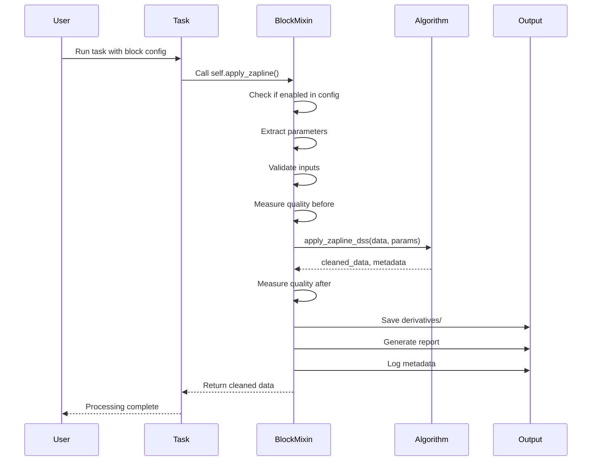

<Note>
**Already familiar with the concept?** Jump straight to [Using Blocks](#using-blocks-in-your-tasks) to see code examples. New to processing blocks? Start with the [Introduction](/processing-blocks/introduction) first.
</Note>

## 5-Minute Quick Start

Get hands-on with processing blocks immediately:

<Steps>
<Step title="Check What's Available">
See all blocks currently on your system:

```bash
autocleaneeg-pipeline blocks list
```

You should see 7 bundled blocks including `wavelet_threshold`, `zapline`, `autoreject`, and analysis blocks.
</Step>

<Step title="Update to Latest Versions">
Pull the most recent block definitions from GitHub:

```bash
autocleaneeg-pipeline blocks update
```

This downloads new blocks and updates to your local cache (`~/.config/autocleaneeg/.block_cache/`).
</Step>

<Step title="Learn About a Block">
Get detailed information before using:

```bash
autocleaneeg-pipeline blocks info zapline
```

This shows what the block does, required packages, parameters, and scientific references.
</Step>

<Step title="Add to Your Task">
Open your task file and add block configuration:

```python
from autoclean.core.task import Task

config = {
    "apply_zapline": {
        "enabled": True,
        "value": {"fline": 60, "nkeep": 1}
    }
}

class MyTask(Task):
    def run(self):
        self.import_raw()
        self.filter_data()
        self.apply_zapline()  # ← New block method
        self.run_ica()
        self.create_epochs()
```
</Step>

<Step title="Process Data">
Run your task normally:

```bash
autocleaneeg-pipeline process /path/to/data.set
```

The block runs automatically, generates reports, and logs quality metrics.
</Step>
</Steps>

<Tip>
**That's it!** No installation, no dependencies to manage manually, no complex setup. Blocks work out-of-the-box with sensible defaults.
</Tip>

---

## Understanding the Workflow

Here's what happens behind the scenes when you use a processing block:



**Key stages:**
1. **Configuration check**: Is the block enabled?
2. **Parameter extraction**: Get user settings or use defaults
3. **Validation**: Check data compatibility, parameter ranges
4. **Quality measurement**: Metrics before processing
5. **Algorithm execution**: Pure signal processing logic
6. **Quality verification**: Metrics after processing
7. **Output generation**: Save data, reports, metadata

---

## Using Blocks in Your Tasks

### Basic Pattern

The standard pattern for all processing blocks:

```python
from autoclean.core.task import Task

config = {
    # Enable and configure the block
    "<block_config_key>": {
        "enabled": True,
        "value": {
            # Block-specific parameters
            "param1": value1,
            "param2": value2,
        }
    }
}

class MyTask(Task):
    def run(self):
        # Standard preprocessing
        self.import_raw()
        self.resample_data()
        self.filter_data()

        # Call block method
        self.<block_method_name>()

        # Continue with rest of pipeline
        self.run_ica()
        self.create_epochs()
```

### Example 1: Zapline for Line Noise

Remove 60 Hz power line noise using spatial filtering:

```python
config = {
    "resample_step": {"enabled": True, "value": 250},
    "filtering": {
        "enabled": True,
        "value": {"l_freq": 1, "h_freq": 100, "notch_freqs": None}
        # No notch filter - using Zapline instead!
    },

    "apply_zapline": {
        "enabled": True,
        "value": {
            "fline": 60,          # Line frequency (50 for Europe/Asia)
            "nkeep": 1,           # Remove primary component
            "use_iter": False,    # Single-pass (fast)
            "max_iter": 10        # Max iterations if iterative
        }
    }
}

class RestingWithZapline(Task):
    def run(self):
        self.import_raw()
        self.resample_data()
        self.filter_data()

        # Remove line noise with spatial filtering
        self.apply_zapline()

        self.run_ica()
        self.create_regular_epochs(export=True)
```

**Console output you'll see:**
```
[INFO] Pre-Zapline: 65.3 dB at 60 Hz (SNR: 3.42)
[HEADER] Applying Zapline (fline=60 Hz, nkeep=1, iter=False)...
[INFO] Post-Zapline: 45.1 dB at 60 Hz (reduction: 20.2 dB, SNR: 0.98)
[SUCCESS] Zapline complete (1 iterations)
```

### Example 2: Wavelet Thresholding for Artifacts

Remove transient artifacts (eye blinks, muscle) using wavelets:

```python
config = {
    "wavelet_threshold": {
        "enabled": True,
        "value": {
            "wavelet": "sym4",         # Wavelet family
            "level": 5,                # Decomposition depth
            "threshold_mode": "soft",  # Smooth reconstruction
            "threshold_scale": 1.0,    # Standard threshold
            "is_erp": False            # ERP-preserving mode off
        }
    }
}

class DevelopmentalData(Task):
    def run(self):
        self.import_raw()
        self.filter_data()

        # Remove transient artifacts
        self.apply_wavelet_threshold()

        self.run_ica()  # Or skip ICA entirely
        self.create_epochs()
```

**What gets generated:**
- `derivatives/wavelet_threshold/sub-01_eeg.fif` (cleaned data)
- `reports/wavelet_threshold/sub-01_report.pdf` (before/after comparison)
- Logged metadata with artifact reduction percentages

### Example 3: Combining Multiple Blocks

Use multiple blocks in sequence:

```python
config = {
    "apply_zapline": {
        "enabled": True,
        "value": {"fline": 60, "nkeep": 1}
    },

    "wavelet_threshold": {
        "enabled": True,
        "value": {"wavelet": "sym4", "level": 5}
    },

    "apply_autoreject": {
        "enabled": True,
        "value": {
            "n_interpolate": [1, 4, 8],
            "consensus": [0.2, 0.5, 1.0]
        }
    }
}

class ComprehensiveCleaning(Task):
    def run(self):
        self.import_raw()
        self.filter_data()

        # 1. Remove line noise spatially
        self.apply_zapline()

        # 2. Remove transient artifacts
        self.apply_wavelet_threshold()

        # 3. ICA for stationary artifacts
        self.run_ica()

        # 4. Epoch the data
        self.create_regular_epochs()

        # 5. ML-based epoch rejection
        self.apply_autoreject()
```

<Warning>
**Order matters!** Some blocks work on continuous data (Raw), others on epochs. Check block documentation for compatible data types:
- **Raw blocks**: `apply_zapline`, `apply_wavelet_threshold`
- **Epoch blocks**: `apply_autoreject`
- **Source blocks**: `apply_source_localization`, `apply_source_psd`
</Warning>

---

## Common Use Cases

### For Developmental/Pediatric EEG

High artifact rates require robust cleaning:

```python
config = {
    "wavelet_threshold": {
        "enabled": True,
        "value": {
            "threshold_mode": "soft",
            "threshold_scale": 1.2  # Slightly more aggressive
        }
    },
    "ICA": {"enabled": False}  # Wavelet often sufficient
}

class PediatricRestingState(Task):
    def run(self):
        self.import_raw()
        self.filter_data()
        self.apply_wavelet_threshold()  # Handles high artifact rates
        self.create_epochs()
```

### For Spectral/Connectivity Analyses

Line noise must be thoroughly removed:

```python
config = {
    "apply_zapline": {
        "enabled": True,
        "value": {
            "fline": 60,
            "nkeep": 2,        # Remove main + first harmonic
            "use_iter": True   # Iterative for thorough removal
        }
    }
}

class ConnectivityAnalysis(Task):
    def run(self):
        self.import_raw()
        self.filter_data()
        self.apply_zapline()  # Critical for frequency domain
        self.apply_source_localization()
        self.apply_source_connectivity()
```

### For Source-Level Analyses

Complete pipeline from sensor to source:

```python
config = {
    "apply_source_localization": {
        "enabled": True,
        "value": {
            "method": "dSPM",
            "lambda2": 1.0 / 9.0
        }
    },

    "apply_source_psd": {
        "enabled": True,
        "value": {
            "fmin": 1,
            "fmax": 45,
            "bandwidth": 4
        }
    }
}

class SourceSpaceAnalysis(Task):
    def run(self):
        self.import_raw()
        self.filter_data()
        self.run_ica()

        # Project to source space
        self.apply_source_localization()

        # Compute source-level power
        self.apply_source_psd()
```

---

## Checking Block Output

After running your task, verify block output:

### Console Output

Look for block-specific messages:

```bash
[INFO] Pre-Zapline: 65.3 dB at 60 Hz (SNR: 3.42)
[HEADER] Applying Zapline...
[INFO] Post-Zapline: 45.1 dB at 60 Hz (reduction: 20.2 dB)
[SUCCESS] Zapline complete
```

### File System Output

Blocks save multiple outputs:

```bash
workspace/
└── output/
    └── MyTask/
        ├── derivatives/
        │   ├── zapline/
        │   │   └── sub-01_task-rest_eeg.fif  # Cleaned data
        │   └── wavelet_threshold/
        │       └── sub-01_task-rest_eeg.fif
        ├── reports/
        │   ├── zapline/
        │   │   └── sub-01_zapline.pdf  # Quality metrics
        │   └── wavelet_threshold/
        │       └── sub-01_wavelet.pdf
        └── metadata/
            └── sub-01_processing.json  # Logged parameters
```

### Metadata Logging

Check processing details:

```bash
cat workspace/output/MyTask/metadata/sub-01_processing.json
```

```json
{
  "step_zapline": {
    "block_name": "zapline",
    "block_version": "1.0.0",
    "parameters": {"fline": 60, "nkeep": 1},
    "quality_metrics": {
      "power_before_db": 65.3,
      "power_after_db": 45.1,
      "reduction_db": 20.2
    }
  }
}
```

---

## Tuning Block Parameters

### Start with Defaults

All blocks have sensible defaults:

```python
# Minimal configuration (uses all defaults)
config = {
    "apply_zapline": {"enabled": True}
}
```

### Adjust Based on Data Quality

If defaults don't work, tune incrementally:

<Tabs>
<Tab title="Zapline Tuning">
```python
# Standard (good for most cases)
"apply_zapline": {
    "enabled": True,
    "value": {"fline": 60, "nkeep": 1}
}

# Severe contamination
"apply_zapline": {
    "enabled": True,
    "value": {
        "fline": 60,
        "nkeep": 2,        # Remove main + harmonic
        "use_iter": True   # Iterative refinement
    }
}

# Very aggressive (use cautiously)
"apply_zapline": {
    "enabled": True,
    "value": {
        "fline": 60,
        "nkeep": 3,
        "use_iter": True,
        "max_iter": 20
    }
}
```
</Tab>

<Tab title="Wavelet Tuning">
```python
# Standard (balanced)
"wavelet_threshold": {
    "enabled": True,
    "value": {
        "threshold_scale": 1.0,
        "threshold_mode": "soft"
    }
}

# High artifacts (more aggressive)
"wavelet_threshold": {
    "enabled": True,
    "value": {
        "threshold_scale": 1.5,  # More aggressive
        "threshold_mode": "hard"  # HAPPE high-artifact mode
    }
}

# Preserve ERP morphology
"wavelet_threshold": {
    "enabled": True,
    "value": {
        "threshold_scale": 1.0,
        "threshold_mode": "soft",
        "is_erp": True,          # ERP-preserving mode
        "bandpass": (1.0, 30.0)  # ERP frequency range
    }
}
```
</Tab>
</Tabs>

<Tip>
**Tuning Strategy**: Start conservative (defaults), process a few subjects, review quality metrics, adjust parameters, repeat. Blocks log metrics automatically, making it easy to compare settings.
</Tip>

---

## Troubleshooting Common Issues

### Block Method Not Available

**Error**: `AttributeError: 'MyTask' object has no attribute 'apply_zapline'`

**Cause**: Block not discovered or cache/bundled out of sync

**Fix**:
```bash
# Update blocks from registry
autocleaneeg-pipeline blocks update

# Verify block is available
autocleaneeg-pipeline blocks list | grep zapline

# Reinstall CLI if needed
uv tool install --force --editable .
```

### Parameters Not Taking Effect

**Symptom**: Block runs but uses different parameters than configured

**Cause**: Typo in config key or nested structure incorrect

**Fix**:
```python
# ❌ WRONG - Incorrect structure
config = {
    "zapline": {"fline": 60}  # Missing "enabled" and "value"
}

# ✅ CORRECT - Proper structure
config = {
    "apply_zapline": {
        "enabled": True,
        "value": {"fline": 60}
    }
}
```

### Block Skipped Without Warning

**Symptom**: Block doesn't run, no error message

**Cause**: Block disabled in config

**Fix**:
```python
# Check enabled flag
config = {
    "apply_zapline": {
        "enabled": True,  # ← Make sure this is True!
        "value": {"fline": 60}
    }
}
```

### Quality Metrics Look Wrong

**Symptom**: Block reports unexpected results (e.g., "Reduction: 0.3 dB")

**Possible causes**:
1. Data already clean (nothing to remove)
2. Wrong line frequency specified (using 60 Hz in Europe)
3. Too few channels for spatial methods (Zapline needs 32+)

**Fix**: Review block's console output and generated reports for clues.

---

## Next Steps

<CardGroup cols={2}>
<Card title="Deep-Dive: Wavelet Block" icon="wave-square" href="/processing-blocks/wavelet-threshold/overview">
  Complete parameter reference and tuning guide for wavelet thresholding
</Card>

<Card title="Browse All Blocks" icon="list" href="/processing-blocks/available-blocks">
  Full catalog of available processing blocks with use cases
</Card>

<Card title="Create Your Own Block" icon="code" href="/processing-blocks/creating-blocks">
  Developer guide for contributing new processing methods
</Card>

<Card title="Task Customization" icon="puzzle-piece" href="/tasks/task-customization">
  Advanced patterns for combining blocks with custom logic
</Card>
</CardGroup>

---

## Quick Reference

### Essential Commands

```bash
# Discovery
autocleaneeg-pipeline blocks list
autocleaneeg-pipeline blocks info <name>

# Updates
autocleaneeg-pipeline blocks update
autocleaneeg-pipeline blocks install <name>

# Usage (in tasks)
self.apply_zapline()
self.apply_wavelet_threshold()
self.apply_autoreject()
```

### Configuration Template

```python
from autoclean.core.task import Task

config = {
    "resample_step": {"enabled": True, "value": 250},
    "filtering": {"enabled": True, "value": {"l_freq": 1, "h_freq": 100}},

    # Add processing blocks here
    "<block_config_key>": {
        "enabled": True,
        "value": {
            # Parameters
        }
    }
}

class MyTask(Task):
    def run(self):
        self.import_raw()
        self.resample_data()
        self.filter_data()

        # Call block methods
        self.<block_method_name>()

        self.run_ica()
        self.create_epochs()
```

<Info>
**Ready to dive deeper?** Each processing block has comprehensive documentation with scientific background, parameter tuning guides, comparison with alternatives, and troubleshooting. Start with [Wavelet Threshold](/processing-blocks/wavelet-threshold/overview) or [browse all blocks](/processing-blocks/available-blocks).
</Info>
