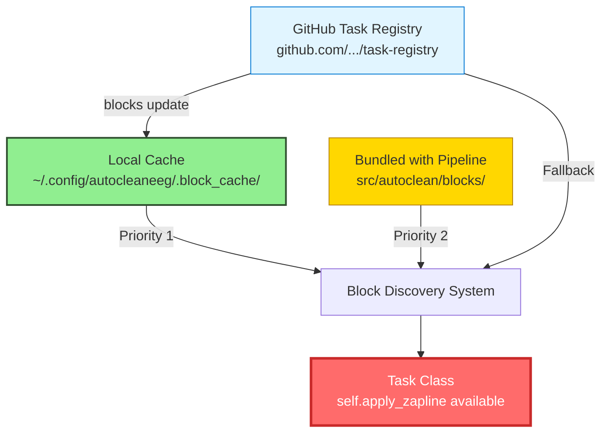
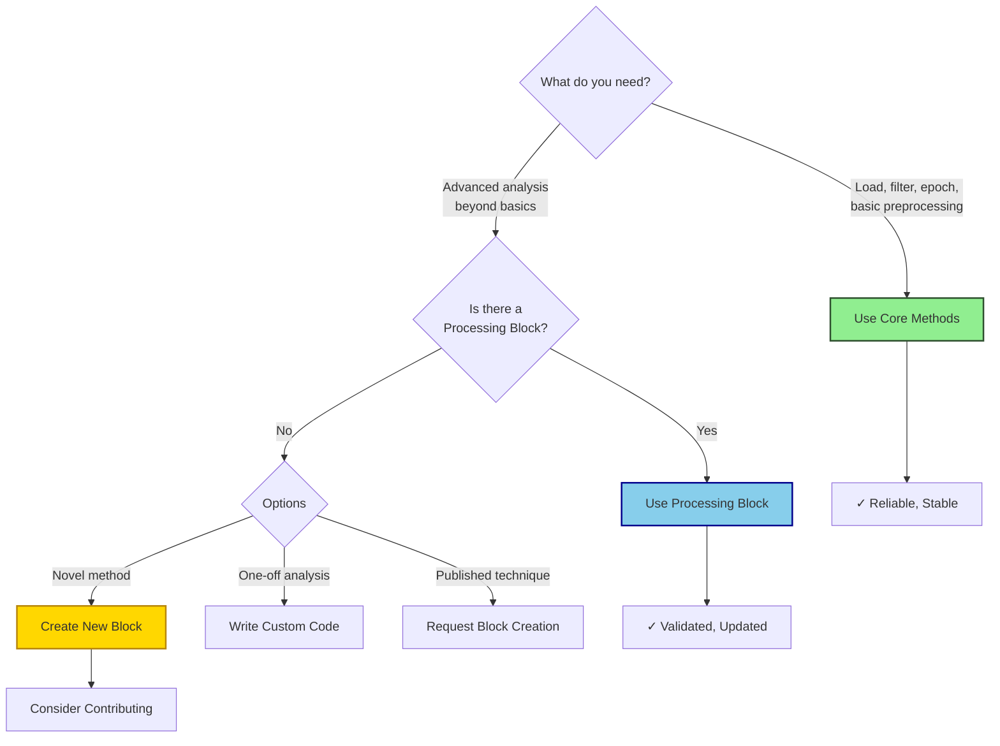

## What are Processing Blocks?

**Processing Blocks** are self-contained signal processing modules that extend AutoCleanEEG Pipeline with advanced analysis methods. Think of them as scientifically-validated plugins: each block packages together an algorithm, documentation, references, and configuration into a single discoverable unit that integrates seamlessly into your tasks.

Unlike traditional EEG software where advanced methods are either built-in (inflexible) or require custom code (unreproducible), processing blocks create a third path: **methods that are both cutting-edge and scientifically documented, that update independently yet integrate automatically**.

<Note>
**The Big Idea**: While AutoCleanEEG's core methods (import, filter, ICA, epoching) handle standard preprocessing, **Processing Blocks** provide specialized techniques—wavelet denoising, source localization, advanced connectivity—that researchers can discover, update, and contribute to the community.
</Note>

### What You Get from Blocks

When you call `self.apply_zapline()` or `self.apply_wavelet_threshold()` in your task, you're not just running a function. You're invoking a complete scientific workflow:

<CardGroup cols={2}>
<Card title="📚 Scientifically Validated" icon="flask">
  Every block cites peer-reviewed papers, includes parameter guidance from experts, and provides validation against published methods.
</Card>

<Card title="🔄 Always Up-to-Date" icon="rotate">
  Run `blocks update` to pull the latest versions from GitHub. New features, bug fixes, and improvements flow automatically.
</Card>

<Card title="📊 Complete Reporting" icon="chart-line">
  Blocks generate comprehensive reports (PDFs, plots) showing before/after comparisons and quality metrics.
</Card>

<Card title="✅ Audit Trail Built-In" icon="file-lines">
  All parameters, versions, and quality metrics logged automatically for reproducibility and peer review.
</Card>

<Card title="🔧 Zero Configuration" icon="wrench">
  Blocks work out-of-the-box with sensible defaults. Tune parameters only when needed for your specific use case.
</Card>

<Card title="🌍 Community Contributions" icon="users">
  Anyone can contribute blocks to the registry. Your lab's novel method can become the community standard.
</Card>
</CardGroup>

---

## How the Block System Works

Processing blocks use a **three-tier architecture** that balances availability, currency, and flexibility. Understanding this architecture helps you know where blocks come from and how they update.



### The Three Tiers Explained

**Tier 1: Local Cache (Highest Priority)**

When you run `autocleaneeg-pipeline blocks update`, the system downloads the latest block definitions from GitHub into a local cache directory (`~/.config/autocleaneeg/.block_cache/`). This cache takes priority over all other sources, ensuring you always use the most recent versions you've explicitly requested.

**Why this matters**: If a block is updated with a bug fix or new feature, running `blocks update` immediately makes it available without waiting for a new pipeline release.

**Tier 2: Bundled Blocks (Always Available)**

Every AutoCleanEEG installation ships with a snapshot of essential blocks bundled directly into the package (`src/autoclean/blocks/`). These blocks are always available even if you're offline or have never run `blocks update`.

**Why this matters**: You can start using processing blocks immediately after installation—no setup, no downloads, no configuration. The bundled blocks act as a safety net.

**Tier 3: Remote Registry (Fallback)**

If a block isn't in your cache or bundled files (rare edge case), the system can fetch it directly from GitHub as a last resort. This ensures you never lose access to blocks even if your cache is corrupted.

**Why this matters**: The system gracefully degrades. Network issues or cache problems won't break your pipeline.

### Discovery Priority in Action

Here's what happens when you import Task and call a block method:

```python
from autoclean.core.task import Task  # Triggers discovery

class MyTask(Task):
    def run(self):
        self.apply_zapline()  # ← How is this available?
```

**Behind the scenes**:

1. Pipeline scans `~/.config/autocleaneeg/.block_cache/` (cache tier)
2. For each block in cache, imports its `ZaplineMixin` class
3. Falls back to `src/autoclean/blocks/` (bundled tier) for missing blocks
4. Combines all mixin classes via multiple inheritance
5. Task now has all block methods available as if they were built-in

**The result**: `self.apply_zapline()`, `self.apply_wavelet_threshold()`, and all other block methods "just work" without any imports or setup.

<Tip>
**Mental Model**: Think of blocks like an app store. Bundled blocks are "pre-installed apps" that come with your phone. Running `blocks update` is like checking for app updates. The cache is your "updated apps" folder that overrides the pre-installed versions.
</Tip>

---

## Using Processing Blocks (Quick Start)

### Step 1: See What's Available

List all blocks currently available on your system:

```bash
autocleaneeg-pipeline blocks list
```

**Example output**:
```
Processing Blocks (7 total)

                               Signal Processing
┏━━━━━━━━━━━━━━━━━━━┳━━━━━━━━━┳━━━━━━━━━┳━━━━━━━━━━━━━━━━━━━━━━━━━━━━━━━━━━━━━━┓
┃ Name              ┃ Version ┃ Source  ┃ Description                          ┃
┡━━━━━━━━━━━━━━━━━━━╇━━━━━━━━━╇━━━━━━━━━╇━━━━━━━━━━━━━━━━━━━━━━━━━━━━━━━━━━━━━━┩
│ wavelet_threshold │ 1.0.0   │ bundled │ Wavelet-based artifact removal       │
│ autoreject        │ 1.0.0   │ bundled │ ML-based epoch rejection             │
│ zapline           │ 1.0.0   │ bundled │ DSS line noise removal               │
└───────────────────┴─────────┴─────────┴──────────────────────────────────────┘

                                   Analysis
┏━━━━━━━━━━━━━━━━━━━━━┳━━━━━━━━━┳━━━━━━━━━┳━━━━━━━━━━━━━━━━━━━━━━━━━━━━━━━━━━┓
┃ Name                ┃ Version ┃ Source  ┃ Description                      ┃
┡━━━━━━━━━━━━━━━━━━━━━╇━━━━━━━━━╇━━━━━━━━━╇━━━━━━━━━━━━━━━━━━━━━━━━━━━━━━━━━━┩
│ fooof_analysis      │ 1.0.0   │ bundled │ Spectral parameterization        │
│ source_localization │ 1.0.0   │ bundled │ MNE source estimation            │
│ source_psd          │ 1.0.0   │ bundled │ Source-level power analysis      │
│ source_connectivity │ 1.0.0   │ bundled │ Functional connectivity          │
└─────────────────────┴─────────┴─────────┴──────────────────────────────────┘
```

**Note the "Source" column**:
- `bundled`: Shipped with pipeline (always available)
- `cache`: Downloaded via `blocks update` (overrides bundled)
- `registry`: Available on GitHub but not yet cached

### Step 2: Get Detailed Information

Learn about a specific block before using it:

```bash
autocleaneeg-pipeline blocks info zapline
```

**Example output**:
```
╭───────────────────────────── Block Information ──────────────────────────────╮
│ zapline v1.0.0                                                               │
╰──────────────────────────────────────────────────────────────────────────────╯

Description: Zapline DSS-based line noise removal using Denoising Source
Separation for removing power line artifacts from EEG/MEG data

Category: signal_processing
Source: bundled
Method: apply_zapline()
Config Key: apply_zapline

Required Packages:
  mne >=1.10.0
  meegkit >=0.1.9

References:
  - de Cheveigné, A. (2020). ZapLine: A simple and effective method to remove
    power line artifacts. NeuroImage, 207, 116356.

Tags: line-noise, 60Hz, 50Hz, dss, denoising
```

This tells you everything you need: what it does, what it requires, how to configure it, and the scientific references.

### Step 3: Update Blocks from GitHub

Pull the latest block versions from the community registry:

```bash
autocleaneeg-pipeline blocks update
```

**Example output**:
```
→ Updating blocks from GitHub registry...

Block Library refreshed (version 8a3f21c).

New blocks:
  + zapline

Updated blocks:
  ↻ wavelet_threshold (1.0.0 → 1.1.0)
```

<Info>
**When to update**: Run `blocks update` periodically (monthly) or when you see announcements about new blocks or bug fixes. Updates are backward-compatible—your existing tasks won't break.
</Info>

### Step 4: Use a Block in Your Task

Add the block to your task configuration and call its method:

```python
from autoclean.core.task import Task

config = {
    "resample_step": {"enabled": True, "value": 250},
    "filtering": {
        "enabled": True,
        "value": {"l_freq": 1, "h_freq": 100, "notch_freqs": [60]}
    },

    # Add block configuration
    "apply_zapline": {
        "enabled": True,
        "value": {
            "fline": 60,     # Line frequency (Hz)
            "nkeep": 1,      # Components to remove
            "use_iter": False # Single-pass mode
        }
    }
}

class MyRestingTask(Task):
    def run(self):
        self.import_raw()
        self.resample_data()
        self.filter_data()

        # Apply Zapline block
        self.apply_zapline()  # ← That's it!

        self.run_ica()
        self.create_regular_epochs(export=True)
```

**What happens when you run this**:

1. Zapline checks if enabled in config (yes)
2. Extracts parameters (`fline=60`, `nkeep=1`)
3. Measures line noise power before processing
4. Applies DSS algorithm to remove 60 Hz contamination
5. Measures line noise power after processing
6. Logs reduction metrics (e.g., "Reduced 60 Hz by 18.3 dB")
7. Saves cleaned data to `derivatives/zapline/`
8. Updates task metadata with processing details

### Step 5: Review Block Output

Blocks generate detailed reports and metrics:

```bash
# View output directory
autocleaneeg-pipeline workspace explore

# Look for:
# - derivatives/zapline/sub-01_task-rest_eeg.fif (processed data)
# - reports/zapline/sub-01_zapline_report.pdf (quality metrics)
# - metadata/sub-01_processing.json (logged parameters)
```

The console output also shows real-time quality metrics:

```
[INFO] Pre-Zapline: 65.3 dB at 60 Hz (SNR: 3.42)
[HEADER] Applying Zapline (fline=60 Hz, nkeep=1, iter=False)...
[INFO] Post-Zapline: 45.1 dB at 60 Hz (reduction: 20.2 dB, SNR: 0.98)
[SUCCESS] Zapline complete (1 iterations)
```

---

## Built-In vs. Processing Blocks: When to Use Each

Not everything is a processing block. AutoCleanEEG's architecture divides functionality between core methods and extensible blocks for good reasons.

### Core Methods (Built Into Pipeline)

These handle fundamental preprocessing that every analysis needs:

| Method | Purpose | Stability |
|--------|---------|-----------|
| `import_raw()` | Load EEG files | Stable API, rarely changes |
| `resample_data()` | Change sampling rate | Standard operation, well-tested |
| `filter_data()` | Band-pass/notch filtering | MNE-based, thoroughly validated |
| `rereference_data()` | Reference to average/mastoid | Core preprocessing step |
| `run_ica()` | Independent component analysis | Established method, stable |
| `create_epochs()` | Segment continuous data | Standard BIDS workflow |

**When to use**: For standard preprocessing that appears in 90%+ of EEG studies. These methods are stable, well-tested, and rarely need updates.

### Processing Blocks (Extensible Modules)

These provide specialized, cutting-edge methods:

| Block | Purpose | Update Frequency |
|-------|---------|------------------|
| `apply_zapline()` | DSS-based line noise removal | As algorithm improves |
| `apply_wavelet_threshold()` | Wavelet denoising (HAPPE-style) | Parameter tuning, bug fixes |
| `apply_autoreject()` | ML-based epoch rejection | Algorithm updates |
| `apply_source_localization()` | Cortical source estimation | MNE updates, new methods |
| `apply_source_connectivity()` | Functional connectivity | New connectivity measures |

**When to use**: For advanced analyses beyond standard preprocessing, methods under active development, or techniques requiring domain expertise.

### The Decision Tree



<Tip>
**Rule of Thumb**: If the method appears in textbook EEG preprocessing chapters, it's probably a core method. If it appears in recent Nature Neuroscience papers, it's probably a processing block.
</Tip>

---

## Current Processing Blocks

### Signal Processing

<AccordionGroup>
<Accordion title="wavelet_threshold — Wavelet-Based Artifact Removal" icon="wave-square">
**Remove transient artifacts using discrete wavelet transform**

Implements the HAPPE pipeline approach for removing high-amplitude transients (eye blinks, muscle twitches, electrode pops) while preserving underlying neural signals.

**Key Features:**
- Universal thresholding (Donoho & Johnstone, 1994)
- Soft/hard thresholding modes
- ERP-preserving option
- Comprehensive PDF reports

**Best For:**
- Developmental EEG (high artifact rates)
- Pediatric populations
- Data with frequent motion artifacts
- Alternative to ICA for transients

**Status**: Stable (v1.0.0)

**References**: Donoho (1995), Gabard-Durnam et al. (2018)

[Complete Documentation →](/processing-blocks/wavelet-threshold/overview)
</Accordion>

<Accordion title="autoreject — ML-Based Epoch Rejection" icon="filter">
**Data-driven automated artifact rejection using cross-validation**

Automatically determines rejection thresholds and decides which epochs to reject vs. which channels to interpolate, using machine learning instead of arbitrary thresholds.

**Key Features:**
- Cross-validation based thresholding
- Channel interpolation decisions
- Consensus rejection across sensors
- Transparent rejection criteria

**Best For:**
- Epoch-level quality control
- Event-related analyses (ERP, ERN, P300)
- Objective artifact rejection
- Studies requiring reproducible QC

**Status**: Stable (v1.0.0)

**References**: Jas et al. (2017) NeuroImage

[Complete Documentation →](/processing-blocks/autoreject/overview)
</Accordion>

<Accordion title="zapline — DSS Line Noise Removal" icon="wave-pulse">
**Remove 50/60 Hz line noise using spatial filtering**

Uses Denoising Source Separation to remove power line artifacts by exploiting spatial consistency of noise across channels. Better signal preservation than traditional notch filters.

**Key Features:**
- Single-pass or iterative modes
- Automatic quality metrics (dB reduction, SNR)
- Preserves neural signals at line frequency
- Works with harmonics

**Best For:**
- Spectral analyses sensitive to line noise
- Connectivity studies
- Frequency domain analyses
- Alternative to aggressive notch filtering

**Status**: Stable (v1.0.0)

**References**: de Cheveigné (2020) NeuroImage

[Complete Documentation →](/processing-blocks/zapline/overview) *(coming soon)*
</Accordion>
</AccordionGroup>

### Analysis Blocks

<AccordionGroup>
<Accordion title="source_localization — MNE Source Estimation" icon="brain">
**Project sensor-space EEG to cortical sources**

Implements minimum norm estimation to localize EEG activity to cortical surfaces using the fsaverage template brain.

**Key Features:**
- Multiple inverse methods (MNE, dSPM, sLORETA)
- Forward model computation
- Source space transformation
- ROI extraction via atlases

**Best For:**
- Source-level analyses
- Cortical mapping
- Network connectivity
- Region-of-interest studies

**Status**: Stable (v1.0.0)
</Accordion>

<Accordion title="source_psd — Source-Level Power Analysis" icon="chart-line">
**Compute power spectral density in source space**

Calculate Welch PSD on cortical sources with automated ROI averaging using Desikan-Killiany atlas.

**Key Features:**
- Frequency band power extraction
- ROI-based averaging
- Multiple atlas support
- Vertex-level or parcel-level output

**Best For:**
- Oscillatory power analyses
- Regional spectral profiles
- Frequency band comparisons
- Resting-state power studies

**Status**: Stable (v1.0.0)
</Accordion>

<Accordion title="source_connectivity — Functional Connectivity" icon="diagram-project">
**Measure functional connectivity between brain regions**

Compute connectivity using multiple methods (wPLI, PLV, coherence, PLI, AEC) with graph theory metrics.

**Key Features:**
- 5 connectivity methods
- Graph theory metrics (clustering, efficiency)
- Frequency-specific connectivity
- Network visualization support

**Best For:**
- Network neuroscience
- Brain connectivity studies
- Graph theory analyses
- Resting-state networks

**Status**: Stable (v1.0.0)
</Accordion>

<Accordion title="fooof_analysis — Spectral Parameterization" icon="wave-square">
**Decompose power spectra into periodic and aperiodic components**

Implements specparam (formerly FOOOF) to separate oscillatory peaks from 1/f background in source-localized data.

**Key Features:**
- Aperiodic component extraction (slope, offset)
- Oscillatory peak detection
- Vertex-level parameterization
- Automated peak fitting

**Best For:**
- Separating oscillations from 1/f noise
- Developmental studies (changing aperiodic slope)
- Aging research
- Cross-frequency comparisons

**Status**: Stable (v1.0.0)

**References**: Donoghue et al. (2020) Nature Neuroscience
</Accordion>
</AccordionGroup>

---

## CLI Reference

Complete command reference for working with processing blocks:

### Discovery Commands

```bash
# List all available blocks with source indicators
autocleaneeg-pipeline blocks list

# Get detailed info about a specific block
autocleaneeg-pipeline blocks info <block_name>
autocleaneeg-pipeline blocks info zapline

# Show registry sync status
autocleaneeg-pipeline blocks list  # Shows registry version at bottom
```

### Update Commands

```bash
# Update blocks from GitHub registry
autocleaneeg-pipeline blocks update

# Update with network disabled (use cache/bundled only)
autocleaneeg-pipeline blocks update --no-network

# Force cache refresh even if up-to-date
autocleaneeg-pipeline blocks update --force
```

### Installation Commands

```bash
# Download a block to local cache for inspection
autocleaneeg-pipeline blocks install <block_name>
autocleaneeg-pipeline blocks install wavelet_threshold

# Install all blocks from registry
autocleaneeg-pipeline blocks install --all
```

<Note>
**About "Installation"**: Unlike traditional plugins, blocks don't require explicit installation to *use*—they're automatically discovered from bundled sources. The `install` command downloads blocks to your cache so you can inspect their source code or ensure you have the latest version before `blocks update` runs.
</Note>

### Working Offline

The three-tier architecture ensures blocks work offline:

```bash
# Bundled blocks always available (no network needed)
autocleaneeg-pipeline blocks list

# Use blocks from cache even if GitHub is unreachable
autocleaneeg-pipeline process /path/to/data.set

# Disable network access entirely
autocleaneeg-pipeline blocks update --no-network
```

**Offline behavior**:
- Bundled blocks always work (shipped with pipeline)
- Cached blocks work (previously downloaded)
- Remote registry fallback skipped if offline
- No errors—graceful degradation

---

## Block Metadata and Reproducibility

Every block includes rich metadata that gets logged automatically for reproducibility:

### What Gets Logged

When you run a block, AutoCleanEEG records:

```json
{
  "step_zapline": {
    "block_name": "zapline",
    "block_version": "1.0.0",
    "block_source": "cache",
    "timestamp": "2025-10-01T14:32:18Z",
    "parameters": {
      "fline": 60,
      "nkeep": 1,
      "use_iter": false,
      "max_iter": 10
    },
    "quality_metrics": {
      "power_before_db": 65.3,
      "power_after_db": 45.1,
      "reduction_db": 20.2,
      "snr_before": 3.42,
      "snr_after": 0.98,
      "iterations": 1
    },
    "method": "dss_line",
    "n_channels": 64
  }
}
```

This metadata appears in:
- **Subject JSON files** (`derivatives/sub-01_processing.json`)
- **Database audit logs** (SQLite with tamper-proof hash chains)
- **BIDS sidecar files** (`.json` accompanying `.fif` files)

### Why This Matters for Science

**Reproducibility**: Six months later, you can see exactly which block version, which parameters, and which quality metrics were used.

**Peer Review**: Reviewers can verify your processing pipeline matches your methods section.

**Debugging**: If results look wrong, metadata shows where processing diverged.

**Method Comparisons**: Compare quality metrics across different parameter settings to optimize.

---

## Contributing Your Own Blocks

Have a novel processing method you'd like to share with the community? Processing blocks are designed to be community-contributed.

<Steps>
<Step title="Develop Your Method">
Create a new directory with the four required files:
- `manifest.json` — Metadata, dependencies, references
- `algorithm.py` — Pure signal processing functions
- `mixin.py` — Task integration wrapper
- `README.md` — Complete documentation

See the [Creating Blocks Guide](/processing-blocks/creating-blocks) for detailed instructions.
</Step>

<Step title="Test Locally">
Test your block with real data to verify:
- Algorithm correctness
- Parameter sensitivity
- Quality metrics
- Error handling
- Documentation clarity
</Step>

<Step title="Submit to Registry">
Fork the [task-registry repository](https://github.com/cincibrainlab/autocleaneeg-task-registry), add your block, and create a pull request with:
- Complete block files
- Test task demonstrating usage
- Scientific references
- Validation results
</Step>

<Step title="Code Review">
Maintainers will review your submission for:
- Scientific validity (methods match cited papers)
- Code quality (docstrings, error handling)
- Documentation completeness
- Test coverage
</Step>

<Step title="Publication">
After approval, your block becomes available to all AutoCleanEEG users via `blocks update`. Your contribution gets cited whenever someone uses the method!
</Step>
</Steps>

**Requirements for new blocks**:
- ✅ Based on peer-reviewed methodology
- ✅ Complete documentation with parameter guidance
- ✅ Scientific references with DOIs
- ✅ Quality metrics and validation
- ✅ Example task demonstrating usage
- ✅ Clear use cases and limitations

---

## Advanced Topics

### Block Versioning

Blocks follow semantic versioning (major.minor.patch):

- **Patch (1.0.0 → 1.0.1)**: Bug fixes, doc improvements (safe to update)
- **Minor (1.0.0 → 1.1.0)**: New features, backward-compatible (safe to update)
- **Major (1.0.0 → 2.0.0)**: Breaking API changes (review migration guide)

The `blocks update` command shows version changes:
```
Updated blocks:
  ↻ wavelet_threshold (1.0.0 → 1.1.0) - Added ERP-preserving mode
```

### Custom Block Locations

Advanced users can add custom block directories:

```python
# In task file
import sys
sys.path.insert(0, '/path/to/my/custom/blocks')

from autoclean.core.task import Task
# Custom blocks now discoverable
```

Or set environment variable:
```bash
export AUTOCLEAN_BLOCKS_PATH="/path/to/custom/blocks:$HOME/.local/blocks"
autocleaneeg-pipeline process data.set
```

### Block Priority and Overrides

If multiple locations have blocks with the same name, priority is:

1. **Local cache** (`~/.config/autocleaneeg/.block_cache/`)
2. **Bundled** (`src/autoclean/blocks/`)
3. **Remote registry** (GitHub fallback)
4. **Custom paths** (if configured, lowest priority)

This allows you to override bundled blocks with newer cached versions without modifying the pipeline installation.

---

## Troubleshooting

### "Block not found" errors

**Symptom**: `AttributeError: 'MyTask' object has no attribute 'apply_zapline'`

**Solution**:
```bash
# Check if block is available
autocleaneeg-pipeline blocks list | grep zapline

# If not listed, update from registry
autocleaneeg-pipeline blocks update

# If still missing, check bundled blocks
ls ~/.local/lib/python3.*/site-packages/autoclean/blocks/
```

### Outdated block versions

**Symptom**: Missing features or bug present in newer versions

**Solution**:
```bash
# Check current version
autocleaneeg-pipeline blocks info wavelet_threshold

# Update to latest
autocleaneeg-pipeline blocks update

# Verify update
autocleaneeg-pipeline blocks list  # Check source column shows "cache"
```

### Network/offline issues

**Symptom**: `blocks update` fails with connection errors

**Solution**: Use bundled blocks (no network needed):
```bash
# Bundled blocks always available
autocleaneeg-pipeline blocks list

# Skip update, use existing blocks
autocleaneeg-pipeline process data.set
```

Bundled blocks are snapshots from the last pipeline release. They work indefinitely offline.

---

## Next Steps

<CardGroup cols={2}>
<Card title="Browse Available Blocks" icon="list" href="/processing-blocks/available-blocks">
  Complete catalog of processing blocks with use cases and references
</Card>

<Card title="Wavelet Threshold Deep-Dive" icon="wave-square" href="/processing-blocks/wavelet-threshold/overview">
  Comprehensive guide to the wavelet_threshold block with parameter tuning
</Card>

<Card title="Create Your Own Block" icon="code" href="/processing-blocks/creating-blocks">
  Developer guide: design, implement, and contribute new processing blocks
</Card>

<Card title="Task Integration Patterns" icon="puzzle-piece" href="/tasks/task-customization">
  Best practices for combining blocks with custom tasks
</Card>
</CardGroup>

---

## Key Takeaways

<Tip>
**Processing Blocks** transform AutoCleanEEG from a fixed pipeline into an extensible platform where cutting-edge methods stay scientifically validated, automatically updated, and community-contributed—without sacrificing reproducibility or ease of use.
</Tip>

<Info>
**For most researchers**, the built-in methods handle all standard preprocessing. Processing blocks become essential when you're working with challenging data (pediatric EEG, high artifacts), conducting advanced analyses (source localization, connectivity), or implementing novel published methods.
</Info>

<Warning>
**Always review block documentation** before applying to your data. Each block has specific use cases, parameter sensitivities, and assumptions. When in doubt, start with default parameters and consult the scientific references.
</Warning>
