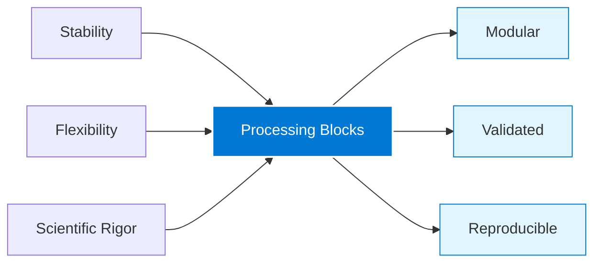
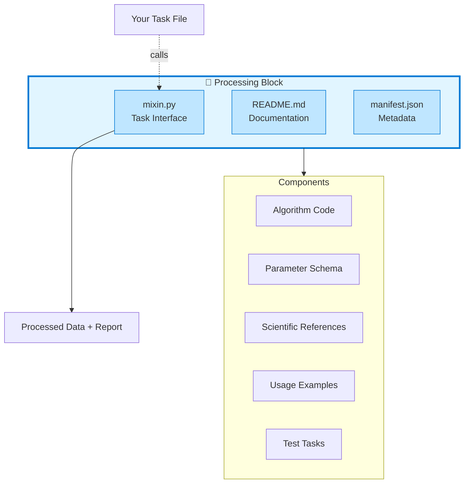
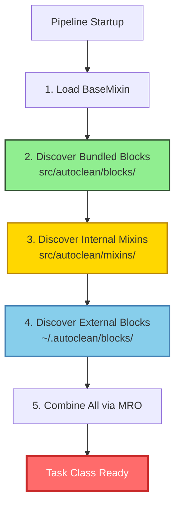
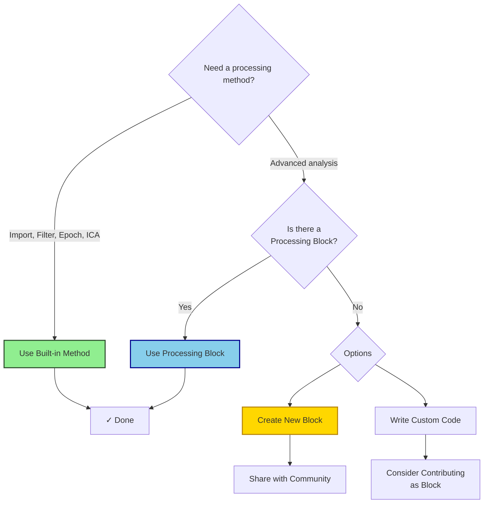

## What are Processing Blocks?

**Processing Blocks** are self-contained, scientifically-documented signal processing modules that extend AutoCleanEEG Pipeline with advanced analysis methods. Think of them as "Lego blocks" for your EEG processing pipeline—each block bundles together code, documentation, scientific references, and configuration in a single, discoverable package.

<Note>
**Key Concept**: While AutoCleanEEG's core methods (import, filter, resample, ICA, epoching) handle 90% of standard preprocessing, **Processing Blocks** provide specialized, cutting-edge methods that can evolve independently and be shared across the research community.
</Note>

---

## Why Processing Blocks?

### The Problem They Solve

Traditional EEG preprocessing tools face a dilemma:
- **Built-in methods** are stable but inflexible
- **Custom code** is flexible but hard to share and validate
- **Plugin systems** are powerful but lack scientific context

Processing Blocks solve this by combining the best of all approaches:



### Benefits for Researchers

<CardGroup cols={2}>
<Card title="🔍 Discoverable" icon="magnifying-glass">
  Browse available blocks with `task list --source=library`. Each block is cataloged with description, scientific references, and use cases.
</Card>

<Card title="📚 Scientifically Documented" icon="book">
  Every block includes literature references, parameter guidance, validation studies, and recommended settings from experts.
</Card>

<Card title="🔧 Easy Integration" icon="wrench">
  Add to any task with a single line: `self.apply_wavelet_threshold()`. No complex installation or setup required.
</Card>

<Card title="🔄 Independently Updated" icon="rotate">
  Blocks have their own version numbers and update cycles, allowing rapid iteration without breaking your existing pipelines.
</Card>

<Card title="✅ Validated" icon="circle-check">
  Each block includes test tasks and example data to verify correct operation and expected output.
</Card>

<Card title="🌍 Community-Driven" icon="users">
  Contribute your own processing methods as blocks, complete with documentation, for the entire community to use.
</Card>
</CardGroup>

---

## How Processing Blocks Work

### Anatomy of a Processing Block

Each processing block is a self-contained package living in the [AutoCleanEEG Task Registry](https://github.com/cincibrainlab/autocleaneeg-task-registry):



### Three Types of Processing Blocks

AutoCleanEEG supports three types of processing blocks, each serving a different purpose in the architecture:

<Tabs>
<Tab title="Bundled Blocks">
**Shipped with the Pipeline** 📦

**Bundled blocks** are processing blocks from the task-registry repository that are packaged and distributed with the pipeline itself.

**Location:** `src/autoclean/blocks/`

**Characteristics:**
- ✅ Always available after installation
- ✅ Task-registry is the source of truth
- ✅ Versioned with the pipeline
- ✅ Automatically discovered and loaded first (highest priority)
- ✅ Include manifest.json with full metadata

**Why Bundled?**
These blocks are copied from the task-registry into the pipeline package during development, ensuring users get essential processing methods out-of-the-box without separate downloads. The task-registry remains the authoritative source, while bundling guarantees availability.

**Currently Bundled (v2.4.0):**
- `wavelet_threshold` - Wavelet-based artifact removal
- `autoreject` - Data-driven epoch rejection
- `source_localization` - MNE source estimation
- `source_psd` - Source-level power spectral density
- `source_connectivity` - Functional connectivity analysis
- `fooof_analysis` - FOOOF/SpecParam spectral parameterization (aperiodic + periodic)

**CLI Commands:**
```bash
# List all bundled blocks
autocleaneeg-pipeline blocks list

# Get detailed info about a specific block
autocleaneeg-pipeline blocks info wavelet_threshold

# Check for updates (future feature)
autocleaneeg-pipeline blocks update
```
</Tab>

<Tab title="Internal Mixins">
**Core Pipeline Methods** 🏗️

**Internal mixins** are fundamental preprocessing methods built directly into the pipeline source code.

**Location:** `src/autoclean/mixins/`

**Characteristics:**
- ✅ Core functionality (import, filter, ICA, epoch)
- ✅ Stable, rarely changing API
- ✅ Required for basic preprocessing
- ✅ Thoroughly tested and validated
- ✅ Not intended for independent distribution

**Purpose:**
These handle the 90% of standard preprocessing that every EEG analysis needs: loading data, filtering, rereferencing, ICA, epoching. They form the foundation on which processing blocks build.

**Examples:**
- `import_raw()` - Load EEG files
- `resample_data()` - Change sampling rate
- `filter_data()` - Band-pass/notch filtering
- `rereference_data()` - Channel rereferencing
- `run_ica()` - Independent component analysis
- `create_epochs()` - Segment continuous data

**Note:** Internal mixins are being gradually replaced by bundled blocks for advanced methods, maintaining clear separation between core functionality and extensible processing methods.
</Tab>

<Tab title="External Blocks">
**User Plugins** 🔌

**External blocks** are custom processing methods installed by users for specialized analyses or local extensions.

**Location:** `~/.autoclean/blocks/` or workspace-specific directories

**Characteristics:**
- 🔧 User-installed
- 🔧 Not part of the package
- 🔧 Lowest priority (can override bundled/internal if needed)
- 🔧 Custom extensions for specific research needs
- 🔧 Can be shared as standalone plugins

**Use Cases:**
- Laboratory-specific processing methods
- Experimental algorithms under development
- Proprietary analyses not suitable for public release
- Custom integrations with other tools

**Installation:**
```bash
# Copy plugin to blocks directory
cp my_custom_block.py ~/.autoclean/blocks/

# Or install from git
git clone https://github.com/lab/custom-block.git ~/.autoclean/blocks/custom_block
```
</Tab>
</Tabs>

### Block Discovery Priority

When AutoCleanEEG starts, it discovers blocks in this priority order:



**What This Means:**
- Bundled blocks take priority over internal mixins with the same method name
- External blocks have lowest priority but can still override if placed correctly
- Task-registry blocks (bundled) are always the source of truth for advanced methods
- Core methods (internal mixins) provide stable foundation

<Note>
**Version 2.4.0 Architecture**: The pipeline transitioned from internal mixins to bundled blocks for advanced processing methods. This creates clear separation:
- **Internal mixins** = Core preprocessing (stable, built-in)
- **Bundled blocks** = Advanced methods (task-registry, always available)
- **External blocks** = User extensions (custom, optional)
</Note>

**Example structure** for the wavelet_threshold block:

```
blocks/signal_processing/wavelet_threshold/
├── mixin.py              # WaveletThresholdMixin class
├── manifest.json         # Metadata, version, dependencies, references
└── README.md             # Complete user documentation (600+ lines)
```

### Integration with Tasks

Processing blocks integrate seamlessly into task files:

<CodeGroup>
```python Task with Wavelet Block
from autoclean.core.task import Task

config = {
    "resample_step": {"enabled": True, "value": 250},
    "filtering": {"enabled": True, "value": {"l_freq": 1, "h_freq": 45}},

    # Add processing block configuration
    "wavelet_threshold": {
        "enabled": True,
        "value": {
            "wavelet": "sym4",
            "level": 5,
            "threshold_mode": "soft",
            "threshold_scale": 1.0,
        }
    },
}

class MyTask(Task):
    def run(self):
        self.import_raw()
        self.resample_data()
        self.filter_data()

        # Call processing block method
        self.apply_wavelet_threshold()  # ← That's it!

        self.create_regular_epochs()
```

```python Traditional Approach (Without Blocks)
from autoclean.core.task import Task
import pywt
import numpy as np
# ... many more imports ...

class MyTask(Task):
    def run(self):
        self.import_raw()
        self.resample_data()
        self.filter_data()

        # Implement algorithm yourself (100+ lines)
        for ch_idx in range(self.raw.get_data().shape[0]):
            data = self.raw.get_data()[ch_idx]
            coeffs = pywt.wavedec(data, 'sym4', level=5)
            sigma = np.median(np.abs(coeffs[-1])) / 0.6745
            # ... threshold calculation ...
            # ... coefficient processing ...
            # ... reconstruction ...
            # ... reporting ...

        self.create_regular_epochs()
```
</CodeGroup>

<Info>
**The power of blocks**: What would take 100+ lines of custom code, plus documentation research, plus validation testing, is reduced to a single method call with well-documented, scientifically-validated parameters.
</Info>

---

## Built-in Methods vs. Processing Blocks

### When to Use Each

<Tabs>
<Tab title="Built-in Methods">
**Use for standard preprocessing steps:**

| Method | Purpose |
|--------|---------|
| `import_raw()` | Load EEG data |
| `resample_data()` | Change sampling rate |
| `filter_data()` | Apply band-pass/notch filters |
| `rereference_data()` | Rereference channels |
| `run_ica()` | Independent component analysis |
| `create_epochs()` | Segment continuous data |

**Characteristics:**
- ✅ Stable API (rarely changes)
- ✅ Always available
- ✅ Thoroughly tested
- ✅ Covers 90% of use cases
- ✅ Required for basic preprocessing
</Tab>

<Tab title="Processing Blocks">
**Use for advanced/specialized methods:**

| Block | Purpose |
|-------|---------|
| `wavelet_threshold` | Transient artifact removal via DWT |
| `advanced_ica` (planned) | Enhanced ICA with multiple algorithms |
| `autoreject` (planned) | Data-driven epoch rejection |
| `connectivity` (planned) | Functional connectivity measures |

**Characteristics:**
- 🔬 Cutting-edge methods
- 📊 Research-validated
- 📚 Scientifically documented
- 🔄 Independently updated
- 🎓 Require domain knowledge
- 🧩 Optional enhancements
</Tab>
</Tabs>

### Decision Tree



---

## Example: Wavelet Thresholding Block

Let's see a real-world example with the **wavelet_threshold** block—our first processing block implementation.

### Scientific Context

**Wavelet thresholding** uses discrete wavelet transform (DWT) to remove transient, high-amplitude artifacts (eye blinks, muscle twitches, electrode pops) while preserving underlying neural signals. This method is the cornerstone of the [HAPPE pipeline](https://github.com/PINE-Lab/HAPPE) for developmental EEG.

**Key papers:**
- Donoho & Johnstone (1994): Universal thresholding theory
- Gabard-Durnam et al. (2018): HAPPE pipeline for high-artifact data

### Using the Block

```python
config = {
    "wavelet_threshold": {
        "enabled": True,
        "value": {
            "wavelet": "sym4",           # Symlet-4 wavelet basis
            "level": 5,                   # Decomposition depth
            "threshold_mode": "soft",     # Soft thresholding (smoother)
            "threshold_scale": 1.0,       # Universal threshold multiplier
            "is_erp": False,              # ERP-preserving mode off
        }
    }
}

class RestingWithWavelet(Task):
    def run(self):
        self.import_raw()
        self.filter_data()

        # Apply wavelet threshold
        self.apply_wavelet_threshold()

        self.create_epochs()
```

### What You Get

- ✅ **Processed data**: Transient artifacts removed
- ✅ **PDF report**: `*_wavelet_threshold.pdf` with:
  - Before/after waveform comparisons
  - Power spectral density changes
  - Per-channel artifact reduction metrics
  - Top 10 most affected channels
- ✅ **Metadata**: Reduction percentages, effective decomposition level
- ✅ **Derivatives**: Saved to `derivatives/05_wavelet_threshold/`

<Tip>
See the [Wavelet Threshold Overview](/processing-blocks/wavelet-threshold/overview) for complete documentation, parameter tuning, and advanced usage patterns.
</Tip>

---

## Current and Planned Blocks

### Available Now ✅

<Card title="wavelet_threshold" icon="wave-square" href="/processing-blocks/wavelet-threshold/overview">
  **Wavelet-based artifact removal** using discrete wavelet transform with universal thresholding.

  - **Status**: Stable (v1.0.0)
  - **Category**: Signal Processing
  - **Use Cases**: Transient artifacts, developmental EEG, high-artifact data
  - **References**: Donoho (1995), HAPPE (2018)
</Card>

### Coming Soon 🔄

<AccordionGroup>
<Accordion title="advanced_ica - Enhanced ICA Methods" icon="brain">
**Multiple ICA algorithms with automated selection**

- Infomax, FastICA, Picard, Extended Infomax
- Automatic algorithm selection based on data characteristics
- Enhanced convergence diagnostics
- Multiple component classification methods

**Priority**: High | **Timeline**: Q1 2026
</Accordion>

<Accordion title="autoreject - Data-Driven Epoch Rejection" icon="filter">
**Automated bad epoch and channel detection**

- Cross-validation based thresholding
- Channel interpolation decisions
- Global vs. local rejection strategies
- Transparent rejection criteria

**Priority**: High | **Timeline**: Q1 2026

**References**: Jas et al. (2017) NeuroImage
</Accordion>

<Accordion title="statistical_learning - ITC/ERSP Analysis" icon="chart-line">
**Advanced time-frequency decomposition**

- Inter-trial coherence (ITC)
- Event-related spectral perturbation (ERSP)
- Statistical learning paradigm support
- Phase-amplitude coupling

**Priority**: Medium | **Timeline**: Q2 2026
</Accordion>

<Accordion title="connectivity - Functional Connectivity" icon="diagram-project">
**Network analysis and connectivity measures**

- Phase lag index (PLI)
- Weighted phase lag index (wPLI)
- Coherence and partial coherence
- Graph theory metrics

**Priority**: Medium | **Timeline**: Q2 2026
</Accordion>
</AccordionGroup>

---

## How to Get Started

<Steps>
<Step title="Browse Available Blocks">
View all processing blocks in the task registry:

```bash
autocleaneeg-pipeline task list --source=library
```

Look for tasks tagged with block names (e.g., "WaveletBlock_Test")
</Step>

<Step title="Review Block Documentation">
Each block has comprehensive documentation:

- Scientific background and use cases
- Complete parameter reference
- Usage examples for different scenarios
- Troubleshooting and tuning guides

See [Wavelet Threshold Overview](/processing-blocks/wavelet-threshold/overview) as an example
</Step>

<Step title="Install Example Task">
Start with a pre-built task demonstrating the block:

```bash
autocleaneeg-pipeline task use RestingState_WaveletDemo
```
</Step>

<Step title="Test with Your Data">
Process a sample file to see the block in action:

```bash
autocleaneeg-pipeline process /path/to/your/data.set
```

Check the generated report to understand the block's effect on your data
</Step>

<Step title="Integrate into Custom Tasks">
Once comfortable, add the block to your own task files. See [Using Processing Blocks](/processing-blocks/using-blocks) for integration patterns
</Step>
</Steps>

---

## Scientific Transparency

All processing blocks maintain the highest standards of scientific transparency:

<CardGroup cols={2}>
<Card title="📄 Literature References" icon="book-open">
  Every block cites foundational papers with DOI links in its manifest and documentation
</Card>

<Card title="🔬 Validation Studies" icon="flask">
  Blocks include validation against published methods and example datasets
</Card>

<Card title="⚙️ Parameter Guidance" icon="sliders">
  Recommended settings from domain experts with explanations of trade-offs
</Card>

<Card title="📊 Comparison Tables" icon="table">
  When multiple methods exist (e.g., wavelet vs. ICA), clear comparison tables help you choose
</Card>

<Card title="✅ Test Tasks" icon="check">
  Each block ships with test tasks demonstrating correct usage and expected output
</Card>

<Card title="📈 Reproducibility" icon="code-compare">
  Complete source code, version tracking, and BIDS-compliant outputs ensure reproducibility
</Card>
</CardGroup>

---

## Contributing New Blocks

Have a processing method you'd like to share? Processing blocks are designed to be community-contributed!

**Requirements for a block:**
1. ✅ Mixin class with clear API
2. ✅ Complete README (scientific background, parameters, examples)
3. ✅ Manifest with metadata and references
4. ✅ Test task demonstrating usage
5. ✅ Literature citations with DOIs
6. ✅ Validation against published method or example data

See [Contributing Processing Blocks](/processing-blocks/contributing-blocks) for detailed guidelines.

---

## Learn More

<CardGroup cols={2}>
<Card title="Getting Started" icon="rocket" href="/processing-blocks/getting-started">
  Quick start guide: discover, install, and use your first processing block
</Card>

<Card title="Wavelet Threshold Block" icon="wave-square" href="/processing-blocks/wavelet-threshold/overview">
  Deep-dive into our first processing block with complete parameter reference
</Card>

<Card title="Using Blocks in Tasks" icon="puzzle-piece" href="/processing-blocks/using-blocks">
  Integration patterns and best practices for adding blocks to custom tasks
</Card>

<Card title="Block Architecture" icon="cubes" href="/processing-blocks/block-architecture">
  Technical details: manifests, registry, versioning, and discovery system
</Card>
</CardGroup>

---

## Key Takeaways

<Tip>
**Processing Blocks** transform AutoCleanEEG from a fixed pipeline tool into a flexible, extensible platform for cutting-edge EEG analysis—while maintaining the scientific rigor and reproducibility researchers demand.
</Tip>

<Info>
**For most users**, built-in methods handle everything you need. Processing blocks are for researchers pushing the boundaries of EEG analysis or working with challenging data types (developmental EEG, high-artifact recordings, multi-modal integration).
</Info>

<Warning>
**Processing blocks require domain knowledge**. Always review the scientific documentation, parameter guidance, and example tasks before applying blocks to your own data. When in doubt, consult the literature or reach out to the community.
</Warning>