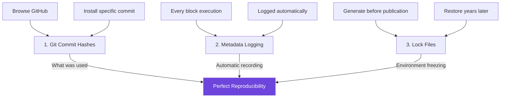

<Note>
**TL;DR**: Every block execution logs its exact git commit hash. Use `blocks lock` before submitting papers to freeze your environment. Restore it later with `blocks install --locked`. Browse GitHub for historical versions.
</Note>

## Why This Matters for Science

You've spent months perfecting your EEG analysis pipeline. Reviewers ask to reproduce your results. A collaborator wants to extend your methods. You're preparing supplementary materials for publication. In each case, you need one critical guarantee: *the exact same processing will happen today as happened six months ago*.

Traditional scientific software struggles with this. Version numbers get bumped manually, dependencies drift, "it worked on my machine" becomes the epitaph of reproducibility. AutoCleanEEG processing blocks solve this problem at the source: every processing step records the exact git commit hash of the code that ran, and you can freeze your entire analysis environment with a single command.

This isn't just about compliance—it's about **trust**. When your metadata logs show `"source_commit": "8a3f21c..."`, any skeptic can browse to that exact commit on GitHub, read the code, verify the algorithm, and see precisely what transformation occurred. No ambiguity, no "trust me," just cryptographic certainty.

## The Three-Layer Reproducibility System

AutoCleanEEG uses three complementary mechanisms to ensure reproducibility:



### Layer 1: Git Commit Hashes as Truth

Every processing block exists as files in a Git repository. When you install or update blocks, the system records the exact commit hash they came from. This hash is cryptographically guaranteed to identify one specific state of the code—change a single character, and the hash changes.

**What gets recorded**:
- `source_commit`: Git hash of the registry when block was fetched
- `directory_hash`: Combined hash of all block files (mixin.py, algorithm.py, etc.)
- `source`: Where the block came from (cache/bundled/registry)

**Why it works**: Git commit hashes are immutable. The hash `8a3f21c4d9e` will *always* point to the exact same code, even years later. You can fetch that commit from GitHub, read every line, and verify exactly what ran.

### Layer 2: Automatic Metadata Logging

Every time a block executes, it automatically records its version information in your run metadata. You don't configure this, you don't enable it—it just happens. Open your `metadata/sub-01_processing.json` file after running an analysis, and you'll see:

```json
{
  "step_zapline": {
    "block_name": "zapline",
    "source_commit": "8a3f21c4d9e...",
    "directory_hash": "abc123...",
    "source": "cache",
    "fline": 60,
    "nkeep": 1,
    "power_before_db": 65.3,
    "power_after_db": 45.1,
    "reduction_db": 20.2
  }
}
```

This metadata travels with your data. Export to BIDS? It's in the sidecar JSON. Archive for publication? It's there. Someone questions your methods? You have cryptographic proof of what ran.

### Layer 3: Lock Files for Environment Freezing

When you're ready to publish or share your analysis, generate a lock file that captures *every* block's exact version:

```bash
autocleaneeg-pipeline blocks lock
```

This creates `blocks.lock`—a snapshot of your entire processing environment. Commit it to git alongside your task files, and anyone (including future-you) can recreate the exact setup:

```bash
autocleaneeg-pipeline blocks install --locked
```

**The result**: Perfect reproducibility across machines, across time, across researchers.

---

## Practical Workflows

### Workflow 1: Installing Specific Block Versions

Sometimes you need a particular version of a block—maybe a collaborator used it, maybe you're reproducing published work, or maybe you want to try an older version for comparison.

**Step 1**: Browse GitHub to find the commit you want

Visit the [task-registry repository](https://github.com/cincibrainlab/autocleaneeg-task-registry) and explore the commit history. You might be looking for:
- A specific release tag (e.g., `blocks/zapline/v1.0.0`)
- A commit mentioned in a paper's methods
- The state of the code on a particular date
- A version before a recent change

<Tip>
**Finding commits**: Use GitHub's commit history page. Click on any commit to see its full hash, or use the "Browse code" button to explore that specific version of files.
</Tip>

**Step 2**: Copy the commit hash

GitHub shows commit hashes in two forms:
- **Short hash**: `8a3f21c` (first 7 characters, shown in lists)
- **Full hash**: `8a3f21c4d9e53b7a1f6e2d8c9b4a3f2e1d0c9b8a` (complete 40-character SHA-1)

Either works, but full hashes are unambiguous.

**Step 3**: Install that exact version

```bash
# Install zapline from specific commit
autocleaneeg-pipeline blocks install zapline --commit 8a3f21c
```

The system fetches the block files from exactly that commit in the registry, stores them in your cache, and records the commit hash. When this block runs, your metadata will show:

```json
{
  "source_commit": "8a3f21c4d9e...",
  "source": "cache"
}
```

**Use cases**:
- Reproducing a colleague's analysis who says "I used zapline from commit 8a3f21c"
- Following a published paper's methods section
- Testing if a bug existed in an older version
- Comparing algorithm changes between versions

### Workflow 2: Locking Your Environment Before Publication

You're submitting a paper. Reviewers will scrutinize your methods. Future researchers will want to replicate your work. Six months from now, you might need to rerun the analysis with minor changes. *Lock your environment now*, while it's fresh.

**Step 1**: Verify your current setup

Check what blocks you're using:

```bash
autocleaneeg-pipeline blocks list
```

Output shows each block's version and source:

```
Processing Blocks (7 total)
Registry version: 8a3f21c

Signal Processing
Name                Version  Source    Description
zapline             1.0.0    cache     Zapline DSS-based line noise removal
wavelet_threshold   1.0.0    bundled   Wavelet-based artifact removal
autoreject          1.0.0    bundled   ML-based epoch rejection
```

**Step 2**: Generate the lock file

```bash
autocleaneeg-pipeline blocks lock
```

This scans your cache and bundled blocks, records each one's commit hash and directory hash, and creates `blocks.lock`:

```json
{
  "version": 1,
  "registry_commit": "8a3f21c4d9e53b7a1f6e2d8c9b4a3f2e1d0c9b8a",
  "locked_at": "2025-10-01T14:32:18+00:00",
  "blocks": {
    "zapline": {
      "commit": "8a3f21c4d9e53b7a1f6e2d8c9b4a3f2e1d0c9b8a",
      "hash": "abc123...",
      "source": "cache"
    },
    "wavelet_threshold": {
      "commit": "7f3a2c1e5d8b9a6c4f2e1d0c9b8a7f6e5d4c3b2a",
      "hash": "def456...",
      "source": "bundled"
    }
  }
}
```

The terminal shows exactly what was locked:

```
✓ Lock file created: blocks.lock

Registry commit: 8a3f21c
Blocks locked: 7

Locked Blocks
Block                Commit    Source
zapline              8a3f21c   cache
wavelet_threshold    7f3a2c1   bundled
autoreject           7f3a2c1   bundled

Commit this file to your repository for reproducibility:
  git add blocks.lock
  git commit -m 'Lock analysis environment'
```

**Step 3**: Commit the lock file

```bash
git add blocks.lock
git commit -m "Lock processing environment for manuscript submission"
git push
```

Now your lock file lives in version control, traveling with your task files and analysis scripts.

**Step 4**: Include in supplementary materials

When preparing your manuscript:

1. **Methods section**: "Processing blocks were version-locked using AutoCleanEEG's lock file system (blocks.lock) to ensure reproducibility."

2. **Supplementary materials**: Include `blocks.lock` alongside your task files

3. **Data repository**: If depositing code on GitHub/OSF/Zenodo, include `blocks.lock` in the repository

**Why this matters**: A year from now, when a PhD student emails asking how to reproduce your Figure 3, you can say: "Clone our repository, run `blocks install --locked`, then execute the task." Perfect reproducibility, zero ambiguity.

### Workflow 3: Reproducing Someone Else's Analysis

You're reading a paper that used AutoCleanEEG processing blocks. Their supplementary materials include `blocks.lock`. You want to run their exact analysis on your data.

**Step 1**: Obtain their repository

```bash
# Clone their analysis repository
git clone https://github.com/lab/eeg-analysis-2024.git
cd eeg-analysis-2024

# Verify blocks.lock exists
ls blocks.lock
```

**Step 2**: Install their exact block versions

```bash
autocleaneeg-pipeline blocks install --locked
```

The system reads `blocks.lock`, fetches each block from its specified commit, verifies the hashes match, and installs everything to your cache:

```
→ Installing blocks from lock file: blocks.lock

Registry commit: 8a3f21c
Locked at: 2024-06-15T09:42:31+00:00

✓ Installed 7/7 blocks
  • zapline
  • wavelet_threshold
  • autoreject
  • source_localization
  • source_psd
  • source_connectivity
  • fooof_analysis
```

**Step 3**: Run their analysis

```bash
# Their task file automatically uses the locked block versions
autocleaneeg-pipeline process RestingEyesOpen /path/to/your/data.raw
```

Your metadata logs will show the same commit hashes as theirs. Your processing is byte-for-byte identical (modulo input data).

**Verification**: Compare your metadata with theirs:

```bash
# Their metadata (from paper's supplementary materials)
cat paper_data/metadata/sub-01_processing.json | grep source_commit

# Your metadata (from fresh run)
cat output/RestingEyesOpen/metadata/sub-01_processing.json | grep source_commit
```

If the commit hashes match, your processing is identical.

**Common scenarios**:
- **Extending methods**: Use their lock file as a starting point, modify one block version, relock
- **Bug hunting**: Install their environment, reproduce the issue, then install updated blocks to verify the fix
- **Replication studies**: Lock file is your ground truth for "what they actually did"

---

## Understanding Lock Files

### Anatomy of a Lock File

Let's dissect a real `blocks.lock` file to understand each component:

```json
{
  "version": 1,
  "registry_commit": "8a3f21c4d9e53b7a1f6e2d8c9b4a3f2e1d0c9b8a",
  "locked_at": "2025-10-01T14:32:18+00:00",
  "blocks": {
    "zapline": {
      "commit": "8a3f21c4d9e53b7a1f6e2d8c9b4a3f2e1d0c9b8a",
      "hash": "abc12345def67890",
      "source": "cache"
    }
  }
}
```

**`version`**: Lock file format version. Currently always `1`. Future versions might add fields (e.g., Python version requirements, dependency constraints), but version 1 lock files will always be supported.

**`registry_commit`**: The commit hash of the task-registry repository when you ran `blocks lock`. This captures the overall state of the block ecosystem at that moment. Think of it as a timestamp: "I locked my environment when the registry looked like this."

**`locked_at`**: ISO 8601 timestamp with timezone. Useful for human readers ("this was locked three months ago") and for ordering multiple lock files.

**`blocks` → each entry**:
- **`commit`**: The exact git commit hash this block came from. For cache/registry blocks, this is the registry commit when they were fetched. For bundled blocks, this is the commit that was bundled with your AutoCleanEEG installation.

- **`hash`**: Combined hash of all files in the block directory (mixin.py, algorithm.py, manifest.json, README.md). This provides a second layer of verification: even if two blocks have the same source commit (e.g., both were fetched from registry at the same time), their directory hashes will differ if their files differ. Guards against accidental modifications.

- **`source`**: Where this block came from:
  - `cache`: Downloaded to `~/.config/autocleaneeg/.block_cache/` via `blocks update` or `blocks install`
  - `bundled`: Shipped with AutoCleanEEG installation in `site-packages/autoclean/blocks/`
  - `registry`: Fallback source (rare, usually indicates the block was discovered from registry but not yet installed)

### What Lock Files Guarantee

**Guarantees**:
- ✅ **Algorithm immutability**: The `commit` hash ensures the exact code that ran
- ✅ **File integrity**: The `directory_hash` verifies no files were modified
- ✅ **Complete environment**: All blocks are specified, no hidden dependencies
- ✅ **Cross-platform**: Same lock file works on macOS, Linux, Windows
- ✅ **Time-proof**: Works years later (git commits are forever)

**Does NOT guarantee**:
- ❌ **Python package versions**: Lock file doesn't control scipy/numpy/mne versions (use `requirements.txt` for that)
- ❌ **Operating system differences**: Floating-point precision, random seeds, etc. may vary
- ❌ **Task file versions**: Your custom task code isn't locked (commit it to git separately)

<Warning>
**Complete reproducibility** requires locking *everything*: processing blocks (via `blocks.lock`), Python packages (via `requirements.txt`), and task files (via git). Lock files solve the "which block version" problem, but you still need traditional tools for dependency management.
</Warning>

### Lock File Best Practices

**Do**:
- ✅ Generate lock files before submitting manuscripts
- ✅ Commit lock files to version control alongside task files
- ✅ Include lock files in supplementary materials and data repositories
- ✅ Document which lock file corresponds to which analysis (e.g., `blocks_rest.lock`, `blocks_mmn.lock`)
- ✅ Update lock files if you rerun analyses with updated blocks

**Don't**:
- ❌ Edit lock files manually (generate them with `blocks lock`)
- ❌ Share lock files without the corresponding task files (they're meaningless alone)
- ❌ Assume a lock file makes your analysis bulletproof (still need good experimental design!)
- ❌ Generate lock files after every block update (only when freezing for publication/sharing)

---

## Advanced Topics

### Version Conflicts and Resolution

**Scenario**: You have two projects that need different block versions.

**Solution**: Lock files are project-specific. Use separate directories:

```bash
# Project 1 (uses old zapline)
cd ~/projects/study-2023/
autocleaneeg-pipeline blocks install --locked  # Uses blocks_2023.lock
autocleaneeg-pipeline process RestingTask data.raw

# Project 2 (uses new zapline)
cd ~/projects/study-2024/
autocleaneeg-pipeline blocks install --locked  # Uses blocks_2024.lock
autocleaneeg-pipeline process RestingTask data.raw
```

The cache (`~/.config/autocleaneeg/.block_cache/`) stores blocks globally, but each `blocks install --locked` overwrites with the requested versions. The last lock file installed "wins" for subsequent processing.

<Tip>
**Best practice**: If actively developing multiple projects, install locked versions right before processing each dataset. Or use Python virtual environments with separate AutoCleanEEG installations.
</Tip>

### Verifying Lock File Integrity

Want to check if your current environment matches a lock file without reinstalling?

```python
from autoclean.utils.block_lock import BlockLockFile

lock = BlockLockFile("blocks.lock")
results = lock.verify()

for block_name, status in results.items():
    print(f"{block_name}: {status}")
    # Status: "ok", "missing", "mismatch"
```

**Statuses**:
- `ok`: Block is installed, commit and hash match lock file
- `missing`: Block isn't in your cache/bundled (run `blocks install --locked`)
- `mismatch`: Block is installed but wrong version (commit or hash differs)

Use this before running large batch analyses to catch version drift early.

### Historical Analysis: Finding Old Versions

Need to see what Zapline looked like 6 months ago? Browse the task-registry on GitHub:

1. **Via commit history**:
   - Go to [repository commits](https://github.com/cincibrainlab/autocleaneeg-task-registry/commits/main)
   - Filter by date (e.g., "6 months ago")
   - Click commits to see which blocks were modified
   - Copy commit hash from any commit

2. **Via tags/releases**:
   - Go to [repository tags](https://github.com/cincibrainlab/autocleaneeg-task-registry/tags)
   - Look for `blocks/zapline/v1.0.0`, `blocks/zapline/v1.1.0`, etc.
   - Click tag to see commit hash

3. **Via blame view**:
   - Navigate to `blocks/signal_processing/zapline/algorithm.py`
   - Click "Blame" to see when each line was last modified
   - Click commit hashes to explore that version

Then install:

```bash
autocleaneeg-pipeline blocks install zapline --commit <commit-hash-you-found>
```

<Accordion title="Example: Comparing Zapline versions">
Let's say you want to compare the original Zapline implementation with a recent update:

```bash
# Install original version (from 6 months ago)
autocleaneeg-pipeline blocks install zapline --commit a1b2c3d

# Process one subject
autocleaneeg-pipeline process RestingTask subject01.raw
mv output/RestingTask/metadata output_original/

# Install latest version
autocleaneeg-pipeline blocks update
autocleaneeg-pipeline blocks install zapline

# Process same subject
autocleaneeg-pipeline process RestingTask subject01.raw
mv output/RestingTask/metadata output_latest/

# Compare metadata
diff output_original/sub-01_processing.json output_latest/sub-01_processing.json
```

This workflow is common when:
- Investigating if a recent change improved results
- Debugging performance regressions
- Writing "what's changed" documentation for updates
</Accordion>

---

## Command Reference

### Core Commands

```bash
# List all available blocks with version info
autocleaneeg-pipeline blocks list

# Get detailed info about a block (includes commit if cached)
autocleaneeg-pipeline blocks info zapline

# Update blocks from GitHub registry (fetches latest)
autocleaneeg-pipeline blocks update

# Install specific block version
autocleaneeg-pipeline blocks install <name> --commit <hash>

# Generate lock file from current state
autocleaneeg-pipeline blocks lock [-o path/to/output.lock]

# Install all blocks from lock file
autocleaneeg-pipeline blocks install --locked [--lock-file path/to/custom.lock]
```

### Common Flags

**`blocks install`**:
- `--commit <hash>`: Install from specific git commit
- `--locked`: Install all blocks from `blocks.lock`
- `--lock-file <path>`: Specify custom lock file path (default: `blocks.lock`)

**`blocks lock`**:
- `-o, --output <path>`: Output file path (default: `blocks.lock`)

### Exit Codes

All commands return standard exit codes:
- `0`: Success
- `1`: Error (block not found, network failure, invalid lock file, etc.)

---

## Troubleshooting

### Issue: "Block not found" when using old commit

**Symptom**: `autocleaneeg-pipeline blocks install zapline --commit abc123` fails with "Block not found"

**Cause**: The commit you specified doesn't contain that block (maybe it was added later, or the path changed)

**Solution**:
1. Visit GitHub at `https://github.com/cincibrainlab/autocleaneeg-task-registry/tree/abc123`
2. Navigate to `blocks/` to see what blocks existed at that commit
3. Check if the block had a different name or path
4. If the block didn't exist yet, find a later commit that includes it

### Issue: Lock file installation fails partway through

**Symptom**: `blocks install --locked` reports "Installed 3/7 blocks" with some failures

**Cause**: Network interruption, GitHub rate limiting, or blocks removed from registry

**Solution**:
1. Check network connectivity: `ping raw.githubusercontent.com`
2. Retry (lock file tracks what failed, safe to rerun): `blocks install --locked`
3. If specific blocks fail repeatedly, inspect lock file to see their commits
4. Try installing failed blocks individually: `blocks install <name> --commit <hash>`

If blocks were removed from registry (rare), you may need to obtain them from the paper's supplementary materials or contact authors.

### Issue: Metadata shows different commit than expected

**Symptom**: You installed `zapline --commit 8a3f21c`, but metadata shows different hash

**Cause**: Either:
- You installed it, then ran `blocks update` which overwrote it
- Another lock file was installed after
- Cache was manually modified

**Solution**:
1. Reinstall the specific version: `blocks install zapline --commit 8a3f21c`
2. Immediately process data (before any updates)
3. If working on multiple projects, use lock files to avoid version drift:
   ```bash
   # Always install locked versions right before processing
   blocks install --locked && autocleaneeg-pipeline process Task data.raw
   ```

### Issue: Lock file verification shows mismatches

**Symptom**: Running verification shows some blocks have status "mismatch"

**Cause**: Cache was modified manually, or blocks were updated after lock file creation

**Solution**:
```bash
# Reinstall from lock file to fix mismatches
autocleaneeg-pipeline blocks install --locked

# Verify again
python -c "from autoclean.utils.block_lock import BlockLockFile; \
           lock = BlockLockFile('blocks.lock'); \
           print(lock.verify())"
```

All blocks should now show `"ok"`.

---

## Best Practices for Publications

When preparing manuscripts that use AutoCleanEEG processing blocks:

### In Your Methods Section

Include a statement like:

> "Processing blocks were version-locked using AutoCleanEEG's reproducibility system (blocks.lock) to ensure exact replicability. All block versions, including git commit hashes and file integrity hashes, are recorded in the supplementary materials."

Be specific about which blocks you used:

> "Line noise removal used Zapline (commit 8a3f21c, de Cheveigné 2020), transient artifact reduction used wavelet thresholding (commit 8a3f21c, Makeig et al. 2004 adapted), and epoch rejection used AutoReject (commit 8a3f21c, Jas et al. 2017)."

### In Supplementary Materials

**Required files**:
1. `blocks.lock` - Your lock file
2. Task file(s) - Your Python task definitions
3. `requirements.txt` - Python package versions

**Recommended files**:
4. Sample metadata JSON showing recorded parameters
5. README explaining how to reproduce your analysis

**Example README**:
```markdown
# Reproducing Our Analysis

## Requirements
- Python 3.10+
- AutoCleanEEG 3.0+

## Steps
1. Install AutoCleanEEG: `pip install autocleaneeg-pipeline`
2. Install dependencies: `pip install -r requirements.txt`
3. Install our exact block versions: `autocleaneeg-pipeline blocks install --locked`
4. Run analysis: `autocleaneeg-pipeline process RestingEyesOpen your_data.raw`

## Verification
Your metadata files should show the same `source_commit` values as ours:
- Zapline: 8a3f21c4d9e...
- Wavelet: 7f3a2c1e5d8...
```

### On Data Repositories

When depositing to OSF, Zenodo, or institutional repositories:

**Minimum**:
- `blocks.lock`
- Task files
- README with reproduction steps

**Ideal**:
- Everything above, plus:
- Example output metadata for verification
- Link to your analysis code repository (GitHub)
- Contact information for questions

---

## FAQ

**Q: Do I need to lock blocks for every analysis?**

No. Lock files are for *sharing* and *publication*. During active development, use `blocks update` freely. Only generate lock files when you're freezing an environment to share with others or for archival.

**Q: Can I use multiple lock files in one project?**

Yes. Name them descriptively:
- `blocks_rest.lock` - For resting state analysis
- `blocks_mmn.lock` - For MMN analysis
- `blocks_baseline.lock` - For your original submission
- `blocks_revision.lock` - After incorporating reviewer feedback

Install the one you need: `blocks install --locked --lock-file blocks_rest.lock`

**Q: What if the registry repository disappears?**

Git commit hashes are permanent. Even if the main repository vanishes:
1. Someone (including you) can fork/mirror it
2. Lock files include the full commit hash, making it findable
3. Block files are small - include them in your supplementary materials as backup

Realistically, GitHub repositories don't disappear, and scientific code is increasingly archived (Zenodo, Software Heritage).

**Q: Why not use semantic versions like `1.0.0` instead of commit hashes?**

Semantic versions are labels that humans create. They can be wrong (forgot to bump version), ambiguous (which `1.0.0`—the one from 2023 or the typo-fixed one from 2024?), or incomplete (tells you version, not exact code).

Git commit hashes are **cryptographic truth**. Hash `8a3f21c` will *always* be the exact same code, no human intervention needed. Plus, GitHub makes it trivial to browse commits, so the UX is actually better.

We do include semantic versions in block manifests for human communication ("we added feature X in v1.1.0"), but commit hashes are the authority for reproducibility.

**Q: Does this work offline?**

Partially:
- ✅ Bundled blocks work offline (shipped with AutoCleanEEG)
- ✅ Cached blocks work offline (already downloaded to `~/.config/`)
- ❌ Fetching new commits requires internet (GitHub API)
- ✅ Lock files work offline if all blocks are bundled/cached

Best practice: Install locked versions while online, then process data offline.

---

## Real-World Example

Let's walk through a complete publication workflow, from analysis to submission to post-publication.

### Phase 1: Initial Analysis (Spring 2024)

You're analyzing resting-state EEG data. You use the latest blocks:

```bash
autocleaneeg-pipeline blocks update
autocleaneeg-pipeline blocks list
# Shows zapline v1.0.0 (commit 8a3f21c), wavelet v1.0.0 (commit 8a3f21c)

# Process 30 subjects
autocleaneeg-pipeline process RestingEyesOpen subjects/*.raw
```

Metadata automatically records commit hashes for all blocks used.

### Phase 2: Manuscript Preparation (Summer 2024)

You're writing the paper. Time to lock the environment:

```bash
# Generate lock file
autocleaneeg-pipeline blocks lock -o blocks_manuscript_v1.lock

# Commit to your analysis repository
git add blocks_manuscript_v1.lock task_resting.py
git commit -m "Freeze analysis environment for manuscript v1"
git push
```

In your methods section, you reference the lock file and commit hash from GitHub.

### Phase 3: Reviewer Revision (Fall 2024)

Reviewers ask you to reprocess with a different epoch length. Meanwhile, Zapline v1.1.0 was released with a bug fix. You want to use the new version:

```bash
# Update to get Zapline v1.1.0
autocleaneeg-pipeline blocks update

# Reprocess subjects
autocleaneeg-pipeline process RestingEyesOpen subjects/*.raw

# New lock file for revision
autocleaneeg-pipeline blocks lock -o blocks_manuscript_v2.lock
git add blocks_manuscript_v2.lock
git commit -m "Updated Zapline to v1.1.0 for revision"
```

Your response to reviewers: "We reprocessed using Zapline v1.1.0 (commit 9c4e2f1), which fixed a harmonic detection bug. Results qualitatively unchanged but quantitatively improved (see updated Figure 3)."

### Phase 4: Publication (Winter 2024)

Paper accepted! You deposit supplementary materials:

OSF repository contents:
```
/supplementary/
  blocks_manuscript_v2.lock        ← Final environment
  task_resting.py                  ← Task file
  requirements.txt                 ← Python packages
  sample_metadata.json             ← Example output showing commit hashes
  README_reproduction.md           ← How to reproduce
```

### Phase 5: Post-Publication (Years Later)

A PhD student emails in 2026: "I can't replicate your Zapline results."

You reply: "Clone our OSF repository, run `blocks install --locked` to get our exact versions (including the v1.1.0 bug fix), then process your data. Our lock file ensures you're using the same code we did."

They do this, get identical results, cite your paper. Science works.

---

## Next Steps

<CardGroup cols={2}>
<Card title="Browse Available Blocks" icon="list" href="/processing-blocks/available-blocks">
  See all 7 processing blocks and their capabilities
</Card>

<Card title="Create Custom Blocks" icon="code" href="/processing-blocks/creating-blocks">
  Extend the system with your own processing methods
</Card>

<Card title="Task Customization" icon="puzzle-piece" href="/tasks/task-customization">
  Combine blocks with custom logic in your tasks
</Card>

<Card title="Processing Blocks Intro" icon="cube" href="/processing-blocks/introduction">
  Deep dive into the block architecture
</Card>
</CardGroup>

---

## Summary

Reproducibility isn't an afterthought in AutoCleanEEG—it's built into every layer of the system:

✅ **Every block execution** logs its git commit hash automatically
✅ **Every commit hash** is a cryptographic guarantee of exact code
✅ **Lock files** capture your entire environment in one command
✅ **GitHub browsing** makes finding old versions trivial
✅ **Metadata logs** travel with your data, proving what ran

You don't need to trust semantic versions, remember which code you used, or hope that "v1.0" today means the same thing as "v1.0" next year. You have mathematical certainty.

This is reproducibility as it should be: **automatic, verifiable, and permanent**.

