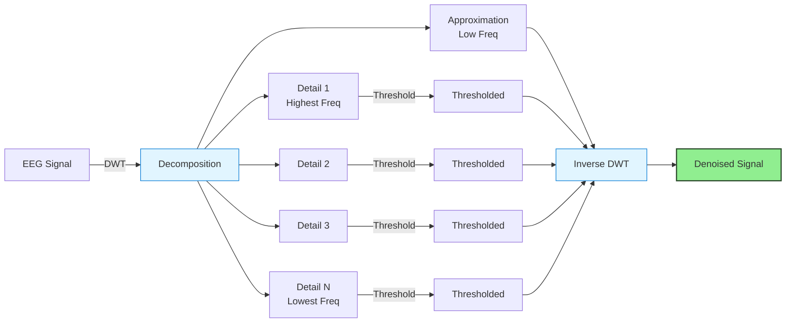

<Note>
**Status**: Stable (v1.0.0) | **Category**: Signal Processing | **Registry**: [GitHub](https://github.com/cincibrainlab/autocleaneeg-task-registry/tree/main/blocks/signal_processing/wavelet_threshold)
</Note>

## What is Wavelet Thresholding?

**Wavelet thresholding** is a powerful signal processing technique for removing transient artifacts from EEG data using **discrete wavelet transform (DWT)** with universal thresholding. This method is particularly effective at removing high-amplitude transient artifacts—eye movements, muscle activity, electrode pops—while preserving the underlying neural signals.

This implementation follows the [HAPPE pipeline](https://github.com/PINE-Lab/HAPPE) approach and provides both standard and ERP-preserving modes.

---

## Scientific Background

### Discrete Wavelet Transform (DWT)

The DWT decomposes a signal into approximation and detail coefficients at multiple scales:



### Universal Thresholding

The **universal threshold** (Donoho & Johnstone, 1994) is calculated as:

$$
T = \sigma \times \sqrt{2 \times \log(N)}
$$

Where:
- $\sigma$ = MAD (median absolute deviation) of finest detail coefficients / 0.6745
- $N$ = signal length

**Key advantages:**
- 📊 Data-driven threshold selection
- 🔄 Adapts to signal characteristics
- ✅ Proven theoretical optimality

### Soft vs Hard Thresholding

<Tabs>
<Tab title="Soft Thresholding (Recommended)">
**Shrinks coefficients toward zero**

- Smoother reconstructed signal
- Better for EEG with gradual transitions
- Default mode in this block

**Formula:**
$$
\text{soft}(x, T) = \begin{cases}
\text{sign}(x)(|x| - T) & \text{if } |x| > T \\
0 & \text{otherwise}
\end{cases}
$$
</Tab>

<Tab title="Hard Thresholding (Aggressive)">
**Binary keep/discard decision**

- Can create discontinuities
- Use for very high-amplitude artifacts
- HAPPE's "high-artifact mode"

**Formula:**
$$
\text{hard}(x, T) = \begin{cases}
x & \text{if } |x| > T \\
0 & \text{otherwise}
\end{cases}
$$
</Tab>
</Tabs>

---

## When to Use Wavelet Thresholding

### ✅ Ideal For:

<AccordionGroup>
<Accordion title="Transient High-Amplitude Artifacts" icon="bolt">
- Eye blinks and movements
- Muscle twitches (brief EMG)
- Electrode pops and motion artifacts
- Non-stationary noise bursts

**Why it works**: Wavelet transform isolates transient events in time-frequency space
</Accordion>

<Accordion title="Developmental/Pediatric EEG" icon="baby">
- High artifact rates in infant and child data
- Non-compliant participants
- Clinical populations with movement disorders

**Why it works**: HAPPE pipeline standard, validated on developmental datasets
</Accordion>

<Accordion title="Quick Preprocessing" icon="stopwatch">
- Faster than ICA (seconds vs minutes)
- No component inspection needed
- Automated, reproducible decisions

**Why it works**: Deterministic algorithm, no manual intervention
</Accordion>

<Accordion title="Complementary to ICA" icon="layer-group">
- Use before ICA to remove transients
- Or after ICA to clean remaining artifacts
- Can replace ICA entirely in some cases

**Why it works**: Removes different artifact types than ICA (transient vs. stationary)
</Accordion>

<Accordion title="Event-Related Data" icon="waveform">
- ERP-preserving mode maintains signal morphology
- Better than filtering for preserving sharp transients
- Preserves phase relationships

**Why it works**: Wavelet basis aligns with ERP time-frequency characteristics
</Accordion>
</AccordionGroup>

### ⚠️ Limitations:

<Warning>
**Less effective for:**
- **Stationary artifacts**: Continuous EMG, steady-state noise (use ICA instead)
- **Low-frequency drifts**: Apply high-pass filtering first
- **Systematic artifacts**: Stereotyped patterns like heartbeat (ICA is better)
- **Over-cleaning risk**: Too aggressive settings can distort signal
</Warning>

---

## Comparison with Other Methods

### Wavelet vs. ICA

| Aspect | Wavelet Thresholding | ICA |
|--------|---------------------|-----|
| **Speed** | ⚡ Fast (seconds) | 🐌 Slow (minutes) |
| **Artifacts** | Transient, non-stationary | Stationary, stereotyped |
| **User input** | Minimal (parameter tuning) | Moderate (component inspection) |
| **Reproducibility** | 🎯 High (deterministic) | 🎲 Moderate (random initialization) |
| **ERP preservation** | ✅ Excellent (ERP mode) | ✅ Good |
| **Best for** | High-amplitude transients | Eye movements, heartbeat, line noise |
| **Automation** | Fully automated | Semi-automated (needs review) |

<Tip>
**Best practice**: Use wavelet thresholding for transients, then ICA for stationary artifacts. This two-stage approach is often more effective than either method alone.
</Tip>

### Wavelet vs. AutoReject

| Aspect | Wavelet Thresholding | AutoReject |
|--------|---------------------|------------|
| **When applied** | Continuous data | Epoched data |
| **Strategy** | Signal reconstruction | Epoch/channel rejection |
| **Data loss** | 🟢 Minimal | 🟡 Can be substantial |
| **Computation** | ⚡ Fast | 🐌 Slow (cross-validation) |
| **Best for** | Transient artifacts in continuous data | Epoch-level quality control |
| **Automation** | Fully automated | Fully automated |

---

## Basic Usage

### Minimal Configuration

```python
from autoclean.core.task import Task

config = {
    "wavelet_threshold": {
        "enabled": True,
        "value": {
            "wavelet": "sym4",
            "level": 5,
            "threshold_mode": "soft",
            "threshold_scale": 1.0,
        }
    }
}

class RestingWithWavelet(Task):
    def run(self):
        self.import_raw()
        self.filter_data()

        # Apply wavelet thresholding
        self.apply_wavelet_threshold()

        self.create_epochs(export=True)
```

### Recommended Pipeline Position

```python
def run(self):
    # 1. Basic preprocessing
    self.import_raw()
    self.resample_data()
    self.filter_data()          # Apply filters BEFORE wavelet
    self.trim_edges()

    # 2. Wavelet thresholding (removes transients)
    self.apply_wavelet_threshold()

    # 3. Post-processing
    self.rereference_data()
    self.create_epochs()

    # Alternative: Wavelet after ICA
    # self.run_ica()
    # self.apply_wavelet_threshold()  # Clean remaining transients
```

<Info>
**Filtering first**: Always apply band-pass and notch filters BEFORE wavelet thresholding. This removes line noise and DC drifts that can interfere with threshold estimation.
</Info>

---

## Output and Quality Control

### Generated Files

The wavelet threshold block generates several outputs automatically:

<Tabs>
<Tab title="Processed Data">
**Location**: `bids/derivatives/05_wavelet_threshold/`

**File**: `*_wavelet_threshold_raw.set`

- Denoised EEG data with transients removed
- Preserves all channels, time points, and metadata
- Ready for downstream processing
</Tab>

<Tab title="PDF Report">
**Location**: `reports/wavelet_threshold/`

**File**: `*_wavelet_threshold.pdf`

**Contents**:
1. **Summary Table**
   - Channels analyzed
   - Sampling rate and duration
   - Effective decomposition level
   - Threshold parameters
   - Mean artifact reduction metrics

2. **Signal Comparison**
   - Before/after waveform overlays for all channels
   - Peak-to-peak reduction per channel
   - Top 10 channels by artifact reduction

3. **Power Spectral Density**
   - Mean PSD before/after processing
   - Band power changes (delta, theta, alpha, beta, gamma)
   - Frequency-specific effects

4. **Top Channels Table**
   - Detailed metrics for most affected channels
   - P2P and STD reduction percentages
</Tab>

<Tab title="Processing Metadata">
**Location**: Logged to processing database

**Recorded**:
- Wavelet family and level used
- Threshold mode and scale
- Mean absolute difference (μV)
- Mean peak-to-peak reduction (%)
- Number of channels processed
- Report path (for later review)
- Execution timestamp and user
</Tab>
</Tabs>

### Example Report Output

```
=== Wavelet Threshold Summary ===
Channels analyzed: 30 (EEG)
Sampling rate: 250 Hz
Duration: 295.8 seconds
Decomposition level: 5
Wavelet: sym4
Threshold mode: soft
Threshold scale: 1.0

Mean artifact reduction: 18.3%
Mean absolute change: 12.5 μV
Processing time: 3.2 seconds

Top 5 affected channels:
  FP1: 34.2% reduction
  FP2: 32.8% reduction
  F7:  28.5% reduction
  F8:  27.1% reduction
  T7:  24.3% reduction
```

---

## Key Parameters

### Core Parameters

<ParamField path="wavelet" type="string" default="sym4">
  Wavelet family to use for decomposition

  **Options**: Any PyWavelets family (e.g., `"sym4"`, `"db4"`, `"coif1"`)

  **Recommendation**: `"sym4"` (symlet 4) works well for most EEG applications
</ParamField>

<ParamField path="level" type="integer" default="5">
  Decomposition level (number of wavelet scales)

  **Range**: 0 to max_level (automatically clamped)

  **Recommendation**:
  - 5-6 for typical EEG (250-1000 Hz sampling)
  - Higher = more aggressive denoising, risk of over-smoothing
</ParamField>

<ParamField path="threshold_mode" type="string" default="soft">
  Thresholding method

  **Options**: `"soft"` or `"hard"`

  **Recommendation**: Use `"soft"` for most cases (smoother results)
</ParamField>

<ParamField path="threshold_scale" type="float" default="1.0">
  Multiplier for universal threshold

  **Range**: > 0.0

  **Tuning guide**:
  - `1.0`: Standard universal threshold
  - `< 1.0`: Less aggressive, preserves more signal
  - `> 1.0`: More aggressive, removes more artifacts

  **Adjust based on artifact severity:**
  - High-quality data: 0.8-1.0
  - Moderate artifacts: 1.0-1.5
  - Heavy artifacts: 1.5-2.0
</ParamField>

### Advanced Parameters

<ParamField path="is_erp" type="boolean" default="false">
  Enable ERP-preserving mode

  **When to use**: `true` for event-related potentials, `false` for continuous EEG

  **ERP mode workflow**:
  1. Filters signal to ERP band (bandpass)
  2. Applies wavelet denoising to filtered signal
  3. Estimates artifacts from filtered space
  4. Subtracts artifacts from original unfiltered signal
  5. Applies final bandpass filter

  This preserves ERP morphology better than direct wavelet application
</ParamField>

<ParamField path="bandpass" type="tuple" default="(1.0, 30.0)">
  Bandpass filter range for ERP mode

  **Format**: `(low_freq, high_freq)`

  **Used only when**: `is_erp=true`

  **Typical ERP bands:**
  - P300: (1.0, 30.0)
  - MMN: (1.0, 20.0)
  - ASSR: (1.0, 100.0)
</ParamField>

<ParamField path="picks" type="string | list" default="eeg">
  Channel selection

  **Options:**
  - `"eeg"`: EEG channels only (recommended)
  - `["Fz", "Cz", "Pz"]`: Specific channels
  - `[0, 1, 2]`: Channel indices

  **Recommendation**: Use `"eeg"` for most cases
</ParamField>

For complete parameter documentation, see [Wavelet Threshold Parameters](/processing-blocks/wavelet-threshold/parameters).

---

## Quick Start Examples

<CardGroup cols={2}>
<Card title="Basic Continuous EEG" icon="chart-line" href="/processing-blocks/wavelet-threshold/examples#basic-continuous">
  Standard wavelet thresholding for resting-state or continuous recordings
</Card>

<Card title="Event-Related Potentials" icon="waveform" href="/processing-blocks/wavelet-threshold/examples#erp-mode">
  ERP-preserving mode for maintaining signal morphology in evoked potential studies
</Card>

<Card title="Heavy Artifacts" icon="bolt" href="/processing-blocks/wavelet-threshold/examples#aggressive-cleaning">
  Aggressive settings for developmental or high-artifact data
</Card>

<Card title="Wavelet-Only Pipeline" icon="layer-group" href="/processing-blocks/wavelet-threshold/examples#wavelet-only">
  Replace ICA entirely with wavelet thresholding for faster processing
</Card>
</CardGroup>

---

## Scientific References

<AccordionGroup>
<Accordion title="Foundational Theory" icon="book">
**Donoho, D. L., & Johnstone, I. M. (1994)**. Ideal spatial adaptation by wavelet shrinkage. *Biometrika*, 81(3), 425-455.
[DOI: 10.1093/biomet/81.3.425](https://doi.org/10.1093/biomet/81.3.425)

**Donoho, D. L. (1995)**. De-noising by soft-thresholding. *IEEE Transactions on Information Theory*, 41(3), 613-627.
[DOI: 10.1109/18.382009](https://doi.org/10.1109/18.382009)

**Mallat, S. (1989)**. A theory for multiresolution signal decomposition: the wavelet representation. *IEEE Transactions on Pattern Analysis and Machine Intelligence*, 11(7), 674-693.
</Accordion>

<Accordion title="HAPPE Pipeline" icon="flask">
**Gabard-Durnam, L. J., et al. (2018)**. The Harvard Automated Processing Pipeline for Electroencephalography (HAPPE): Standardized Processing Software for Developmental and High-Artifact Data. *Frontiers in Neuroscience*, 12, 97.
[PubMed: 29527157](https://pubmed.ncbi.nlm.nih.gov/29527157/)

**GitHub**: [HAPPE Pipeline](https://github.com/PINE-Lab/HAPPE)
</Accordion>

<Accordion title="EEG Applications" icon="brain">
**Wiltschko, A. B., et al. (2015)**. Wavelet filtering before spike detection preserves waveform shape and enhances single-unit discrimination. *Journal of Neuroscience Methods*, 244, 34-39.

**Gribonval, R., et al. (2003)**. Proposals for performance measurement in source separation. *4th International Symposium on Independent Component Analysis and Blind Signal Separation*, 763-768.
</Accordion>
</AccordionGroup>

---

## Learn More

<CardGroup cols={3}>
<Card title="Parameters" icon="sliders" href="/processing-blocks/wavelet-threshold/parameters">
  Complete parameter reference with tuning guide
</Card>

<Card title="Examples" icon="code" href="/processing-blocks/wavelet-threshold/examples">
  Usage examples for different scenarios
</Card>

<Card title="Getting Started" icon="rocket" href="/processing-blocks/getting-started">
  Quick start guide for processing blocks
</Card>
</CardGroup>

---

## Summary

<Tip>
**Wavelet thresholding** is ideal for removing transient artifacts from EEG while preserving neural signals. It's fast, automated, and particularly effective for developmental/pediatric data with high artifact rates.
</Tip>

<Info>
**Start with defaults** (`sym4`, level=5, soft, scale=1.0) and adjust based on the generated report. Most users find the defaults work well for typical EEG data.
</Info>

<Warning>
**Always filter first**: Apply band-pass and notch filters before wavelet thresholding to remove line noise and DC drifts that can interfere with threshold estimation.
</Warning>