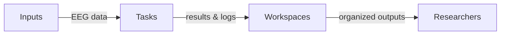
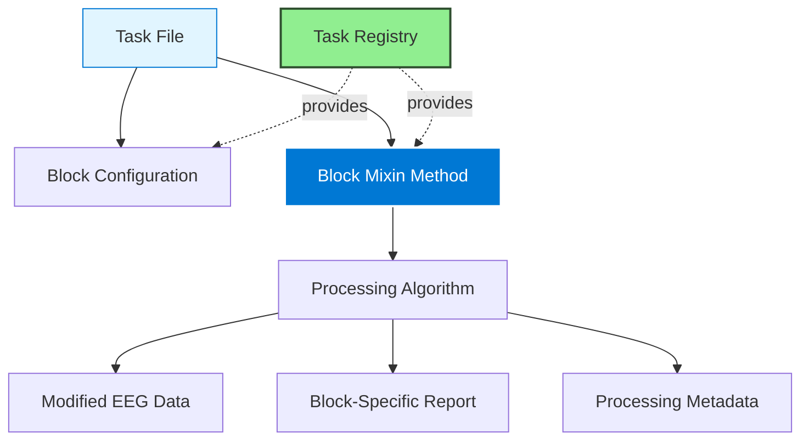

## Overview: Modular Task Design, Data Flow, and Conceptual Pillars

AutoCleanEEG organizes preprocessing around three core concepts: **Workspaces**, **Tasks**, and **Inputs**. A *Workspace* stores task definitions, intermediate results, and final outputs in a transparent folder structure. An *Input* points to the EEG data to process, whether a single recording or a batch of files. The *Task* encapsulates a reproducible pipeline that may be built-in (e.g., `RestingState_Basic`) or custom.

This separation keeps analyses organized while preserving reproducibility. Workspaces ensure outputs and provenance are centralized; inputs maintain data integrity; tasks capture the scientific logic. Under the hood, AutoCleanEEG standardizes data flow using canonical [MNE](https://mne.tools/stable/index.html) objects or EEGLAB `.set` files, balancing Python compatibility and legacy MATLAB support.


```mermaid
flowchart LR
    Inputs[Inputs] -->|EEG data| Tasks
    Tasks -->|results & logs| Workspaces
    Workspaces -->|organized outputs| Researchers
```

By building on these pillars, AutoCleanEEG supports varied paradigms—resting-state, event-related, or murine recordings—while ensuring that identical tasks yield identical outputs across laboratories and regulatory environments.

## Task System: Classes, Configurations, and Reusable Components

Rather than treating preprocessing steps as independent scripts, AutoCleanEEG defines entire pipelines as subclasses of a base `Task` class. Each task combines a structured configuration dictionary with a `run` method that sequences multiple operations. Parameters such as filter cutoffs, notch frequencies, ICA methods, and classification thresholds live entirely in the configuration, allowing pipelines to be reproduced or modified without editing code.

Internally, the base class provides canonical methods for importing raw data, handling metadata, tracking provenance, and generating reports. Optional mixins extend capabilities with features like compliance logging or visualization. New preprocessing strategies emerge by subclassing `Task` and overriding only the scientific logic in `run`, while the framework handles file management, state persistence, and audit logging.

This design yields several advantages:

1. **Flexibility without fragility** – steps can be reordered, enabled, or parameterized through configuration.
2. **Consistency across paradigms** – tasks enforce a common structure while allowing paradigm-specific logic.
3. **Compliance readiness** – authenticated, logged executions produce traceable units suitable for regulated environments.

## Processing Blocks: Modular Scientific Methods

While the Task system provides core preprocessing methods (import, filter, resample, ICA, epoching), **Processing Blocks** extend the pipeline with advanced, scientifically-validated signal processing methods that can evolve independently from the core framework.

### Architecture

Processing Blocks are self-contained modules that bundle:
- **Mixin interface** – Task-level API (e.g., `self.apply_wavelet_threshold()`)
- **Algorithm implementation** – Core signal processing code
- **Scientific documentation** – Literature references, parameter guidance, validation studies
- **Configuration schema** – Structured parameter definitions
- **Example tasks** – Demonstration of correct usage


```mermaid
flowchart TB
    Task[Task File] --> Config[Block Configuration]
    Task --> Method[Block Mixin Method]

    Method --> Algorithm[Processing Algorithm]
    Algorithm --> Data[Modified EEG Data]
    Algorithm --> Report[Block-Specific Report]
    Algorithm --> Metadata[Processing Metadata]

    Registry[Task Registry] -.provides.-> Method
    Registry -.provides.-> Config

    style Task fill:#e1f5ff,stroke:#0078d4
    style Method fill:#0078d4,stroke:#fff,stroke-width:2px,color:#fff
    style Registry fill:#90EE90,stroke:#2F4F2F,stroke-width:2px
```

### Core vs. Advanced Methods

AutoCleanEEG distinguishes between two tiers of preprocessing capabilities:

**Core Methods** (built-in, always available):
- Import, resample, filter, rereference
- ICA with component rejection
- Epoching and baseline correction
- Basic artifact detection and removal
- Standard quality control and reporting

**Processing Blocks** (advanced, independently versioned):
- Wavelet-based artifact removal ([wavelet_threshold](https://github.com/cincibrainlab/autocleaneeg-task-registry/tree/main/blocks/signal_processing/wavelet_threshold))
- Enhanced ICA algorithms (planned)
- Data-driven epoch rejection (planned)
- Connectivity analysis (planned)
- Time-frequency decomposition (planned)

### Discovery and Distribution

Processing blocks are discovered through the [AutoCleanEEG Task Registry](https://github.com/cincibrainlab/autocleaneeg-task-registry), a public repository that serves as both:
1. **Block registry** – Centralized catalog with versions, dependencies, and scientific references
2. **Example repository** – Pre-built task files demonstrating block usage

This separation ensures:
- **Transparency** – All block code is publicly visible and auditable
- **Independent versioning** – Blocks evolve separately from the core pipeline
- **Scientific rigor** – Each block includes peer-reviewed references and validation studies
- **Community contribution** – Researchers can submit new blocks for shared use

### Integration Example

Using a processing block in a task is straightforward:

```python
from autoclean.core.task import Task

config = {
    "resample_step": {"enabled": True, "value": 250},
    "filtering": {"enabled": True, "value": {"l_freq": 1, "h_freq": 45}},

    # Processing block configuration
    "wavelet_threshold": {
        "enabled": True,
        "value": {
            "wavelet": "sym4",
            "level": 5,
            "threshold_mode": "soft",
            "threshold_scale": 1.0,
        }
    },
}

class MyTask(Task):
    def run(self):
        self.import_raw()
        self.resample_data()
        self.filter_data()

        # Call processing block method
        self.apply_wavelet_threshold()  # ← Processing block

        self.create_epochs(export=True)
```

The block handles algorithm execution, report generation, and metadata logging automatically. No additional code is required.

For comprehensive documentation on processing blocks, see [Processing Blocks Introduction](/processing-blocks/introduction).

## Command-Line Interface (CLI)

The `autocleaneeg-pipeline` CLI exposes Workspaces, Tasks, and Inputs through a single entrypoint:

```bash
autocleaneeg-pipeline workspace  # create, inspect, and manage workspaces
autocleaneeg-pipeline task       # define, list, or execute preprocessing tasks
autocleaneeg-pipeline input      # validate or register EEG data sources
```

Clear subcommands and rich help menus make the framework approachable to users with limited programming experience. Each invocation is logged and linked to the workspace's provenance system, enabling reproducible pipelines without writing Python code.

In compliance mode, commands such as `task run` or `workspace finalize` require authentication through identity management (e.g., Auth0). Actions are recorded with user identity, timestamp, and cryptographic signature, creating a tamper-evident audit trail. Sensitive information is redacted from logs, while audit-relevant details are immutably chained to prevent undetected modification.

## Provenance and Reproducibility

Every preprocessing run produces a detailed provenance record capturing:

- **Configuration parameters** – explicit task settings and inferred defaults.
- **Software environment** – version identifiers for AutoCleanEEG, MNE-Python, EEGLAB/Matlab connectors, and dependencies.
- **Dataset metadata** – subject IDs, input paths, montages, and workspace organization.
- **Execution context** – user identity (when authenticated), timestamps, environment variables, and process IDs.

AutoCleanEEG also snapshots the source code used during execution, including file paths and cryptographic hashes of relevant `Task` classes.

Provenance records are exported in human-readable formats (CSV, JSON) and stored in a structured database for aggregation and auditing. When tasks invoke external tools—such as the Matlab Runtime via the `autocleaneeg-matlab-connector`—the Docker image tag is recorded to guarantee consistent results across machines and time.

When Compliance Mode is enabled, provenance and user interactions satisfy FDA 21 CFR Part 11 requirements. Records are tamper-evident, cryptographically chained, and authenticated via Auth0. Users can generate electronic signatures tied to individual runs, permanently linking identity, timestamp, and signature type to the record.

Provenance extends to manual interventions and report generation. If processing resumes after manual ICA adjustment, the new raw data and metadata are logged alongside a pointer to the post-ICA file. Quality-control visualizations—raw versus cleaned overlays, power spectral density topographies—are automatically generated and attached to the record, capturing both algorithmic steps and human decisions.

AutoCleanEEG therefore serves both exploratory science and regulated clinical workflows by uniting reproducibility, auditability, and compliance in a single architecture.

