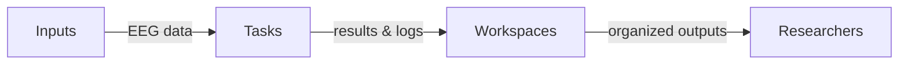

## Overview: Three Simple Concepts

AutoCleanEEG is built around three core ideas:

**Workspaces** are folders where you store your tasks and results. Think of a workspace as your project directory—everything related to your analysis lives here in an organized structure.

**Tasks** are Python files that define your preprocessing pipeline. Each task specifies what steps to run (filtering, ICA, epoching) and what parameters to use. Tasks can be built-in templates or custom pipelines you create.

**Inputs** are your EEG data files. You can process a single file or batch process an entire folder.

That's it. Point the pipeline at your data, tell it which task to run, and it handles everything else—processing, quality reports, organized outputs, and complete documentation of what was done.


```mermaid
flowchart LR
    Inputs[Inputs] -->|EEG data| Tasks
    Tasks -->|results & logs| Workspaces
    Workspaces -->|organized outputs| Researchers
```

By building on these pillars, AutoCleanEEG supports varied paradigms—resting-state, event-related, or murine recordings—while ensuring that identical tasks yield identical outputs across laboratories and regulatory environments.

## Task System: Python Files with Configuration

Each task is a Python file with two parts:

A **configuration section** at the top lists all your preprocessing parameters—filter frequencies, ICA settings, epoch lengths. This is what you'll edit most often. Change a number here, and your entire pipeline updates accordingly.

A **run method** at the bottom sequences your preprocessing steps in order. It calls built-in methods like `self.import_raw()`, `self.filter_data()`, and `self.run_ica()`. The framework handles all file management, logging, and report generation behind the scenes.

This design means you can:
- Share exact preprocessing protocols as simple Python files
- Modify parameters without touching code logic
- Reproduce results across different datasets and labs
- Track exactly what was done for regulatory compliance

## Processing Blocks: Advanced Methods

The pipeline includes standard preprocessing methods that cover 90% of use cases: importing data, filtering, ICA, epoching, and basic quality control.

**Processing blocks** extend the pipeline with advanced, scientifically-validated methods for specialized analyses. These include wavelet-based artifact removal, data-driven epoch rejection, source localization, and spectral parameterization. Each block comes with comprehensive documentation, literature references, and example tasks.

Unlike core methods, processing blocks are independently versioned and maintained in the [Task Registry](https://github.com/cincibrainlab/autocleaneeg-task-registry). This means new cutting-edge methods can be added without changing the core pipeline, and you can choose exactly which advanced methods you need.

### Integration Example

Using a processing block in a task is straightforward:

```python
from autoclean.core.task import Task

config = {
    "resample_step": {"enabled": True, "value": 250},
    "filtering": {"enabled": True, "value": {"l_freq": 1, "h_freq": 45}},

    # Processing block configuration
    "wavelet_threshold": {
        "enabled": True,
        "value": {
            "wavelet": "sym4",
            "level": 5,
            "threshold_mode": "soft",
            "threshold_scale": 1.0,
        }
    },
}

class MyTask(Task):
    def run(self):
        self.import_raw()
        self.resample_data()
        self.filter_data()

        # Call processing block method
        self.apply_wavelet_threshold()  # ← Processing block

        self.create_epochs(export=True)
```

The block handles algorithm execution, report generation, and metadata logging automatically. No additional code is required.

For comprehensive documentation on processing blocks, see [Processing Blocks Introduction](/processing-blocks/introduction).

## Command-Line Interface

The `autocleaneeg-pipeline` command provides everything you need:

```bash
autocleaneeg-pipeline workspace  # Set up and manage your project workspace
autocleaneeg-pipeline task       # Choose and configure preprocessing tasks
autocleaneeg-pipeline process    # Run the pipeline on your data
autocleaneeg-pipeline review     # Open the results viewer
```

The interface uses clear menus and helpful prompts—you don't need to be a programmer to use it effectively. Every command you run is logged automatically, creating a complete audit trail of your work.

When compliance mode is enabled (for clinical or regulatory work), you'll authenticate with your institution's identity system before processing. All actions are cryptographically signed and tamper-evident.

## Provenance and Reproducibility

AutoCleanEEG automatically tracks everything about each processing run:

**What was done**: Every parameter, every step, every decision is recorded. The exact task file (including its cryptographic hash) is saved alongside the results.

**What was used**: Software versions, data paths, montage information—everything needed to reproduce the analysis.

**Who did it**: When compliance mode is enabled, user identity, timestamps, and electronic signatures create audit trails that meet FDA 21 CFR Part 11 requirements.

All records are exported in human-readable formats (CSV, JSON) and stored in a tamper-evident database. If you manually adjust ICA components and then resume processing, that intervention is logged too. Quality control visualizations are automatically generated and linked to the provenance record.

This means whether you're doing exploratory research or preparing for regulatory submission, you have complete documentation of what was done and why.

