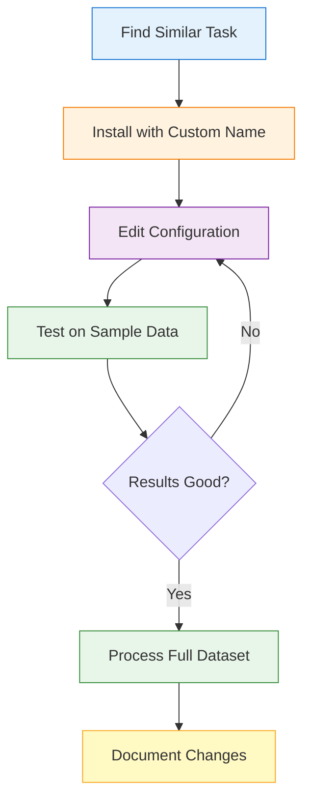

## Should You Customize?

Before diving into customization, consider whether you actually need to modify a task:

<CardGroup cols={2}>
<Card title="✅ Use Pre-Built Tasks When:" icon="check">
  - You're processing standard protocols (resting state, ASSR, MMN)
  - Your data follows common acquisition parameters
  - You want reproducible, validated pipelines
  - You're starting a new project
</Card>

<Card title="🔧 Customize Tasks When:" icon="wrench">
  - Your protocol has unique parameters (e.g., different frequencies)
  - Clinical study requires specific preprocessing
  - You need to compare different processing strategies
  - Pre-built task is "almost perfect" but needs tweaks
</Card>
</CardGroup>

<Tip>
**Best practice**: Always start with a pre-built task and test it first. Most researchers find that library tasks work perfectly without any customization!
</Tip>

## Quick Customization Overview

Here's the typical customization workflow:



<Info>
**Time estimate**: 15-30 minutes for simple parameter changes, 1-2 hours for complex modifications.
</Info>

---

## Step-by-Step: Your First Customization

Let's walk through customizing a resting-state task to use different filtering parameters for a clinical study.

### 1. Install Task with Custom Name

Start by installing the base task with a descriptive name:

```bash
autocleaneeg-pipeline task install RestingEyesOpen --name ClinicalResting
```

<CodeGroup>
```bash Output
✓ RestingEyesOpen installed as ClinicalResting
→ Task saved to: ~/Documents/Autoclean-EEG/tasks/ClinicalResting.py
```
</CodeGroup>

<Note>
**Why use a custom name?**
- Keeps the original library task intact
- Clearly identifies your customized version
- Allows multiple variants for comparison
- Helps with team collaboration
</Note>

### 2. Activate Your New Task

Set it as your active task:

```bash
autocleaneeg-pipeline task set ClinicalResting
```

### 3. Open for Editing

Edit the task file in your preferred editor:

```bash
autocleaneeg-pipeline task edit
```

This opens the task file at `~/Documents/Autoclean-EEG/tasks/ClinicalResting.py`.

<Tip>
**Pro tip**: Set your preferred editor with the `EDITOR` environment variable:
```bash
export EDITOR="code"    # VS Code
export EDITOR="nano"    # Nano (beginner-friendly)
export EDITOR="vim"     # Vim
```
</Tip>

### 4. Understand the Task File Structure

When you open the file, you'll see two main sections:

<Tabs>
<Tab title="Configuration Section">
The `config` dictionary at the top contains all parameters:

```python
config = {
    "schema_version": "2025.09",
    "montage": {
        "enabled": True,
        "value": "GSN-HydroCel-129"
    },
    "filtering": {
        "enabled": True,
        "value": {
            "l_freq": 1.0,      # High-pass filter (Hz)
            "h_freq": 100.0,    # Low-pass filter (Hz)
            "notch_freqs": [60, 120]  # Line noise removal
        }
    },
    # ... more settings ...
}
```

**This is what you'll customize most often!**
</Tab>

<Tab title="Task Class">
The `class` defines the processing workflow:

```python
class ClinicalResting(Task):
    def run(self):
        # Import and basic setup
        self.import_raw()

        # Preprocessing steps
        self.resample_data()
        self.filter_data()      # Uses config["filtering"]
        self.drop_outer_layer()

        # ICA and cleaning
        self.run_ica()
        self.clean_bad_channels()

        # ... more steps ...
```

**You usually don't need to modify this!**
</Tab>
</Tabs>

<Warning>
**Important**: Most customizations only require editing the `config` section. Only modify the class if you need to add or remove entire processing steps.
</Warning>

---

## Common Customizations for EEG Scientists

Here are the most common parameters researchers need to adjust:

### Filtering Parameters

**When to change**: Clinical protocols, different age groups, specific frequency bands

<CodeGroup>
```python Default Settings
config = {
    "filtering": {
        "enabled": True,
        "value": {
            "l_freq": 1.0,      # High-pass: 1 Hz
            "h_freq": 100.0,    # Low-pass: 100 Hz
            "notch_freqs": [60, 120]
        }
    }
}
```

```python Infant Study (Slower Oscillations)
config = {
    "filtering": {
        "enabled": True,
        "value": {
            "l_freq": 0.3,      # Lower high-pass for slow waves
            "h_freq": 50.0,     # Reduce high-frequency noise
            "notch_freqs": [60, 120]
        }
    }
}
```

```python High-Frequency Analysis
config = {
    "filtering": {
        "enabled": True,
        "value": {
            "l_freq": 1.0,
            "h_freq": 200.0,    # Keep gamma frequencies
            "notch_freqs": [60, 120, 180]  # Add 3rd harmonic
        }
    }
}
```
</CodeGroup>

<Accordion title="📚 Understanding filtering parameters">
- **l_freq** (high-pass): Removes slow drifts below this frequency
  - Lower values (0.1-0.5 Hz) preserve slow oscillations (good for infants)
  - Higher values (1-2 Hz) remove more drift (good for long recordings)
- **h_freq** (low-pass): Removes fast noise above this frequency
  - Standard: 40-100 Hz for typical analysis
  - Higher: 200+ Hz for high-frequency studies
- **notch_freqs**: Removes line noise (60 Hz in US, 50 Hz in Europe)
  - Include harmonics: [60, 120, 180] or [50, 100, 150]
</Accordion>

### Epoching Parameters

**When to change**: Different event durations, baseline periods, rejection thresholds

<CodeGroup>
```python Standard Event Epochs
config = {
    "create_epochs": {
        "enabled": True,
        "value": {
            "tmin": -0.2,       # 200ms before event
            "tmax": 0.8,        # 800ms after event
            "baseline": (-0.2, 0),
            "reject": {
                "eeg": 150e-6   # Reject trials > 150 µV
            }
        }
    }
}
```

```python Long Baseline Period
config = {
    "create_epochs": {
        "enabled": True,
        "value": {
            "tmin": -0.5,       # Longer baseline
            "tmax": 1.0,
            "baseline": (-0.5, 0),
            "reject": {
                "eeg": 150e-6
            }
        }
    }
}
```

```python Relaxed Rejection (Noisy Data)
config = {
    "create_epochs": {
        "enabled": True,
        "value": {
            "tmin": -0.2,
            "tmax": 0.8,
            "baseline": (-0.2, 0),
            "reject": {
                "eeg": 200e-6   # More lenient threshold
            }
        }
    }
}
```
</CodeGroup>

<Accordion title="📚 Understanding epoching parameters">
- **tmin/tmax**: Time window around events (in seconds)
  - Negative values are before the event (baseline)
  - Positive values are after the event (response)
- **baseline**: Period used to zero the data (tmin, 0) is common
- **reject**: Automatic trial rejection thresholds
  - Standard: 100-150 µV for clean data
  - Relaxed: 150-250 µV for noisier data (infants, clinical)
  - Strict: 75-100 µV for very clean data
</Accordion>

### Montage and Channel Settings

**When to change**: Different cap systems, non-standard layouts

<CodeGroup>
```python GSN HydroCel 129
config = {
    "montage": {
        "enabled": True,
        "value": "GSN-HydroCel-129"
    }
}
```

```python Standard 10-20 System
config = {
    "montage": {
        "enabled": True,
        "value": "standard_1020"
    }
}
```

```python BioSemi 64
config = {
    "montage": {
        "enabled": True,
        "value": "biosemi64"
    }
}
```

```python Custom Montage File
config = {
    "montage": {
        "enabled": True,
        "value": "/path/to/custom_montage.sfp"
    }
}
```
</CodeGroup>

<Tip>
**Finding your montage**: See available options with:
```python
import mne
print(mne.channels.get_builtin_montages())
```
</Tip>

### ICA Settings

**When to change**: Different artifact patterns, varying data lengths

<CodeGroup>
```python Standard ICA
config = {
    "ica_step": {
        "enabled": True,
        "value": {
            "n_components": 0.95,  # Keep 95% of variance
            "method": "fastica",
            "random_state": 42
        }
    }
}
```

```python More Components (Long Recording)
config = {
    "ica_step": {
        "enabled": True,
        "value": {
            "n_components": 0.99,  # Keep 99% of variance
            "method": "fastica",
            "random_state": 42
        }
    }
}
```

```python Fewer Components (Short Recording)
config = {
    "ica_step": {
        "enabled": True,
        "value": {
            "n_components": 15,    # Fixed number
            "method": "fastica",
            "random_state": 42
        }
    }
}
```
</CodeGroup>

<Accordion title="📚 Understanding ICA parameters">
- **n_components**: How many ICA components to extract
  - Float (0.95): Keep components explaining this much variance
  - Integer (15): Extract exactly this many components
- **method**: ICA algorithm
  - `fastica`: Fast and reliable (recommended)
  - `infomax`: Alternative algorithm
  - `picard`: Faster for large datasets
- **random_state**: Seed for reproducibility (keep at 42)
</Accordion>

### Resampling Rate

**When to change**: Reducing file sizes, matching acquisition rates

<CodeGroup>
```python Standard Rate
config = {
    "resample_step": {
        "enabled": True,
        "value": 250  # Hz
    }
}
```

```python Higher Rate (High-Frequency Analysis)
config = {
    "resample_step": {
        "enabled": True,
        "value": 500  # Hz
    }
}
```

```python Lower Rate (File Size Reduction)
config = {
    "resample_step": {
        "enabled": True,
        "value": 125  # Hz
    }
}
```

```python Disable Resampling
config = {
    "resample_step": {
        "enabled": False
    }
}
```
</CodeGroup>

<Warning>
**Nyquist rule**: Sampling rate must be at least 2× your highest frequency of interest. For 100 Hz analysis, use ≥200 Hz sampling rate.
</Warning>

---

## Advanced: Adding or Removing Processing Steps

If you need to change the workflow itself (not just parameters), modify the `run()` method in the class.

### Removing a Step

To skip a processing step, simply comment it out or remove it:

<CodeGroup>
```python Original
class MyTask(Task):
    def run(self):
        self.import_raw()
        self.resample_data()
        self.filter_data()
        self.drop_outer_layer()  # Remove edge channels
        self.run_ica()
```

```python Modified (Skip Edge Removal)
class MyTask(Task):
    def run(self):
        self.import_raw()
        self.resample_data()
        self.filter_data()
        # self.drop_outer_layer()  # SKIPPED: Keep all channels
        self.run_ica()
```
</CodeGroup>

### Adding a Custom Step

You can add custom processing between existing steps:

```python
class MyTask(Task):
    def run(self):
        self.import_raw()
        self.resample_data()
        self.filter_data()

        # Custom processing step
        self.raw.pick_types(eeg=True, exclude='bads')  # Keep only good EEG

        self.run_ica()
        # ... rest of workflow
```

<Warning>
**Advanced users only**: Modifying the workflow requires understanding MNE-Python. If you're not comfortable with Python, stick to config changes or ask for help on our forums.
</Warning>

---

## Testing Your Customizations

**Critical step**: Always test on sample data before processing your entire dataset!

### 1. Save Your Changes

After editing, save the task file (`Ctrl+S` or `:wq` in vim).

### 2. Process a Single Test File

Run on one known-good file:

```bash
autocleaneeg-pipeline process /path/to/test_subject.raw
```

### 3. Review the Results

Check the outputs:

```bash
autocleaneeg-pipeline review
```

**What to look for**:
- ✅ Pipeline completed without errors
- ✅ Data quality metrics look reasonable
- ✅ Artifacts were properly removed
- ✅ Frequency spectrum looks as expected
- ✅ No excessive data rejection

### 4. Compare to Original

Process the same file with the original library task to compare:

```bash
# Process with original
autocleaneeg-pipeline task set RestingEyesOpen
autocleaneeg-pipeline process /path/to/test_subject.raw

# Compare to your customization
autocleaneeg-pipeline task set ClinicalResting
autocleaneeg-pipeline process /path/to/test_subject.raw
```

<Tip>
**Validation checklist**:
- [ ] Processing completes without errors
- [ ] Output files are created in expected locations
- [ ] Quality metrics are within acceptable range
- [ ] Visual inspection shows proper cleaning
- [ ] Compared to baseline/original task results
</Tip>

---

## Documenting Your Changes

**Essential for reproducibility!** Document what you changed and why.

### Add Comments to Your Task File

At the top of your customized task, add a documentation block:

```python
"""
CLINICAL RESTING STATE - Customized for XYZ Study

Modifications from RestingEyesOpen:
- Changed l_freq from 1.0 to 0.5 Hz (preserve slow oscillations)
- Changed h_freq from 100 to 45 Hz (reduce high-frequency noise)
- Changed epoch rejection from 150µV to 200µV (noisy clinical population)

Rationale:
- Clinical population shows more motion artifacts
- Interest in slow-wave activity requires lower high-pass filter
- Study design: 5-minute resting state, eyes open

Created: 2025-09-29
Author: Dr. Smith
Study: Clinical-EEG-2025
"""

config = {
    "schema_version": "2025.09",
    # ... rest of config ...
}
```

### Keep a Change Log

For collaborative projects, maintain a changelog:

```markdown
# ClinicalResting Task - Change Log

## v1.1 - 2025-09-30
- Increased epoch rejection threshold to 250µV (noisy subjects)
- Added 180 Hz to notch filter (3rd harmonic)

## v1.0 - 2025-09-29
- Initial customization from RestingEyesOpen
- Changed filtering: l_freq 0.5, h_freq 45
- Changed rejection: 200µV
```

<Note>
**For publications**: Include the exact task file as supplementary material. This ensures complete reproducibility of your preprocessing pipeline.
</Note>

---

## Sharing Customized Tasks

### With Collaborators

Share the task file directly:

1. Find your task file:
```bash
autocleaneeg-pipeline task explore  # Opens tasks folder
```

2. Copy `ClinicalResting.py` and share it via:
   - Email attachment
   - Shared drive
   - Version control (Git)
   - Cloud storage

3. Collaborators install it:
```bash
autocleaneeg-pipeline task install /path/to/ClinicalResting.py
```

### With the Community

Consider contributing your task to the library! See the [contribution guide](https://github.com/cincibrainlab/autocleaneeg-task-registry/blob/main/CONTRIBUTING.md).

<Info>
**Task review process**:
1. Test thoroughly on multiple datasets
2. Document parameters and rationale
3. Submit to task registry
4. Community review
5. Added to library in next release
</Info>

---

## Common Customization Patterns

### Pattern 1: Age-Specific Variants

Create task variants optimized for different age groups:

```bash
# Install base task three times
autocleaneeg-pipeline task install RestingEyesOpen --name Resting_Infant
autocleaneeg-pipeline task install RestingEyesOpen --name Resting_Child
autocleaneeg-pipeline task install RestingEyesOpen --name Resting_Adult

# Customize each for age group
autocleaneeg-pipeline task set Resting_Infant
autocleaneeg-pipeline task edit
# Adjust: l_freq=0.3, reject=250µV (infants are noisy)

autocleaneeg-pipeline task set Resting_Child
autocleaneeg-pipeline task edit
# Adjust: l_freq=0.5, reject=200µV

autocleaneeg-pipeline task set Resting_Adult
autocleaneeg-pipeline task edit
# Keep defaults: l_freq=1.0, reject=150µV
```

### Pattern 2: Pilot vs. Production

Use relaxed parameters for pilot data, strict for final dataset:

```bash
# Pilot: Keep more data, explore artifacts
autocleaneeg-pipeline task install MyProtocol --name MyProtocol_Pilot
# Edit: reject=300µV, n_components=0.99

# Production: Stricter quality control
autocleaneeg-pipeline task install MyProtocol --name MyProtocol_Final
# Edit: reject=150µV, n_components=0.95
```

### Pattern 3: Methodological Comparison

Compare preprocessing strategies:

```bash
# Variant A: ICA-based
autocleaneeg-pipeline task install ASSR --name ASSR_ICA
# Enable ICA, disable other artifact removal

# Variant B: Correlation-based
autocleaneeg-pipeline task install ASSR --name ASSR_Correlation
# Disable ICA, enable correlation removal

# Process same data with both, compare results
```

---

## Troubleshooting Customizations

<AccordionGroup>
<Accordion title="Task fails to load after editing" icon="triangle-exclamation">
**Symptom**: Error when trying to process data with customized task

**Common causes**:
1. Syntax error in Python (missing comma, bracket, quote)
2. Invalid parameter values
3. Incorrect indentation

**Solutions**:
```bash
# Check task validity
autocleaneeg-pipeline task diagnose

# Restore from backup if needed
cp ~/Documents/Autoclean-EEG/tasks/MyTask.backup.py ~/Documents/Autoclean-EEG/tasks/MyTask.py

# Reinstall original from library
autocleaneeg-pipeline task install MyTask --force
```

<Tip>
Use a text editor with Python syntax highlighting to catch errors while editing!
</Tip>
</Accordion>

<Accordion title="Processing fails with parameter error" icon="gear">
**Symptom**: Task loads but fails during processing with parameter-related error

**Common causes**:
1. Invalid frequency values (e.g., l_freq > h_freq)
2. Negative time windows
3. Incompatible parameter combinations

**Solutions**:
- Check parameter logic:
  - `l_freq` < `h_freq`
  - `tmin` < 0 < `tmax` for epochs
  - Rejection thresholds are positive
  - Sampling rate > 2× highest frequency

**Example fix**:
```python
# WRONG
"filtering": {
    "value": {
        "l_freq": 100,  # Higher than h_freq!
        "h_freq": 50
    }
}

# CORRECT
"filtering": {
    "value": {
        "l_freq": 1,
        "h_freq": 100
    }
}
```
</Accordion>

<Accordion title="Too much data rejected" icon="ban">
**Symptom**: Most or all trials/epochs are rejected

**Solutions**:
1. **Relax rejection thresholds**:
```python
"reject": {
    "eeg": 200e-6  # Increase from 150e-6
}
```

2. **Check your data quality**: High rejection may indicate real problems
```bash
# Visual inspection before processing
autocleaneeg-pipeline review --raw /path/to/data.raw
```

3. **Adjust filtering**: Too aggressive filtering can cause edge artifacts
```python
"filtering": {
    "value": {
        "l_freq": 0.5,  # Lower from 1.0
        "h_freq": 100   # Keep reasonable
    }
}
```
</Accordion>

<Accordion title="Customization not taking effect" icon="question">
**Symptom**: Changes don't seem to apply when processing

**Common causes**:
1. Wrong task is active
2. Changes not saved
3. Cached results from previous run

**Solutions**:
```bash
# 1. Verify active task
autocleaneeg-pipeline task show

# 2. Set correct task
autocleaneeg-pipeline task set MyCustomTask

# 3. Clear output and reprocess
rm -rf output/  # Clear previous results
autocleaneeg-pipeline process /path/to/data.raw
```
</Accordion>

<Accordion title="How to undo customizations?" icon="rotate-left">
**Option 1 - Restore from backup**:
```bash
# Backups created automatically with timestamp
cp ~/Documents/Autoclean-EEG/tasks/MyTask.backup.2025-09-29.py \
   ~/Documents/Autoclean-EEG/tasks/MyTask.py
```

**Option 2 - Reinstall from library**:
```bash
autocleaneeg-pipeline task install MyTask --force
# Warning: This overwrites all customizations
```

**Option 3 - Compare and selectively revert**:
```bash
# See what changed
autocleaneeg-pipeline task diff MyTask

# Edit to revert specific changes
autocleaneeg-pipeline task edit
```
</Accordion>
</AccordionGroup>

---

## Best Practices Summary

<Steps>
<Step title="Start Simple">
Always begin with a pre-built library task. Test it first before customizing.
</Step>

<Step title="Use Descriptive Names">
Name customized tasks clearly: `ASSR_HighFreq`, `Resting_Clinical`, `MMN_Pilot`
</Step>

<Step title="Document Everything">
Add comments explaining what you changed and why. Future you will thank you!
</Step>

<Step title="Test Incrementally">
Make one change at a time, test, then make the next change. Don't change everything at once.
</Step>

<Step title="Keep Backups">
The system auto-backs up, but you can manually copy task files for safety.
</Step>

<Step title="Version Control">
For serious projects, keep task files in Git. Track every change.
</Step>

<Step title="Share with Team">
Ensure all collaborators use the exact same task file for consistency.
</Step>
</Steps>

---

## When to Ask for Help

Some customizations require programming knowledge. Ask for help if you need:

- Custom preprocessing algorithms not available in library
- Integration with external tools or pipelines
- Complex conditional logic in workflows
- Custom artifact detection methods
- Advanced statistical analyses

<CardGroup cols={2}>
<Card title="Community Forums" icon="comments" href="https://github.com/cincibrainlab/autoclean_pipeline/discussions">
  Ask questions and share experiences with other researchers.
</Card>

<Card title="GitHub Issues" icon="github" href="https://github.com/cincibrainlab/autoclean_pipeline/issues">
  Report bugs or request features for the task system.
</Card>
</CardGroup>

---

## Next Steps

<CardGroup cols={2}>
<Card title="Task Library" icon="books" href="/tasks/task-library">
  Browse all available pre-built tasks to customize.
</Card>

<Card title="Workflows" icon="list-check" href="/tasks/task-workflows">
  See practical workflows using customized tasks.
</Card>

<Card title="Command Reference" icon="terminal" href="/tasks/task-management">
  Complete reference of all task commands.
</Card>

<Card title="Troubleshooting" icon="life-ring" href="/tasks/task-troubleshooting">
  Solutions to common problems and questions.
</Card>
</CardGroup>

## Quick Reference: Essential Customizations

| What to Customize | Config Parameter | Common Use Cases |
|-------------------|------------------|------------------|
| **Filtering frequencies** | `filtering.value.l_freq`, `h_freq` | Age groups, frequency bands |
| **Epoch windows** | `create_epochs.value.tmin`, `tmax` | Protocol timing, baseline length |
| **Rejection thresholds** | `create_epochs.value.reject.eeg` | Data quality, population |
| **Montage** | `montage.value` | Different cap systems |
| **ICA components** | `ica_step.value.n_components` | Data length, artifact types |
| **Sampling rate** | `resample_step.value` | File size, frequency analysis |

---

<Tip>
**Remember**: The best customization is the one you can explain clearly in your methods section. If you can't explain why you changed something, reconsider whether you should change it!
</Tip>