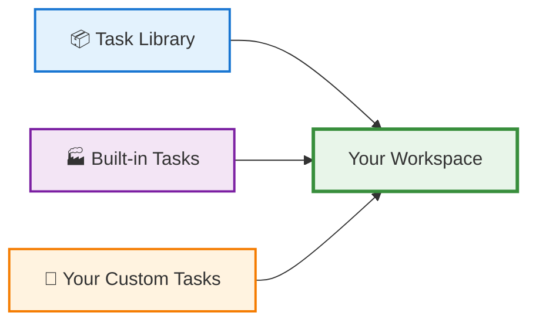

## What Are Tasks?

Think of a **task** as a complete recipe for processing your EEG data. Just like following a recipe to bake a cake, a task tells AutoCleanEEG exactly how to clean, filter, and analyze your recordings.

<Note>
**Tasks contain everything needed to process your data:**
- Which preprocessing steps to apply (filtering, artifact removal, etc.)
- The order to apply them in
- All the parameters (frequencies, thresholds, time windows)
- How to save and organize the outputs
</Note>

## Why Use Tasks?

<CardGroup cols={2}>
<Card title="Reproducibility" icon="repeat">
  The same task always produces the same results. Share your task file with colleagues and they can replicate your exact analysis pipeline.
</Card>

<Card title="No Coding Required" icon="magic">
  Use pre-built tasks from our library without writing a single line of code. Just install and run!
</Card>

<Card title="Flexibility" icon="sliders">
  Need to customize? Tasks are easy to edit and can be tailored to your specific study design.
</Card>

<Card title="Quality Control" icon="shield-check">
  Every task includes automatic quality checks and generates detailed reports for your data.
</Card>
</CardGroup>

## Understanding Task Sources

AutoCleanEEG provides tasks from three sources:



### 📦 Task Library (Recommended)
Pre-built tasks for common EEG protocols, curated by the AutoCleanEEG team:
- **Resting State EEG** (eyes open, eyes closed)
- **Event-Related Potentials** (MMN, VEP, auditory)
- **ASSR protocols** (40Hz steady-state responses)
- **Rodent EEG protocols**

**Best for**: Most users starting out

### 🏭 Built-in Tasks
A small set of core tasks that come pre-installed with AutoCleanEEG.

**Best for**: Quick testing, basic workflows

### 🔧 Your Custom Tasks
Tasks you've created or modified yourself, stored in your workspace.

**Best for**: Advanced users, specialized protocols

<Tip>
**Start with the Library!** Most researchers will find everything they need in the pre-built task library. You can always customize later if needed.
</Tip>

## Your First Task: A 5-Minute Walkthrough

Let's process some resting-state EEG data using a library task.

<Steps>
<Step title="See What's Available">
First, let's browse the task library to see what's available:

```bash
autocleaneeg-pipeline task list --source=library
```

You'll see output like this:

```
Available to Install

 Task Name                Source      Description
 RestingEyesOpen          📦 library  Standard resting-state eyes-open protocol
 ASSR_40Hz                📦 library  Auditory steady-state response at 40 Hz
 MMN_Standard             📦 library  Mismatch negativity (oddball paradigm)
 ...
```

<Info>
The 📦 icon indicates these tasks are in the library and ready to install.
</Info>
</Step>

<Step title="Install and Activate a Task">
Found a task you want to use? Install it with one command:

```bash
autocleaneeg-pipeline task use RestingEyesOpen
```

This command does two things:
1. **Installs** the task to your workspace
2. **Activates** it so it's ready to use

You'll see confirmation:
```
✓ RestingEyesOpen installed to /Users/you/Autoclean-EEG/tasks/RestingEyesOpen.py
✓ Active task set to: RestingEyesOpen
Ready to process: autocleaneeg-pipeline process <file>
```

<Tip>
**Pro tip**: The `task use` command is your friend! It's the fastest way to start using any task from the library.
</Tip>
</Step>

<Step title="Process Your Data">
Now that your task is active, process your EEG file:

```bash
autocleaneeg-pipeline process /path/to/your/eeg_data.raw
```

AutoCleanEEG will:
- ✅ Load your data
- ✅ Apply all preprocessing steps defined in the task
- ✅ Generate quality control reports
- ✅ Save cleaned data and results to your workspace

<Note>
Processing time varies based on your data size and the complexity of the task. Expect 2-10 minutes for typical resting-state recordings.
</Note>
</Step>

<Step title="Review the Results">
After processing completes, review your results:

```bash
autocleaneeg-pipeline review
```

This opens an interactive viewer where you can:
- 📊 See before/after comparisons
- 📈 Review quality metrics
- 🔍 Inspect artifact removal
- ✅ Validate the preprocessing worked correctly
</Step>
</Steps>

## Common Questions

<AccordionGroup>
<Accordion title="How do I find the right task for my data?" icon="magnifying-glass">
Use the search command to find tasks by keyword:

```bash
autocleaneeg-pipeline task search resting
autocleaneeg-pipeline task search auditory
autocleaneeg-pipeline task search mmn
```

This searches across all task names and descriptions to help you find what you need.
</Accordion>

<Accordion title="Can I use multiple tasks on different datasets?" icon="layers">
Yes! You can:
1. Install multiple tasks (they're all stored in your workspace)
2. Switch between them using `task set <name>`
3. Process different datasets with different tasks

Example:
```bash
# Process resting state data
autocleaneeg-pipeline task set RestingEyesOpen
autocleaneeg-pipeline process resting_data.raw

# Switch to ASSR task for auditory data
autocleaneeg-pipeline task set ASSR_40Hz
autocleaneeg-pipeline process auditory_data.raw
```
</Accordion>

<Accordion title="What if I need to customize a task?" icon="wrench">
Tasks are easy to customize! See the [Task Customization Guide](/tasks/task-customization) for details.

Quick preview:
1. Install the task you want to customize
2. Edit it: `autocleaneeg-pipeline task edit`
3. Modify parameters (filtering, epochs, etc.)
4. Save and run!

All tasks are stored as readable Python files in your workspace.
</Accordion>

<Accordion title="How do I know if a task is working correctly?" icon="heart-pulse">
Use the health check command:

```bash
autocleaneeg-pipeline task diagnose
```

This checks:
- ✅ All installed tasks are valid
- ✅ Tasks are up to date with the library
- ✅ Your workspace is configured correctly
- ⚠️ Any issues that need attention
</Accordion>

<Accordion title="What's the difference between 'task use' and 'task install'?" icon="circle-question">
**`task use`** (Recommended): One-step workflow
- Installs the task from the library
- Immediately sets it as your active task
- You're ready to process data right away

**`task install`**: More control
- Just installs the task to your workspace
- Doesn't activate it automatically
- Good when you want to install multiple tasks at once

For most users, `task use` is simpler and faster!
</Accordion>
</AccordionGroup>

## What Happens Behind the Scenes?

When you use a task, AutoCleanEEG:

1. **Downloads** the task file from the library (if needed)
2. **Copies** it to your workspace folder: `~/Documents/Autoclean-EEG/tasks/`
3. **Validates** that the task file is correctly formatted
4. **Sets** it as your active task (if using `task use`)

<Info>
**Your workspace location**: Tasks are stored in `~/Documents/Autoclean-EEG/tasks/` (Mac/Linux) or `C:\Users\YourName\Documents\Autoclean-EEG\tasks\` (Windows)

You can open this folder anytime with: `autocleaneeg-pipeline task explore`
</Info>

## Next Steps

Now that you understand the basics, explore these guides:

<CardGroup cols={2}>
<Card title="Browse the Task Library" icon="books" href="/tasks/task-library">
  See all available pre-built tasks and what they do.
</Card>

<Card title="Common Workflows" icon="list-check" href="/tasks/task-workflows">
  Learn workflows for typical EEG processing scenarios.
</Card>

<Card title="Customize Tasks" icon="pen-to-square" href="/tasks/task-customization">
  Learn how to modify tasks for your specific needs.
</Card>

<Card title="Command Reference" icon="terminal" href="/tasks/task-management">
  Complete list of all task commands and options.
</Card>
</CardGroup>

## Quick Command Cheat Sheet

Here are the most common commands you'll use:

| What you want to do | Command |
|---------------------|---------|
| See available tasks | `task list` |
| Search for a task | `task search <keyword>` |
| Install and activate a task | `task use <name>` 🎯 |
| Switch to a different task | `task set <name>` |
| Check task health | `task diagnose` |
| Edit a task | `task edit` |
| See all commands | `task --help` |

<Tip>
**Bookmark this page!** Return here whenever you need a refresher on task basics.
</Tip>