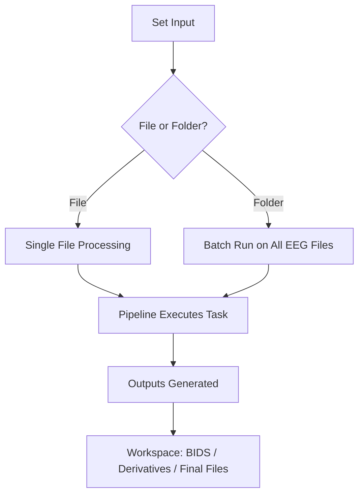

Once you’ve created or selected a Task file, you can run it on your EEG recordings directly from the command line.  
AutoCleanEEG makes it simple to **set an input file or folder**, confirm it, and then process the data.

### Step 1: Copy Your Folder Path
- Navigate to the folder that contains your EEG recordings.  
- Use your file explorer’s **“Copy Path”** option (shortcut varies by OS).  
- In this example, our folder contains **two raw EEG files**.

### Step 2: Show Current Input

Type:

```bash
autocleaneeg-pipeline input show
```

This will display the **current active input** (file or folder). If nothing is set yet, you’ll see an empty or default value.

### Step 3: Set Input to a Folder

Run:

```bash
autocleaneeg-pipeline  input set
```

You’ll be prompted with four options:

1. Select file
2. **Select directory**

Choose **2** and paste the path to your EEG folder.
You should see a success message:

### Step 4: Run the Pipeline

Check your workspace, input, and task file by running:

```bash
autocleaneeg-pipeline
```
To start preprocessing, simply run:

```bash
autocleaneeg-pipeline process
```

Confirm when prompted, and the pipeline will run on all files in the folder.



### Notes

* The **active input** can be a single file or an entire directory.
* When a folder is set, all compatible EEG files inside will be processed in a **batch run**.
* You can re-run tasks safely — previous outputs will be backed up with a timestamped folder name.

---

<Info>
Batch processing makes it easy to run the same preprocessing task across multiple EEG files in one step.  
This is especially useful in large studies or when testing new preprocessing configurations.
</Info>
