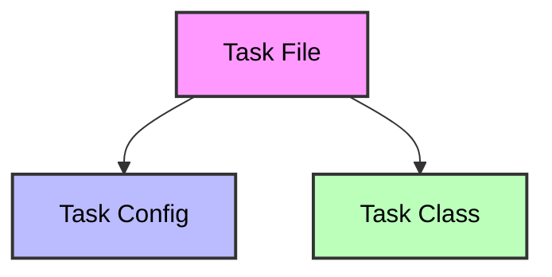

Task files are the **blueprints** of AutoCleanEEG pipeline.  

They combine two parts:

1. **Configuration (`config`)** – a dictionary that specifies which steps to enable and how to parameterize them.  
2. **Task class (`Task`)** – a Python class that orchestrates the execution of steps in order.

## High-Level Overview



## Why Task Files?

- **Reproducibility**: The same task file always runs with the same parameters.  
- **Transparency**: Every step and setting is explicitly defined.  
- **Flexibility**: You can create different task files for different study designs or datasets (e.g., resting state vs. oddball tasks).  
- **Automation**: Tasks integrate with the pipeline CLI to run end-to-end preprocessing.

<Info>
Task files are designed to be **human-readable and editable**.  
While you can generate them automatically, customizing them allows you to tailor preprocessing to your study’s specific needs.
</Info>

## Example Snippet

```python
config = {
    "resample_step": {"enabled": True, "value": 250},
    "filtering": {"enabled": True, "value": {"l_freq": 1, "h_freq": 100}},
    "ICA": {"enabled": True, "value": {"method": "infomax"}},
    "epoch_settings": {"enabled": True, "value": {"tmin": -1, "tmax": 1}},
}

class RestingState_Basic(Task):
    def run(self) -> None:
        self.import_raw()
        self.resample_data()
        self.filter_data()
        self.run_ica()
        self.create_regular_epochs(export=True)
        self.generate_reports()
````


