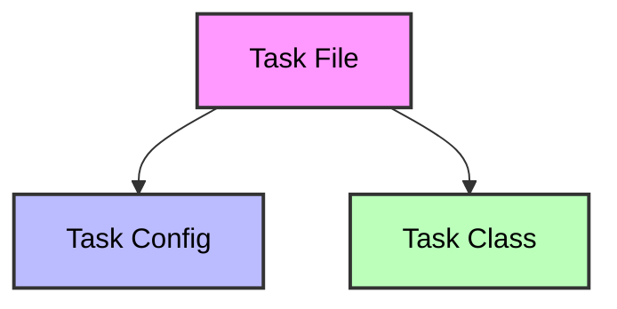

Task files are the **blueprints** of AutoCleanEEG pipeline.  

They combine two parts:

1. **Configuration (`config`)** – a dictionary that specifies which steps to enable and how to parameterize them.  
2. **Task class (`Task`)** – a Python class that orchestrates the execution of steps in order.

## High-Level Overview


```mermaid
flowchart TD

    A[Task File] --> B[Task Config]
    A --> C[Task Class]

    %% Styles
    style A fill:#f9f,stroke:#333,stroke-width:2px,color:#000
    style B fill:#bbf,stroke:#333,stroke-width:2px,color:#000
    style C fill:#bfb,stroke:#333,stroke-width:2px,color:#000
```

## Why Task Files?

- **Reproducibility**: The same task file always runs with the same parameters.  
- **Transparency**: Every step and setting is explicitly defined.  
- **Flexibility**: You can create different task files for different study designs or datasets (e.g., resting state vs. oddball tasks).  
- **Automation**: Tasks integrate with the pipeline CLI to run end-to-end preprocessing.

<Info>
Task files are designed to be **human-readable and editable**.  
While you can generate them automatically, customizing them allows you to tailor preprocessing to your study’s specific needs.
</Info>

## Example Snippet

```python
config = {
    "resample_step": {"enabled": True, "value": 250},
    "filtering": {"enabled": True, "value": {"l_freq": 1, "h_freq": 100}},
    "ICA": {"enabled": True, "value": {"method": "infomax"}},
    "epoch_settings": {"enabled": True, "value": {"tmin": -1, "tmax": 1}},
}

class RestingState_Basic(Task):
    def run(self) -> None:
        self.import_raw()
        self.resample_data()
        self.filter_data()
        self.run_ica()
        self.create_regular_epochs(export=True)
        self.generate_reports()
```

---

## Task File Sources

AutoCleanEEG provides tasks from three sources:

<AccordionGroup>
<Accordion title="📦 Task Library (Recommended)" icon="books">
Pre-built, validated tasks for common EEG paradigms maintained by the AutoCleanEEG team.

**Examples**: RestingEyesOpen, ASSR_40Hz, MMN_Standard, Chirp_Default

**How to use**:
```bash
autocleaneeg-pipeline task use RestingEyesOpen
```

See [Task Library](/tasks/task-library) for the complete catalog.
</Accordion>

<Accordion title="🏭 Built-in Tasks" icon="box">
Core tasks that come pre-installed with AutoCleanEEG.

**How to view**:
```bash
autocleaneeg-pipeline task list --source=builtin
```
</Accordion>

<Accordion title="🔧 Custom Tasks" icon="pen-to-square">
Tasks you create or customize yourself, stored in your workspace.

**How to create**:
- Customize library tasks: [Customization Guide](/tasks/task-customization)
- Generate with TaskWizard: [TaskWizard](/tasks/taskwizard)
- Write from scratch using Task API

**Location**: `~/Documents/Autoclean-EEG/tasks/`
</Accordion>
</AccordionGroup>

---

## Working with Task Files

### Quick Start

If you're new to tasks, start here:

<Steps>
<Step title="Browse Available Tasks">
```bash
autocleaneeg-pipeline task list --source=library
```
</Step>

<Step title="Install and Activate">
```bash
autocleaneeg-pipeline task use RestingEyesOpen
```
</Step>

<Step title="Process Your Data">
```bash
autocleaneeg-pipeline process /path/to/data.raw
```
</Step>
</Steps>

See [Getting Started Guide](/tasks/task-getting-started) for a complete walkthrough.

### Common Commands

| Action | Command |
|--------|---------|
| Browse library | `task list --source=library` |
| Search for tasks | `task search <keyword>` |
| Install and activate | `task use <name>` |
| Switch tasks | `task set <name>` |
| Edit a task | `task edit` |
| Check health | `task diagnose` |

See [Command Reference](/tasks/task-management) for complete documentation.

---

## Learn More

<CardGroup cols={2}>
<Card title="Getting Started" icon="rocket" href="/tasks/task-getting-started">
  New to tasks? Start here with a 5-minute walkthrough.
</Card>

<Card title="Task Library" icon="books" href="/tasks/task-library">
  Browse pre-built tasks for common EEG paradigms.
</Card>

<Card title="Common Workflows" icon="list-check" href="/tasks/task-workflows">
  Practical examples for typical research scenarios.
</Card>

<Card title="Customization Guide" icon="pen-to-square" href="/tasks/task-customization">
  Learn how to modify tasks for your specific needs.
</Card>

<Card title="TaskWizard" icon="wand-magic-sparkles" href="/tasks/taskwizard">
  Generate custom tasks with a visual web interface.
</Card>

<Card title="Command Reference" icon="terminal" href="/tasks/task-management">
  Complete reference for all task management commands.
</Card>

<Card title="Troubleshooting" icon="life-ring" href="/tasks/task-troubleshooting">
  Solutions to common problems and FAQ.
</Card>

<Card title="Task Class Reference" icon="code" href="/tasks/task_class">
  Technical reference for task file structure and methods.
</Card>
</CardGroup>

---

## Key Concepts

<Tip>
**Task files are self-contained**: Each `.py` file includes both configuration and processing logic. This makes them easy to share, version control, and reproduce.
</Tip>

<Info>
**Most users never write code**: The task library covers 90% of use cases. When needed, customization is as simple as changing a few numbers in the `config` section.
</Info>

<Warning>
**Task files are Python code**: While designed to be user-friendly, syntax errors can break tasks. Always test changes on sample data first, and use the `task diagnose` command to check for issues.
</Warning>

